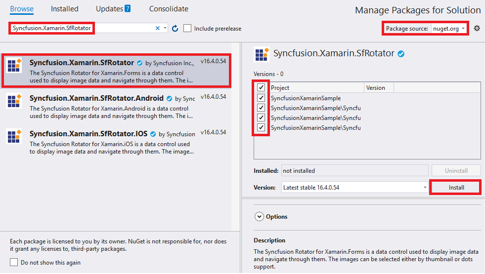

# Getting Started

This section explains you the steps to configure a SfRotator control in a real-time scenario and also provides a walk-through on some of the customization features available in SfRotator control.

## Adding SfRotator reference

You can add SfRotator reference using one of the following methods:

**Method 1: Adding SfRotator reference from nuget.org**

Syncfusion Xamarin components are available in [nuget.org](https://www.nuget.org/). To add SfRotator to your project, open the NuGet package manager in Visual Studio, search for [Syncfusion.Xamarin.SfRotator](https://www.nuget.org/packages/Syncfusion.Xamarin.SfRotator), and then install it.

N> Install the same version of SfRotator NuGet in all the projects.

**Method 2: Adding SfRotator reference from toolbox**

Syncfusion also provides Xamarin Toolbox. Using this toolbox, you can drag the SfRotator control to the XAML page. It will automatically install the required NuGet packages and add the namespace to the page. To install Syncfusion Xamarin Toolbox, refer to [Toolbox](https://help.syncfusion.com/xamarin/utility#toolbox).

**Method 3: Adding SfRotator assemblies manually from the installed location**

If you prefer to manually reference the assemblies instead referencing from NuGet, add the following assemblies in respective projects.

Location: {Installed location}/{version}/Xamarin/lib

<table>
<tr>
<td>PCL</td>
<td>Syncfusion.SfRotator.XForms.dll Syncfusion.Core.XForms.dll Syncfusion.Licensing.dll </td>
</tr>
<tr>
<td>Android</td>
<td>Syncfusion.SfRotator.Android.dll Syncfusion.SfRotator.XForms.Android.dll Syncfusion.SfRotator.XForms.dll Syncfusion.Core.XForms.dll Syncfusion.Core.XForms.Android.dll Syncfusion.Licensing.dll </td>
</tr>
<tr>
<td>iOS</td>
<td>Syncfusion.SfRotator.iOS.dll Syncfusion.SfRotator.XForms.iOS.dll Syncfusion.SfRotator.XForms.dll Syncfusion.Core.XForms.dll Syncfusion.Core.XForms.iOS.dll Syncfusion.Licensing.dll </td>
</tr>
<tr>
<td>UWP</td>
<td>Syncfusion.SfRotator.UWP.dll Syncfusion.SfRotator.XForms.UWP.dll Syncfusion.SfRotator.XForms.dll Syncfusion.Core.XForms.dll Syncfusion.Core.XForms.UWP.dll Syncfusion.Licensing.dll </td>
</tr>
</table>

N> To know more about obtaining our components, refer to these links for [Mac](https://help.syncfusion.com/xamarin/introduction/download-and-installation/mac/) and [Windows](https://help.syncfusion.com/xamarin/introduction/download-and-installation/windows/).

I> Starting with v16.2.0.x, if you reference Syncfusion assemblies from the trial setup or from the NuGet feed, you also have to include a license key in your projects. Please refer to [Syncfusion license key](https://help.syncfusion.com/common/essential-studio/licensing/license-key/) to know about registering Syncfusion license key in your Xamarin application to use our components.

## Launching the SfRotator on each platform

To use SfRotator inside an application, each platform application must initialize the SfRotator renderer. This initialization step varies from platform to platform and is discussed in the following sections.

### Android and  UWP

The Android and UWP launches the SfRotator without any initialization and is enough to only initialize the Xamarin.Forms Framework to launch the application

N> If you are adding the references from toolbox, this step is not needed.

### iOS

To launch SfRotator in iOS, need to create an instance of SfRotatorRenderer in FinishedLaunching overridden method of AppDelegate class in iOS Project as shown below.





public override bool FinishedLaunching(UIApplication app, NSDictionary options)
{
	global::Xamarin.Forms.Forms.Init();

	new SfRotatorRenderer();

	LoadApplication(new App());

	return base.FinishedLaunching(app, options);
}	





### ReleaseMode issue in UWP platform

There is a known Framework issue in UWP platform. The custom controls will not render when deployed the application in `Release Mode`.

The above problem can be resolved by initializing the SfRotator assemblies in `App.xaml.cs` in UWP project as like in below code snippet.



// In App.xaml.cs

protected override void OnLaunched(LaunchActivatedEventArgs e)
{
…

	rootFrame.NavigationFailed += OnNavigationFailed;
		
	// you'll need to add `using System.Reflection;`
	List<Assembly> assembliesToInclude = new List<Assembly>();

	//Now, add all the assemblies your app uses
	assembliesToInclude.Add(typeof(SfRotatorRenderer).GetTypeInfo().Assembly);

	// replaces Xamarin.Forms.Forms.Init(e);        
	Xamarin.Forms.Forms.Init(e, assembliesToInclude);
		
…     
}


## Create a Simple SfRotator 

The SfRotator control is configured entirely in C# code or by using XAML markup. The following steps explain on how to create a SfRotator and configure its elements,

* Adding namespace for the added assemblies. 





	xmlns:rotator="clr-namespace:Syncfusion.SfRotator.XForms;assembly=Syncfusion.SfRotator.XForms"





	using Syncfusion.SfRotator.XForms; 
	




* Now add the SfRotator control with a required optimal name by using the included namespace.





<?xml version="1.0" encoding="utf-8"?>
<ContentPage xmlns="http://xamarin.com/schemas/2014/forms" 
	xmlns:x="http://schemas.microsoft.com/winfx/2009/xaml"
	xmlns:local="clr-namespace:GettingStarted" 
	xmlns:syncfusion="clr-namespace:Syncfusion.SfRotator.XForms;assembly=Syncfusion.SfRotator.XForms"
	x:Class="GettingStarted.RotatorControlPage">
<ContentPage.Content>
 <syncfusion:SfRotator x:Name="rotator" />	
</ContentPage.Content>
</ContentPage>
	
	


		

using Syncfusion.SfRotator.XForms;
using Xamarin.Forms;

namespace GettingStarted
{
public partial class RotatorControlPage : ContentPage
    {
        public RotatorControlPage()
        {
            InitializeComponent();
            SfRotator rotator = new SfRotator();
            this.Content = rotator;
        }
    }
}
	




## Add Rotator Items

We can populate the rotator's items by using any one of the following ways,

* Through SfRotatorItem

* Through ItemTemplate

### Through SfRotatorItem

By passing the list of `SfRotatorItem` , we can get the view of SfRotator control. In that we can pass Images as well as Item content.

The following code example illustrates to add list of Images in Rotator ,





using Syncfusion.SfRotator.XForms;
using System.Collections.Generic;
using Xamarin.Forms;
using Xamarin.Forms.Xaml;

namespace Rotator
{
    [XamlCompilation(XamlCompilationOptions.Compile)]
	public partial class Rotator : ContentPage
	{
        SfRotator rotator = new SfRotator();
        StackLayout stackLayout = new StackLayout();
		public Rotator()
		{
			InitializeComponent ();
            stackLayout.HeightRequest = 300;
            List<SfRotatorItem> collectionOfItems = new List<SfRotatorItem>();
            collectionOfItems.Add(new SfRotatorItem() { Image = "movie1.png" });
            collectionOfItems.Add(new SfRotatorItem() { Image = "movie2.png" });
            collectionOfItems.Add(new SfRotatorItem() { Image = "movie3.png" });
            collectionOfItems.Add(new SfRotatorItem() { Image = "movie4.png" });
            collectionOfItems.Add(new SfRotatorItem() { Image = "movie5.png" });
            rotator.DataSource = collectionOfItems;
            stackLayout.Children.Add(rotator);
            this.Content = stackLayout;
        }
	}
}





The following code example illustrates to add list of items through ItemContent API in Rotator ,





using Syncfusion.SfRotator.XForms;
using System;
using System.Collections.Generic;
using System.Linq;
using System.Text;
using System.Threading.Tasks;
using Xamarin.Forms;
using Xamarin.Forms.Xaml;

namespace Rotator
{
	[XamlCompilation(XamlCompilationOptions.Compile)]
	public partial class Rotator : ContentPage
	{
		public Rotator()
		{
			InitializeComponent ();
            SfRotator rotator = new SfRotator();
            List<SfRotatorItem> collectionOfItems = new List<SfRotatorItem>();
            collectionOfItems.Add(new SfRotatorItem() { ItemContent = new Xamarin.Forms.Button() { Text = "ItemContent1", TextColor = Color.White, BackgroundColor = Color.FromHex("#7E6E6B"), FontSize = 12 } });
            collectionOfItems.Add(new SfRotatorItem() { ItemContent = new Label() { Text = "ItemContent2", BackgroundColor = Color.FromHex("#7E6E6B"), FontSize = 12 } });
            collectionOfItems.Add(new SfRotatorItem() { ItemContent = new Image() { Source = "movie1.png", Aspect = Aspect.AspectFit } });
            rotator.DataSource = collectionOfItems;
            this.Content = rotator;
        }
	}
}





### Through ItemTemplate

ItemTemplate property of SfRotator control is used to customize the contents of SfRotator items. ItemTemplate provides common template with different data. SfRotator items can be populated with a collection of image data. This collection includes Arrays, Lists and DataTables. 





// Model Class for Rotator.

public RotatorModel(string imageString)
{
    Image = imageString;
}
private String _image;
public String Image
{
    get { return _image; }
    set { _image = value; }
}

     




Create and populate Rotator collection as follows





// ViewModel class for Rotator.

public RotatorViewModel()
{
    ImageCollection.Add(new RotatorModel("movie1.png"));
    ImageCollection.Add(new RotatorModel("movie2.png"));
    ImageCollection.Add(new RotatorModel("movie3.png"));
    ImageCollection.Add(new RotatorModel("movie4.png"));
    ImageCollection.Add(new RotatorModel("movie5.png"));
}
private List<RotatorModel> imageCollection = new List<RotatorModel>();
public List<RotatorModel> ImageCollection
{
    get { return imageCollection; }
    set { imageCollection = value; }
}









<ContentPage xmlns="http://xamarin.com/schemas/2014/forms"
             xmlns:x="http://schemas.microsoft.com/winfx/2009/xaml"
             xmlns:local="clr-namespace:Rotator"
             xmlns:syncfusion="clr-namespace:Syncfusion.SfRotator.XForms;assembly=Syncfusion.SfRotator.XForms"
             x:Class="Rotator.Rotator">
    <ContentPage.BindingContext>
        <local:RotatorViewModel/>
    </ContentPage.BindingContext>
    <ContentPage.Content>
        <syncfusion:SfRotator x:Name="rotator" 
                        NavigationDelay="2000" 
                        ItemsSource="{Binding ImageCollection}" 
                        SelectedIndex="2"
                        NavigationDirection="Horizontal"
                        NavigationStripMode="Dots" 
                        BackgroundColor="#ececec">
            <syncfusion:SfRotator.ItemTemplate>
                <DataTemplate>
                    <Image  Source="{Binding Image}"/>
                </DataTemplate>
            </syncfusion:SfRotator.ItemTemplate>
        </syncfusion:SfRotator>
    </ContentPage.Content>
</ContentPage>
	  




using Syncfusion.SfRotator.XForms;
using System;
using System.Collections.Generic;
using System.Linq;
using System.Text;
using System.Threading.Tasks;
using Xamarin.Forms;
using Xamarin.Forms.Xaml;

namespace Rotator
{
	[XamlCompilation(XamlCompilationOptions.Compile)]
	public partial class Rotator : ContentPage
	{
		public Rotator()
		{
			InitializeComponent ();
            SfRotator rotator = new SfRotator();
            var ImageCollection = new List<RotatorModel> {
            new RotatorModel ("movie1.png"),
            new RotatorModel ("movie2.png"),
            new RotatorModel ("movie3.png"),
            new RotatorModel ("movie4.png"),
            new RotatorModel ("movie5.png")
            };
            var itemTemplate = new DataTemplate(() =>
            {
                var grid = new Grid();
                var nameLabel = new Image();
                nameLabel.SetBinding(Image.SourceProperty, "Image");
                grid.Children.Add(nameLabel);
                return grid;
            });
            rotator.ItemTemplate = itemTemplate;
            rotator.ItemsSource = ImageCollection;
            this.Content = rotator;
        }
	}
    public class RotatorModel
    {
        public RotatorModel(string imageString)
        {
            Image = imageString;
        }
        private String _image;
        public String Image
        {
            get { return _image; }
            set { _image = value; }
        }
    }
}





* Set the `BindingContext` for the items collection.





    <ContentPage.BindingContext>
        <local:RotatorViewModel/>
	</ContentPage.BindingContext>





	rotator.BindingContext = new RotatorViewModel();





I> Rotator's Images are placed within the application folder for Android, iOS and UWP with build action Android Resource, Bundled Resource and Content respectively. 

N> In addition, rotator provides a support to load the Images from `URL` and `SD Card` location.
 
## Setting Navigation Mode

SfRotator provides option to display the navigating items either in Thumbnail or Dots mode. The navigation mode for navigating the items can be decided using `NavigationMode` property.





<ContentPage xmlns="http://xamarin.com/schemas/2014/forms"
             xmlns:x="http://schemas.microsoft.com/winfx/2009/xaml"
             xmlns:local="clr-namespace:RangeSlider"
             xmlns:syncfusion="clr-namespace:Syncfusion.SfRotator.XForms;assembly=Syncfusion.SfRotator.XForms"
             x:Class="Rotator.Rotator">
    <ContentPage.BindingContext>
        <local:RotatorViewModel/>
    </ContentPage.BindingContext>
    <ContentPage.Content>
        <syncfusion:SfRotator x:Name="rotator" 
                        NavigationDelay="2000" 
                        ItemsSource="{Binding ImageCollection}" 
                        SelectedIndex="2"
                        NavigationDirection="Horizontal"
                        NavigationStripMode="Thumbnail" 
                        BackgroundColor="#ececec">
            <syncfusion:SfRotator.ItemTemplate>
                <DataTemplate>
                    <Image  Source="{Binding Image}"/>
                </DataTemplate>
            </syncfusion:SfRotator.ItemTemplate>
        </syncfusion:SfRotator>
    </ContentPage.Content>
</ContentPage>



	

using Syncfusion.SfRotator.XForms;
using System;
using System.Collections.Generic;
using System.Linq;
using System.Text;
using System.Threading.Tasks;
using Xamarin.Forms;
using Xamarin.Forms.Xaml;

namespace Rotator
{
	[XamlCompilation(XamlCompilationOptions.Compile)]
	public partial class Rotator : ContentPage
	{
		public Rotator()
		{
			InitializeComponent ();
            SfRotator rotator = new SfRotator();
            var ImageCollection = new List<RotatorModel> {
            new RotatorModel ("movie1.png"),
            new RotatorModel ("movie2.png"),
            new RotatorModel ("movie3.png"),
            new RotatorModel ("movie4.png"),
            new RotatorModel ("movie5.png")
            };
            var itemTemplate = new DataTemplate(() =>
            {
                var grid = new Grid();
                var nameLabel = new Image();
                nameLabel.SetBinding(Image.SourceProperty, "Image");
                grid.Children.Add(nameLabel);
                return grid;
            });
            rotator.ItemTemplate = itemTemplate;
            rotator.NavigationStripMode = NavigationStripMode.Thumbnail;
            rotator.ItemsSource = ImageCollection;
            this.Content = rotator;
        }
	}
    public class RotatorModel
    {
        public RotatorModel(string imageString)
        {
            Image = imageString;
        }
        private String _image;
        public String Image
        {
            get { return _image; }
            set { _image = value; }
        }
    }
}





## Customizing Position

The placement position of navigation strip items such as Thumbnail or Dots can be customized in SfRotator. This can be specified using `NavigationStripPosition` property.   





<ContentPage xmlns="http://xamarin.com/schemas/2014/forms"
             xmlns:x="http://schemas.microsoft.com/winfx/2009/xaml"
             xmlns:local="clr-namespace:Rotator"
             xmlns:syncfusion="clr-namespace:Syncfusion.SfRotator.XForms;assembly=Syncfusion.SfRotator.XForms"
             x:Class="Rotator.Rotator">
    <ContentPage.BindingContext>
        <local:RotatorViewModel/>
    </ContentPage.BindingContext>
    <ContentPage.Content>
        <syncfusion:SfRotator x:Name="rotator" 
                        NavigationDelay="2000" 
                        ItemsSource="{Binding ImageCollection}" 
                        SelectedIndex="2"
                        NavigationDirection="Horizontal"
                        NavigationStripMode="Dots" 
                        BackgroundColor="#ececec"
                        NavigationStripPosition="Top">
            <syncfusion:SfRotator.ItemTemplate>
                <DataTemplate>
                    <Image  Source="{Binding Image}"/>
                </DataTemplate>
            </syncfusion:SfRotator.ItemTemplate>
        </syncfusion:SfRotator>
    </ContentPage.Content>
</ContentPage>	



	

using Syncfusion.SfRotator.XForms;
using System;
using System.Collections.Generic;
using System.Linq;
using System.Text;
using System.Threading.Tasks;
using Xamarin.Forms;
using Xamarin.Forms.Xaml;

namespace Rotator
{
	[XamlCompilation(XamlCompilationOptions.Compile)]
	public partial class Rotator : ContentPage
	{
		public Rotator()
		{
			InitializeComponent ();
            SfRotator rotator = new SfRotator();
            var ImageCollection = new List<RotatorModel> {
            new RotatorModel ("movie1.png"),
            new RotatorModel ("movie2.png"),
            new RotatorModel ("movie3.png"),
            new RotatorModel ("movie4.png"),
            new RotatorModel ("movie5.png")
            };
            var itemTemplate = new DataTemplate(() =>
            {
                var grid = new Grid();
                var nameLabel = new Image();
                nameLabel.SetBinding(Image.SourceProperty, "Image");
                grid.Children.Add(nameLabel);
                return grid;
            });
            rotator.ItemTemplate = itemTemplate;
            rotator.NavigationStripMode = NavigationStripMode.Dots;
            rotator.NavigationStripPosition = NavigationStripPosition.Top;
            rotator.ItemsSource = ImageCollection;
            this.Content = rotator;
        }
	}
    public class RotatorModel
    {
        public RotatorModel(string imageString)
        {
            Image = imageString;
        }
        private String _image;
        public String Image
        {
            get { return _image; }
            set { _image = value; }
        }
    }
}
	




You can find the complete getting started sample from this [link.](http://www.syncfusion.com/downloads/support/directtrac/general/ze/GettingStarted1493259513.zip)