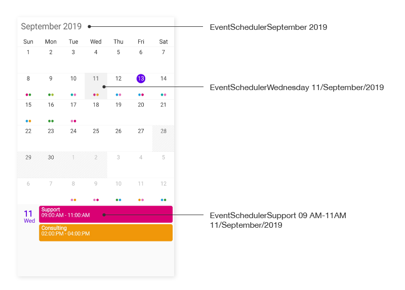
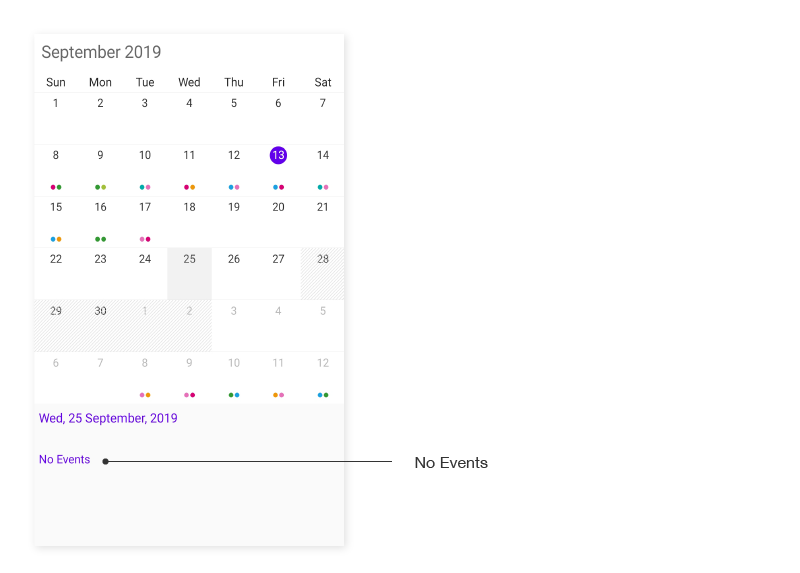
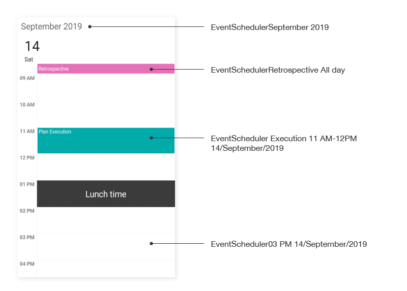
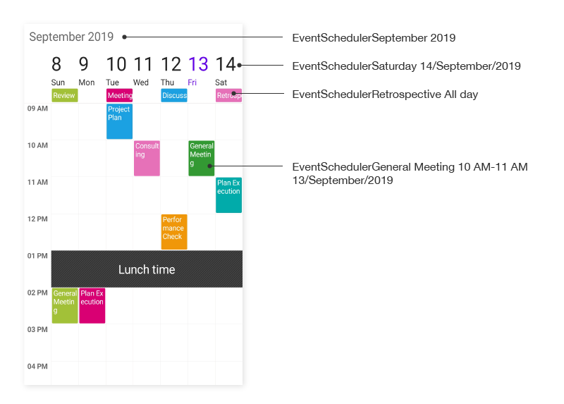
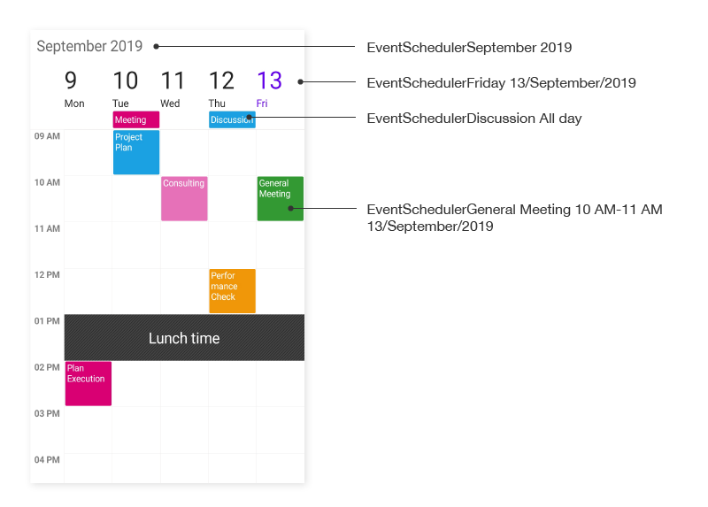
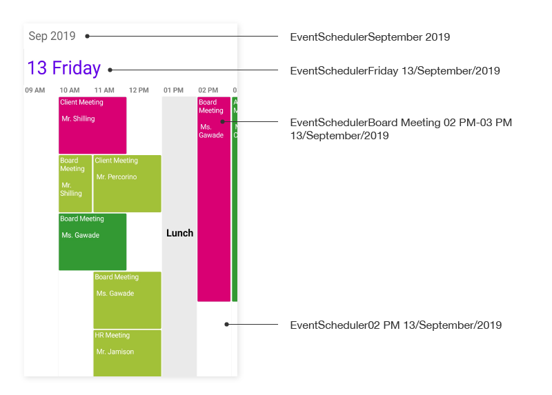
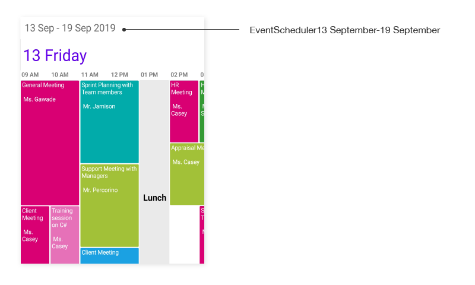

## AutomationId

The `SfSchedule` control has built-in `AutomationId` for inner elements. Please find the following table of Automation IDs for inner elements. To keep unique `AutomationId`, these inner elements’ AutomationIds are updated based on the control’s `AutomationId`.  For example, if you set `SfSchedule` `AutomationId` as `SfSchedule.AutomationId = EventScheduler`, then the Automation framework will interact with the month header as `EventSchedulerAugust 2019`. The following screenshots denote the AutomationIds for inner elements.

### Month view

<table>
<tr>
<th align="center" >View</th>
<th align="center" >AutomationId Format</th>
<th align="center" >Example</th>
</tr>

<tr>
<td>MonthCell</td>
<td>dd/MMMM/yyyy</td>
<td>01/July/2019</td>
</tr>

<tr>
<td>Month Header</td>
<td>MMMM yyyy</td>
<td>August 2019</td>
</tr>

<tr>
<td>Inline View</td>
<td>hh a Subject dd/MMMM/yyyy</td>
<td>10 AM Consulting 22/August/2019</td>
</tr>

<tr>
<td>Agenda View</td>
<td>hh a Subject dd/MMMM/yyyy</td>
<td>11 AM Planning 22/August/2019</td>
</tr>

<tr>
<td>No Events</td>
<td>No Events text</td>
<td>No Events</td>
</tr>

</table>

### Day, week and workweek views

<table>
<tr>
<th align="center" >View</th>
<th align="center" >AutomationId Format</th>
<th align="center" >Example</th>
</tr>

<tr>
<td>TimeslotView(Only for DayView)</td>
<td>hh a dd/MMMM/yyyy</td>
<td>09 AM 22/August/2019</td>
</tr>

<tr>
<td>Appointment</td>
<td>hh a Subject dd/MMMM/yyyy</td>
<td>10 AM Consulting 22/August/2019</td>
</tr>

<tr>
<td>Header</td>
<td>MMMM yyyy</td>
<td>August 2019</td>
</tr>

<tr>
<td>ViewHeader</td>
<td>dddd dd/MMMM/yyyy</td>
<td>Sunday 22/August/2019</td>
</tr>

<tr>
<td>AllDay</td>
<td>hh a Subject dd/MMMM/yyyy</td>
<td>10 AM Consulting 22/August/2019</td>
</tr>

</table>

### Timeline view

<table>
<tr>
<th align="center" >View</th>
<th align="center" >AutomationId Format</th>
<th align="center" >Example</th>
</tr>

<tr>
<td>TimeslotView(Only applicable if days count is 1)</td>
<td>hh a dd/MMMM/yyyy</td>
<td>09 AM 22/August/2019</td>
</tr>

<tr>
<td>Appointment</td>
<td>hh a Subject dd/MMMM/yyyy</td>
<td>10 AM Consulting 22/August/2019</td>
</tr>

<tr>
<td>Header</td>
<td>MMMM yyyy</td>
<td>August 2019</td>
</tr>

<tr>
<td>Header - DaysCount</td>
<td>dd MMMM - dd MMMM yyyy</td>
<td>04 December - 08 December 2018</td>
</tr>

<tr>
<td>ViewHeader</td>
<td>dddd dd/MMMM/yyyy</td>
<td>Sunday 22/August/2019</td>
</tr>

</table>

