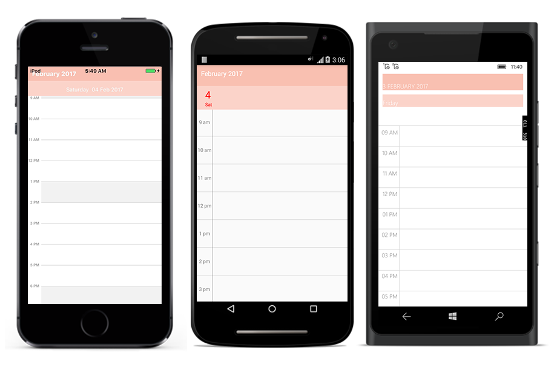
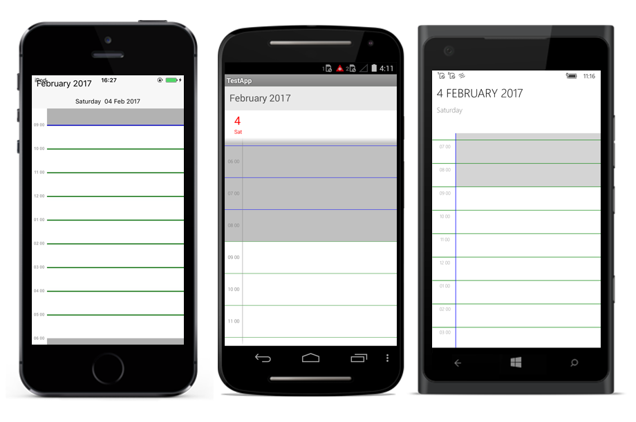
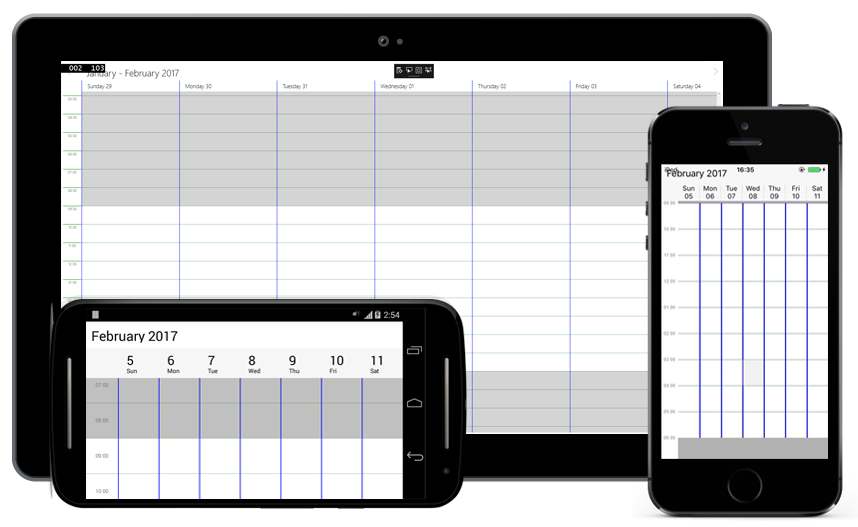
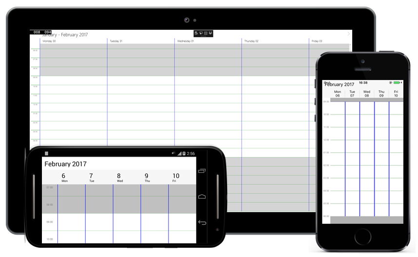
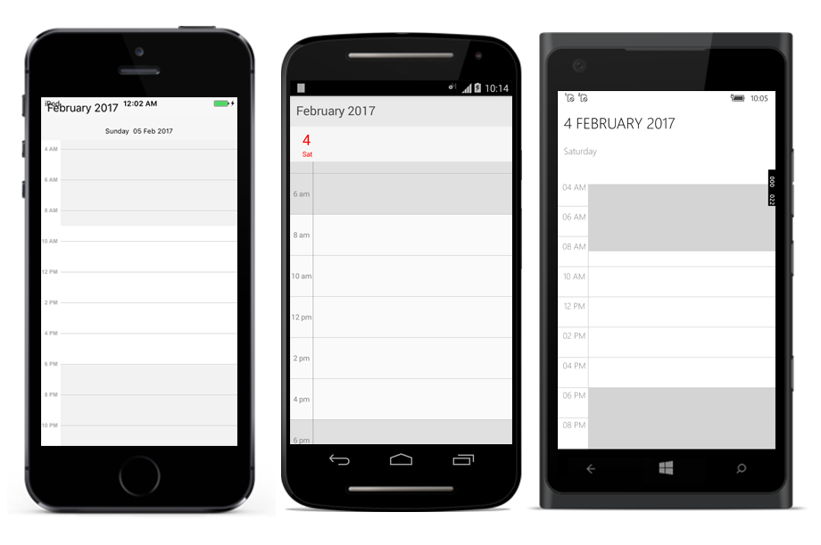

# Appearance & Styling

## Header Customization

You can customize the header of the Schedule using `HeaderStyle` and `HeaderHeight` property in schedule.

### Header Height

You can customize the height for the Header in Schedule using `HeaderHeight` in schedule.



	sfSchedule.HeaderHeight = 50;



### Labels

you can change the header format and style using `HeaderStyle` property in schedule.

#### Fonts and colors

You can change the background color,text style and text size using properties such as `BackgroundColor`,`TextStyle`, `TextSize` of Header using `HeaderStyle` property in schedule.



	HeaderStyle headerStyle = new HeaderStyle();
	headerStyle.BackgroundColor = Color.FromRgb(251, 211, 201);
	headerStyle.TextStyle = Font.Default;
	headerStyle.TextSize = 15;
	headerStyle.TextColor=Color.White;
	schedule.HeaderStyle = headerStyle;



## View Header Customization

You can customize the view header of the Schedule using `ViewHeaderStyle` and `ViewHeaderHeight` property in schedule.

### Labels

#### Fonts and Colors

You can change the background color,text style and text size using properties such as `BackgroundColor`,`DateTextStyle`, `DayTextStyle`, `DayTextColor`, `DateTextColor`,`DateTextSize`, `DayTextSize` of ViewHeader using `ViewHeaderStyle` property in schedule.



	ViewHeaderStyle viewHeaderStyle = new ViewHeaderStyle();
	viewHeaderStyle.BackgroundColor = Color.FromRgb(251,211,201);
	viewHeaderStyle.DayTextColor = Color.White;
	viewHeaderStyle.DateTextColor = Color.White;
	viewHeaderStyle.DateTextSize = 15;
	viewHeaderStyle.DayTextSize = 10;
	viewHeaderStyle.DateTextStyle = Font.Default;
	viewHeaderStyle.DayTextStyle = Font.Default;
	schedule.ViewHeaderStyle = viewHeaderStyle;



### ViewHeader Height

You can customize the height for the view header in Schedule using `HeaderHeight` in schedule.



	sfSchedule.ViewHeaderHeight = 50;



## Timeslots customization

### Custom Day View

#### Non-Working Hours 

You can differentiate working hours with non-working hour timeslots by its color using `NonWorkingHoursTimeSlotBorderColor`, `NonWorkingHoursTimeSlotColor` properties of `DayViewSettings`.





	<schedule:SfSchedule>
	<schedule:SfSchedule.DayViewSettings>
	<!--setting working hours properties -->
	<schedule:DayViewSettings
	NonWorkingHoursTimeSlotColor="Gray"
	NonWorkingHoursTimeSlotBorderColor="Gray">
	</schedule:DayViewSettings>
	</schedule:SfSchedule.DayViewSettings>
	</schedule:SfSchedule>





	//setting working hours properties 
	DayViewSettings dayViewSettings = new DayViewSettings ();
	dayViewSettings.NonWorkingHoursTimeSlotBorderColor = Color.Gray;
	dayViewSettings.NonWorkingHoursTimeSlotColor = Color.Gray;
	sfschedule.DayViewSettings = dayViewSettings;





#### Timeslots 

You can differentiate working hours with non-working hour timeslots by its color using `TimeSlotColor`,`TimeSlotBorderColor` and `TimeSlotBorderStrokeWidth` properties of `DayViewSettings`.





	<schedule:SfSchedule>
	<schedule:SfSchedule.DayViewSettings>
	<!--setting working hours properties -->
	<schedule:DayViewSettings
	TimeSlotColor="White"
	TimeSlotBorderColor="Blue"
	TimeSlotBorderStrokeWidth="2">
	</schedule:DayViewSettings>
	</schedule:SfSchedule.DayViewSettings>
	</schedule:SfSchedule>





	//setting working hours properties 
	DayViewSettings dayViewSettings = new DayViewSettings ();
	dayViewSettings.TimeSlotColor = Color.White;
	dayViewSettings.TimeSlotBorderColor = Color.Blue;
	dayViewSettings.TimeSlotBorderStrokeWidth = 2;
	sfschedule.DayViewSettings = dayViewSettings;





#### Lines

You can differentiate the timeslot panel using `VerticalLineColor` and `VerticalLineStrokeWidth` properties of `DayViewSettings`.





	<schedule:SfSchedule>
	<schedule:SfSchedule.DayViewSettings>
	<schedule:DayViewSettings VerticalLineColor="Green"
	VerticalLineStrokeWidth="5">
	</schedule:DayViewSettings>
	</schedule:SfSchedule.DayViewSettings>
	</schedule:SfSchedule>





	DayViewSettings dayviewsettings = new DayViewSettings();
	dayviewsettings.VerticalLineColor = Color.Green;
	dayviewsettings.VerticalLineStrokeWidth = 5;

	sfschedule.DayViewSettings = dayviewsettings;
	this.Content = sfschedule;

 



#### Labels

You can change the format,colors,size of text using `TimeFormat`, `TimeLabelColor`,`TimeLabelSize` properties of `DayLabelSettings` in `DayViewSettings`.



	DayViewSettings dayViewSettings = new DayViewSettings();
	DayLabelSettings dayLabelSettings = new DayLabelSettings();
	dayLabelSettings.TimeFormat = "hh mm";
	dayLabelSettings.TimeLabelColor = Color.Blue;
	dayLabelSettings.TimeLabelSize = 10;
	dayViewSettings.DayLabelSettings = dayLabelSettings;
	sfSchedule.DayViewSettings = dayViewSettings;



#### All Day Appointments Color

You can change the all day appointment panel color using the property `AllDayAppointmentBackgroundColor` of `DayViewSettings`.





	<schedule:SfSchedule.DayViewSettings>
	<schedule:DayViewSettings
	AllDayAppointmentLayoutColor="Fuchsia">
	</schedule:DayViewSettings>
	</schedule:SfSchedule.DayViewSettings>





	dayViewSettings.AllDayAppointmentLayoutColor = Color.Pink; 

 

 

### Custom Week View

#### Non-Working Hours 

You can differentiate working hours with non-working hour timeslots by its color using `NonWorkingHoursTimeSlotBorderColor`, `NonWorkingHoursTimeSlotColor` properties of `WeekViewSettings`.





	<schedule:SfSchedule ScheduleView="WeekView">
	<schedule:SfSchedule.WeekViewSettings>
	<!--setting week view settings properties -->
	<schedule:WeekViewSettings
	NonWorkingHoursTimeSlotColor="Gray"
	NonWorkingHoursTimeSlotBorderColor="Gray">
	</schedule:WeekViewSettings>
	</schedule:SfSchedule.WeekViewSettings>
	</schedule:SfSchedule>





	//setting week view settings properties
	WeekViewSettings weekViewSettings = new WeekViewSettings ();
	weekViewSettings.NonWorkingHoursTimeSlotBorderColor = Color.Gray;
	weekViewSettings.NonWorkingHoursTimeSlotColor = Color.Gray;
	sfschedule.WeekViewSettings = weekViewSettings;
	this.Content= sfschedule;





#### Timeslots

You can differentiate working hours with non-working hour timeslots by its color using `TimeSlotColor`,`TimeSlotBorderColor` and `TimeSlotBorderStrokeWidth` properties of `WeekViewSettings`.





	<schedule:SfSchedule ScheduleView="WeekView">
	<schedule:SfSchedule.WeekViewSettings>
	<!--setting week view settings properties -->
	<schedule:WeekViewSettings
	TimeSlotColor="White"
	TimeSlotBorderColor="Green" 
	TimeSlotBorderStrokeWidth="2">
	</schedule:WeekViewSettings>
	</schedule:SfSchedule.WeekViewSettings>
	</schedule:SfSchedule>





	//setting week view settings properties
	WeekViewSettings weekViewSettings = new WeekViewSettings ();
	weekViewSettings.TimeSlotBorderColor = Color.Green;
	weekViewSettings.TimeSlotColor = Color.White;
	weekViewSettings.TimeSlotBorderStrokeWidth = 2;
	sfschedule.WeekViewSettings = weekViewSettings;
	this.Content= sfschedule;





#### Lines

You can differentiate the timeslot panel using `VerticalLineColor` and `VerticalLineStrokeWidth` properties of `WeekViewSettings`.





	<schedule:SfSchedule ScheduleView="WeekView">
	<schedule:SfSchedule.WeekViewSettings>
	<schedule:WeekViewSettings 
	VerticalLineColor="Blue"
	VerticalLineStrokeWidth="5">
	</schedule:WeekViewSettings>
	</schedule:SfSchedule.WeekViewSettings>
	</schedule:SfSchedule>





	WeekViewSettings weekViewSettings = new WeekViewSettings ();
	weekViewSettings.VerticalLineColor = Color.Blue;
	weekViewSettings.VerticalLineStrokeWidth = 5;
	sfschedule.WeekViewSettings = weekViewSettings;
	this.Content= sfschedule;





#### Labels

You can change the format,colors,size,style of text using `TimeFormat`, `TimeLabelColor`,`TimeLabelSize` properties of `WeekLabelSettings` in `WeekViewSettings`.



	WeekViewSettings weekViewSettings = new WeekViewSettings();
	WeekLabelSettings weekLabelSettings = new WeekLabelSettings();
	weekLabelSettings.TimeFormat = "hh mm";
	weekLabelSettings.TimeLabelColor = Color.Blue;
	weekLabelSettings.TimeLabelSize = 10;
	weekViewSettings.WeekLabelSettings = weekLabelSettings;
	sfSchedule.WeekViewSettings = weekViewSettings;



#### All Day Appointments Color

You can change the all day appointment panel color using the property `AllDayAppointmentBackgroundColor` of `WeekViewSettings`.





	<schedule:SfSchedule ScheduleView="WeekView">
	<schedule:SfSchedule.WeekViewSettings>
	<!--setting week view settings properties -->
	<schedule:WeekViewSettings
	AllDayAppointmentLayoutColor="Fuchsia"/>
	</schedule:SfSchedule.WeekViewSettings>
	</schedule:SfSchedule>





	//setting week view settings properties
	WeekViewSettings weekViewSettings = new WeekViewSettings ();
	weekViewSettings.AllDayAppointmentLayoutColor = Color.Pink;
	sfschedule.WeekViewSettings = weekViewSettings;
	this.Content= sfschedule;





>**NOTE** Timeslots customization is not applicable for `WeekView` and `WorkWeekView` in UWP mobile device.

### Custom Work Week View

#### Non-Working Hours 

You can also differentiate working hours with non-working hour timeslots by its color using `NonWorkingHoursTimeSlotBorderColor`, `NonWorkingHoursTimeSlotColor`, properties of `WorkWeekViewSettings`.





	<schedule:SfSchedule ScheduleView="WorkWeekView">
	<schedule:SfSchedule.WorkWeekViewSettings>
	<!--setting workweek view settings properties -->
	<schedule:WorkWeekViewSettings
	NonWorkingHoursTimeSlotColor="Silver"
	NonWorkingHoursTimeSlotBorderColor="Gray">
	</schedule:WorkWeekViewSettings>
	</schedule:SfSchedule.WorkWeekViewSettings>
	</schedule:SfSchedule>





	//setting workweekviewsettings properties
	WorkWeekViewSettings workWeekViewSettings = new WorkWeekViewSettings ();
	workWeekViewSettings.NonWorkingHoursTimeSlotBorderColor = Color.Gray;
	workWeekViewSettings.NonWorkingHoursTimeSlotColor = Color.Silver;
	sfschedule.WorkWeekViewSettings = workWeekViewSettings;
	this.Content= sfschedule;





#### Timeslots 

You can also differentiate working hours with non-working hour timeslots by its color using `TimeSlotColor`,`TimeSlotBorderColor` and `TimeSlotBorderStrokeWidth` properties of `WorkWeekViewSettings`.





	<schedule:SfSchedule ScheduleView="WorkWeekView">
	<schedule:SfSchedule.WorkWeekViewSettings>
	<!--setting workweek view settings properties -->
	<schedule:WorkWeekViewSettings
	TimeSlotColor="Yellow"
	TimeSlotBorderColor="Aqua" 
	TimeSlotBorderStrokeWidth="5">
	</schedule:WorkWeekViewSettings>
	</schedule:SfSchedule.WorkWeekViewSettings>
	</schedule:SfSchedule>





	//setting workweekviewsettings properties
	WorkWeekViewSettings workWeekViewSettings = new WorkWeekViewSettings ();
	workWeekViewSettings.TimeSlotBorderColor = Color.Aqua;
	workWeekViewSettings.TimeSlotColor = Color.Yellow;
	workWeekViewSettings.TimeSlotBorderStrokeWidth = 5;
	sfschedule.WorkWeekViewSettings = workWeekViewSettings;
	this.Content= sfschedule;





#### Lines

You can differentiate the timeslot panel using `VerticalLineColor` and `VerticalLineStrokeWidth` properties of `WorkWeekViewSettings`.





	<schedule:SfSchedule ScheduleView="WorkWeekView">
	<schedule:SfSchedule.WorkWeekViewSettings>
	<schedule:WeekViewSettings 
	VerticalLineColor="Green"
	VerticalLineStrokeWidth="5">
	</schedule:WorkWeekViewSettings>
	</schedule:SfSchedule.WorkWeekViewSettings>
	</schedule:SfSchedule>





	WorkWeekViewSettings workWeekViewSettings = new WorkWeekViewSettings ();
	workWeekViewSettings.VerticalLineColor = Color.Green;
	workWeekViewSettings.VerticalLineStrokeWidth = 5;
	sfschedule.WorkWeekViewSettings = (workWeekViewSettings);
	this.Content= sfschedule;





#### Labels

You can change the format , colors, size, style of text using `TimeFormat`, `TimeLabelColor`,`TimeLabelSize` properties of `WorkWeekLabelSettings` in `WorkWeekViewSettings`.



	WorkWeekViewSettings workweekViewSettings = new WorkWeekViewSettings();
	WorkWeekLabelSettings workWeekLabelSettings = new WorkWeekLabelSettings();
	workWeekLabelSettings.TimeFormat = "hh mm";
	workWeekLabelSettings.TimeLabelColor = Color.Blue;
	workWeekLabelSettings.TimeLabelSize = 10;
	workweekViewSettings.WorkWeekLabelSettings = workWeekLabelSettings;
	sfSchedule.WorkWeekViewSettings = workweekViewSettings;



#### All Day Appointments Color

You can change the all day appointment panel color using the property `AllDayAppointmentLayoutColor` of `WorkWeekViewSettings`.





	<schedule:SfSchedule ScheduleView="WorkWeekView">
	<schedule:SfSchedule.WorkWeekViewSettings>
	<!--setting workweek view settings properties -->
	<schedule:WorkWeekViewSettings
	AllDayAppointmentLayoutColor="Fuchsia">
	</schedule:WorkWeekViewSettings>
	</schedule:SfSchedule.WorkWeekViewSettings>
	</schedule:SfSchedule>





	//setting workweekviewsettings properties
	WorkWeekViewSettings workWeekViewSettings = new WorkWeekViewSettings ();
	workWeekViewSettings.AllDayAppointmentLayoutColor = Color.Pink;
	sfschedule.WorkWeekViewSettings = workWeekViewSettings;
	this.Content= sfschedule;





### Interval

You can change the time interval and time interval height using `TimeInterval` and `TimeIntervalHeight` in schedule.





	<schedule:SfSchedule ScheduleView="WeekView" 
	TimeInterval="120"
	TimeIntervalHeight="100" >
	</schedule:SfSchedule>





	sfSchedule.TimeInterval = 120;
	sfSchedule.TimeIntervalHeight = 100;





>**NOTE** : `TimeInterval` value should be given in minutes.

