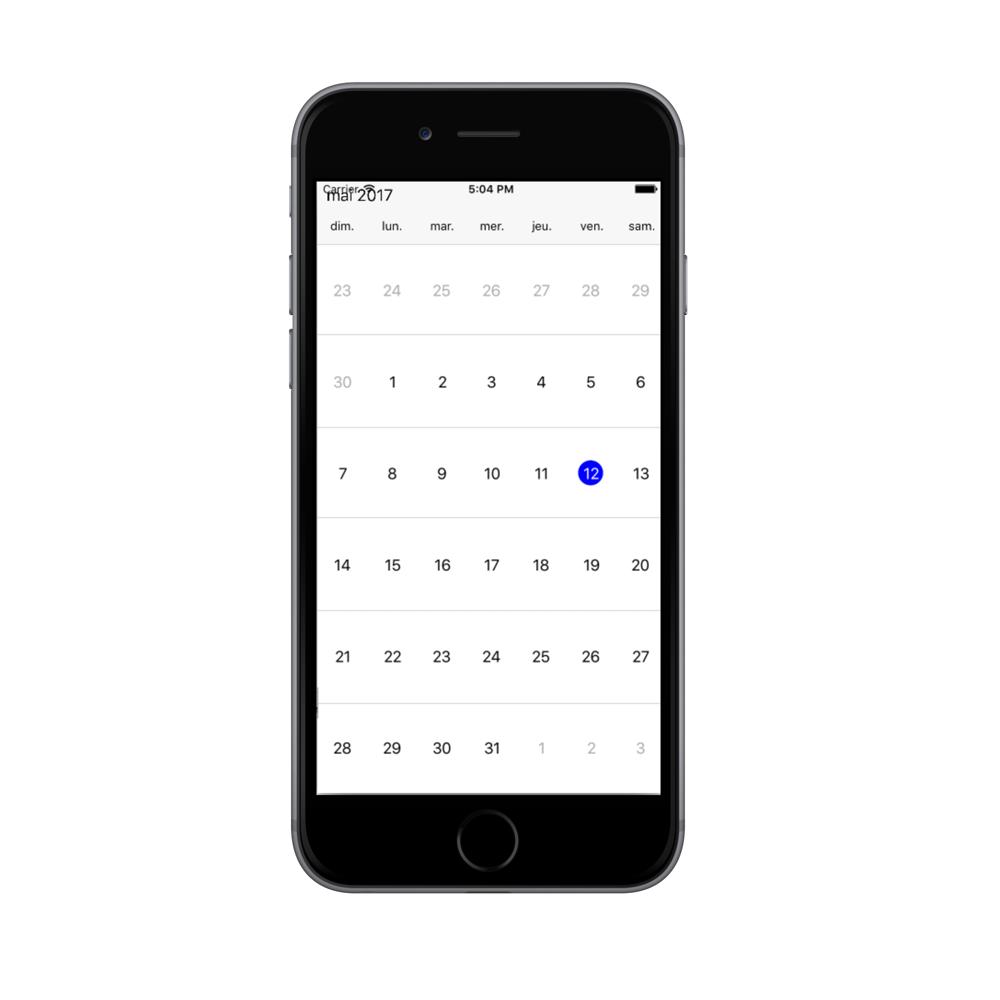

# Localization

Schedule control is available with complete localization support. Localization can be specified by setting the [Locale](https://help.syncfusion.com/cr/cref_files/xamarin/sfschedule/Syncfusion.SfSchedule.XForms~Syncfusion.SfSchedule.XForms.SfSchedule~Locale.html) property of SfSchedule. In the format of `Language code`.

## Change default control language

Based on the `Locale` specified the strings in the control such as Date, time, days are localized accordingly.

By default, schedule control is available with en locale, which is English.

   
 

     
      <schedule:SfSchedule
              x:Name="schedule" 
              ScheduleView="WeekView"
              Locale="fr">
     </schedule:SfSchedule>

   
   
    
           //creating new instance for schedule
            SfSchedule schedule = new SfSchedule();
            //setting schedule view 
            schedule.ScheduleView = ScheduleView.WeekView;
            //setting locale for the control 
            schedule.Locale = "fr";  
      
   
   

>**Note:** AM/PM in the timeline will not be localized in the Schedule views

   

## Change custom texts in the control.

You can localize the custom strings used in the schedule control. For that you need to configure it for each platform separately.

*	Localizing custom text in Android renderer.
*	Localizing custom text in iOS renderer.
*	Localizing custom text in UWP renderer.

You can download the entire source code of this demo for Xamarin.Forms from
here [Localization](http://www.syncfusion.com/downloads/support/directtrac/general/ze/Localization_Forms-583877984.zip).

### Localizing custom text in Android renderer.

You can localize custom text available in the control by adding equivalent localized string in the string.xml file.

 
       
     <resources>
    	<string name="No_Appointments">Aucun événement</string>
     	<string name="all_day">Toute la journée</string>
     </resources>
   

Android can select and load resources from different directories, based on the current device configuration and locale, refer [here](https://developer.xamarin.com/guides/android/advanced_topics/localization/). For an example, if an application requires multiple languages we can follow the below steps.

The procedure for creating strings.xml files is as follows:

*	Translate the strings.xml file to each language.
*	Create new folders under resource as values-`ar`, values-`de`, values-`en` and values-`fr` (The original values folder already exists).
*	Place the translated strings.xml files in the respective folders.
 
  

>**Note:** The corresponding values folder loads only depends on the device configuration and locale.

### Localizing custom text in iOS renderer.

You can localize custom text available in the control by adding equivalent localized string in the Localizable.strings file, refer [here](https://developer.xamarin.com/guides/ios/advanced_topics/localization_and_internationalization/).

 

If an application requires multiple languages we can follow the below steps.
*	Translate the Localizable.Strings file to each language. 
*	Create new `<Language>.lproj` folders under resource as `en.lproj`, `fr.lproj`, `de.lproj`.
* 	Place the `Localizable.Strings` file in the respective `<Language>.lproj` folders.

>**Note:** The corresponding `<Language>.lproj` folder loads only depends on the device configuration and locale.

### Localizing custom text in UWP renderer.
You can localize custom text available in the control by adding equivalent localized string in the fr.resw file.

 
