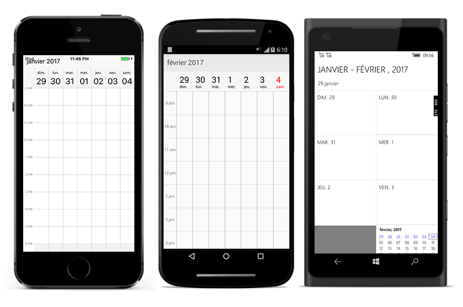

# Localization 

Schedule control is available with complete localization support. Localization can be specified by setting the `Locale` property of the control. In the format of `Language code`.

## Locale

Based on the locale specified the strings in the control such as Date, time, days are localized accordingly.

By default schedule control is available with **en**-**US** locale. 

As the subject of the appointments are given in the application level, it can be set as localized strings as per the requirement. To know more about settings the subject refer [Schedule Appointments](/xamarin/sfschedule/populating-appointment "Schedule Appointments").





    <schedule:SfSchedule
    x:Name="sfschedule" 
    ScheduleView="WeekView"
    Locale="fr">
    </schedule:SfSchedule>
	




    //creating new instance for schedule
    SfSchedule sfschedule = new SfSchedule();
    //setting schedule view 
    sfschedule.ScheduleView=(ScheduleView.WeekView);
    //setting locale for the control 
    sfschedule.Locale=("fr");
    this.Content= sfschedule;





N> AM/PM in the timeline will not be localized in the Schedule views.

