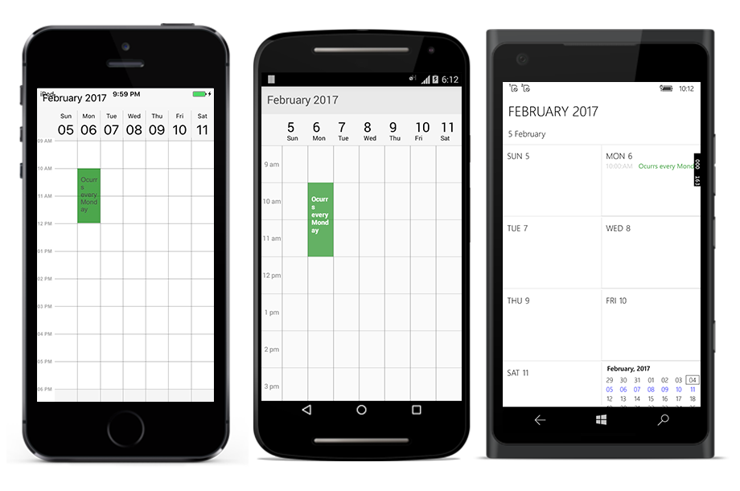

# RECURRENCE

Recursive appointments can be created by enabling isRecursive property in Schedule appointments, to know more about adding appointments in the control, refer [Schedule Appointments](/xamarin/sfschedule/populating-appointment "Schedule Appointments").

And then need to set the RecurrenceRule to populate the required recursive appointment collection in a specific pattern.

Recursive appointment can be created in any recurrence patterns, for instance, some events can be repeated every week such as “Server maintenance”, and where as some of they may repeat every year like wedding anniversary. 

## Recurrence Pattern

* Recurrence pattern used in the control are in iCal standard 

* Schedule control supports all four types of recurrence patterns.
    * Daily Recurrence
    * Weekly Recurrence
    * Monthly Recurrence
    * Yearly Recurrence

## RRule generator

RecurrenceGenerator/ recurrence builder is available with the control to create RRule. RRule can be easily created through this engine by simple APIs available.


    
    //creating new instance for schedule
    SfSchedule sfschedule = new SfSchedule(this);
    sfschedule.ScheduleView=(ScheduleView.WeekView);
    
    ScheduleAppointmentCollection appointmentCollection = new ScheduleAppointmentCollection();
    //Creating new events
    ScheduleAppointment clientMeeting = new ScheduleAppointment();
    DateTime currentDate = DateTime.Now;
    
    DateTime startTime = new DateTime (currentDate.Year, currentDate.Month, currentDate.Day, 10, 0, 0);
    
    DateTime endTime = new DateTime (currentDate.Year, currentDate.Month, currentDate.Day, 12, 0, 0);
    clientMeeting.StartTime = startTime;
    clientMeeting.EndTime = endTime;
    clientMeeting.Color = Color.Blue;
    clientMeeting.Subject = “ClientMeeting”;
    clientMeeting.IsRecursive = true;
    
    RecurrenceProperties recurrenceProperties = new RecurrenceProperties();
    recurrenceProperties.RecurrenceType = RecurrenceType.Weekly;
    recurrenceProperties.IsRangeRecurrenceCount = true;
    recurrenceProperties.WeeklyEveryNWeeks = 1;
    recurrenceProperties.IsWeeklySunday = false;
    recurrenceProperties.IsWeeklyMonday = true;
    recurrenceProperties.IsWeeklyTuesday = false;
    recurrenceProperties.IsWeeklyWednesday = false;
    recurrenceProperties.IsWeeklyThursday = false;
    recurrenceProperties.IsWeeklyFriday = false;
    recurrenceProperties.IsWeeklySaturday = false;
    recurrenceProperties.RangeRecurrenceCount = 10;
    recurrenceProperties.RecurrenceRule = DependencyService.Get<IRecurrenceBuilder>().RRuleGenerator(recurrenceProperties, clientMeeting.StartTime, clientMeeting.EndTime);
    clientMeeting.RecurrenceRule = recurrenceProperties.RecurrenceRule;
    appointmentCollection.Add(clientMeeting);
    sfschedule.DataSource = appointmentCollection;
    this.Content= sfschedule;
	


