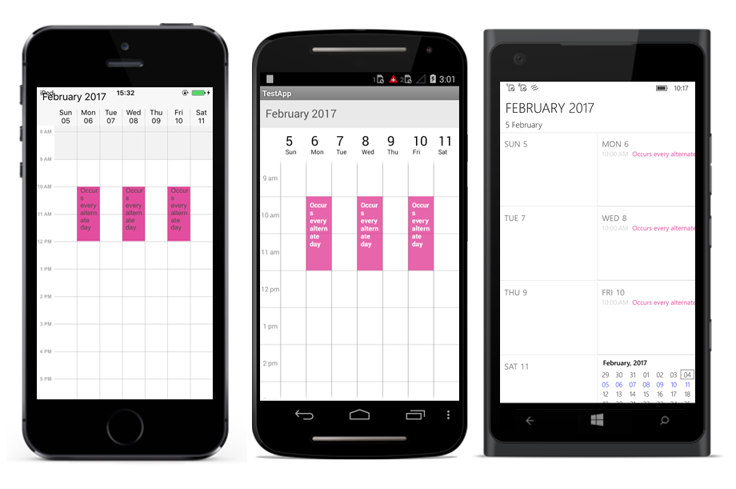

# Recurrence

Recursive appointments can be created by enabling `IsRecursive` property in Schedule appointments, to know more about adding appointments in the control, refer [Schedule Appointment](/xamarin/sfschedule/data-bindings "Schedule Appointment").

And then need to set the `RecurrenceRule` to populate the required recursive appointment collection in a specific pattern.RRULE can be easily created through `RecurrenceBuilder` engine by simple APIs available in Schedule control. 

Recursive appointment can be created in any recurrence patterns, for instance, some events can be repeated every week such as “Server maintenance”, and where as some of they may repeat every year like wedding anniversary. 

## Recurrence Pattern

* Recurrence pattern used in the control are in iCal standard 

* Schedule control supports all four types of recurrence patterns.
    * Daily Recurrence
    * Weekly Recurrence
    * Monthly Recurrence
    * Yearly Recurrence

## RRULE generator

`RecurrenceGenerator/RecurrenceBuilder` is available with the control to create `RecurrenceRule`. RRULE can be easily created through this engine by simple APIs available.

RecurrenceRule `FREQ=DAILY;INTERVAL=2;COUNT=10` will be generated by assigning the below mentioned Recurrence properties 


    
    //creating new instance for schedule
    SfSchedule schedule = new SfSchedule();
    schedule.ScheduleView= ScheduleView.WeekView;
    
    ScheduleAppointmentCollection appointmentCollection = new ScheduleAppointmentCollection();
    //Creating new events
    ScheduleAppointment scheduleAppointment = new ScheduleAppointment();
    DateTime currentDate = DateTime.Now;
    
    DateTime startTime = new DateTime (currentDate.Year, currentDate.Month, currentDate.Day, 10, 0, 0);
    DateTime endTime = new DateTime (currentDate.Year, currentDate.Month, currentDate.Day, 12, 0, 0);
    scheduleAppointment.StartTime = startTime;
    scheduleAppointment.EndTime = endTime;
    scheduleAppointment.Color = Color.Blue;
    scheduleAppointment.Subject = "Occurs every alternate day";
    scheduleAppointment.IsRecursive = true;
    
    RecurrenceProperties recurrenceProperties = new RecurrenceProperties();
    recurrenceProperties.RecurrenceType = RecurrenceType.Daily;
    recurrenceProperties.IsRangeRecurrenceCount = true;
    recurrenceProperties.DailyNDays = 2;
    recurrenceProperties.IsDailyEveryNDays = true;
    recurrenceProperties.IsWeeklySunday = false;
    recurrenceProperties.IsWeeklyMonday = true;
    recurrenceProperties.IsWeeklyTuesday = false;
    recurrenceProperties.IsWeeklyWednesday = false;
    recurrenceProperties.IsWeeklyThursday = false;
    recurrenceProperties.IsWeeklyFriday = false;
    recurrenceProperties.IsWeeklySaturday = false;
    recurrenceProperties.RangeRecurrenceCount = 10;
    recurrenceProperties.RecurrenceRule = DependencyService.Get<IRecurrenceBuilder>().RRuleGenerator(recurrenceProperties, scheduleAppointment.StartTime, scheduleAppointment.EndTime);
	


The generated RRULE is assigned to the created ScheduleAppointment as given below.


	
	scheduleAppointment.RecurrenceRule = recurrenceProperties.RecurrenceRule;
    appointmentCollection.Add(scheduleAppointment);
    schedule.DataSource = appointmentCollection;
    this.Content= schedule;
	


