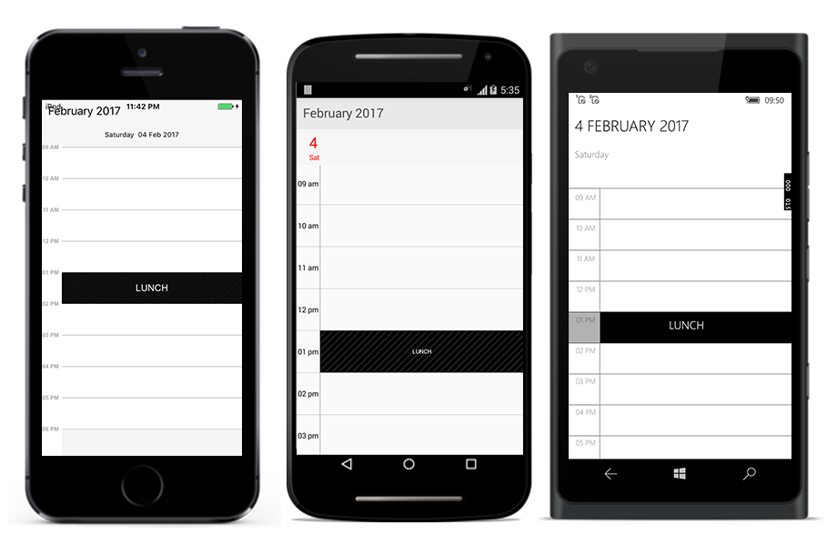
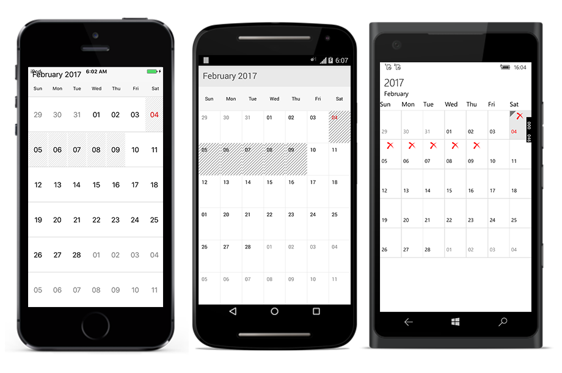

# Restricted Hours And Dates 

You can restrict the timeslots and certain month cells using `NonAccessibleBlocks` and `BlackOutDates` properties in the respective view settings of schedule

## Non-Accessible blocks

### Day View

You can restrict/allocate certain timeslot as Non-accessible block using `NonAccessibleBlocks` of `DayViewSettings`, so that you can allocate those timeslots for predefined events/activities like Lunch hour.





	<!--setting non-accessing blocks-->
	<schedule:DayViewSettings.NonAccessibleBlocks>
	<schedule:NonAccessibleBlock 
	StartTime="13" 
	EndTime ="14"
	Text="LUNCH"
	Color="Black"/>			
	</schedule:DayViewSettings.NonAccessibleBlocks>





	//setting non-accessing blocks.
	NonAccessibleBlock nonAccessibleBlock = new NonAccessibleBlock ();
	NonAccessibleBlocksCollection nonAccessibleBlocksCollection = new    NonAccessibleBlocksCollection ();
	nonAccessibleBlock.StartTime = 13;
	nonAccessibleBlock.EndTime = 14;
	nonAccessibleBlock.Text = “LUNCH”;
	nonAccessibleBlock.Color = Color.Black;
	nonAccessibleBlocksCollection.Add (nonAccessibleBlock);
	dayViewSettings.NonAccessibleBlocks =nonAccessibleBlocksCollection;
	schedule.DayViewSettings = dayViewSettings;





### Week View

You can restrict/allocate certain timeslot as Non-accessible block using `NonAccessibleBlocks` of `WeekViewSettings`, so that you can allocate those timeslots for predefined events/activities like Lunch hour.





	<schedule:SfSchedule ScheduleView="WeekView">
	<schedule:SfSchedule.WeekViewSettings>
	<!--setting non-accessing blocks-->
	<schedule:WeekViewSettings.NonAccessibleBlocks>
	<schedule:NonAccessibleBlock 
	StartTime="13" 
	EndTime ="14"
	Text="LUNCH"
	Color="Black"/>			
	</schedule:WeekViewSettings.NonAccessibleBlocks>
	</schedule:WeekViewSettings>
	</schedule:SfSchedule.WeekViewSettings>
	</schedule:SfSchedule>





	//setting non-accessing blocks
	NonAccessibleBlock nonAccessibleBlock = new NonAccessibleBlock ();
	NonAccessibleBlocksCollection nonAccessibleBlocksCollection = new NonAccessibleBlocksCollection ();
	nonAccessibleBlock.StartTime = 13;
	nonAccessibleBlock.EndTime = 14;
	nonAccessibleBlock.Text = "LUNCH”; 
	nonAccessibleBlock.Color = Color.Black;
	nonAccessibleBlocksCollection.Add (nonAccessibleBlock);
	weekViewSettings.NonAccessibleBlocks = nonAccessibleBlocksCollection;
	schedule.WeekViewSettings = weekViewSettings;





>**NOTE**:
Non-Accessible Block is not applicable in Windows Phone.

### WorkWeek View

You can restrict/allocate certain timeslot as Non-accessible block using `NonAccessibleBlocks` of `WorkWeekViewSettings`, so that you can allocate those timeslots for predefined events/activities like Lunch hour.





	<schedule:SfSchedule ScheduleView="WorkWeekView">
	<schedule:SfSchedule.WorkWeekViewSettings>
	<!--setting non-accessing blocks-->
	<schedule:WorkWeekViewSettings.NonAccessibleBlocks>
	<schedule:NonAccessibleBlock 
	StartTime="13" 
	EndTime ="14"
	Text="LUNCH"
	Color="Black"/>			
	</schedule:WorkWeekViewSettings.NonAccessibleBlocks>
	</schedule:WorkWeekViewSettings>
	</schedule:SfSchedule.WorkWeekViewSettings>
	</schedule:SfSchedule>





	//setting non-accessing blocks.
	NonAccessibleBlock nonAccessibleBlock = new NonAccessibleBlock ();
	NonAccessibleBlocksCollection nonAccessibleBlocksCollection = new NonAccessibleBlocksCollection ();
	nonAccessibleBlock.StartTime = 13;
	nonAccessibleBlock.EndTime = 14;
	nonAccessibleBlock.Text = "LUNCH”;
	nonAccessibleBlock.Color = Color.Black;
	nonAccessibleBlocksCollection.Add (nonAccessibleBlock);
	workWeekViewSettings.NonAccessibleBlocks = nonAccessibleBlocksCollection;
	schedule.WorkWeekViewSettings = workWeekViewSettings;
	schedule.WorkWeekViewSettings = (workWeekViewSettings);
	this.Content= schedule;





>**NOTE**:
Non-Accessible Block is not applicable in Windows Phone.

## Blackout Dates

You can restrict/allocate certain month cell as blackout days using `BlackoutDates` of `MonthViewSettings`, so that we can allocate those cells for predefined events/activities like Scheduled maintenance, planned leave etc.



	//setting month view settings properties
	MonthViewSettings monthViewSettings =  new MonthViewSettings();
	ObservableCollection<DateTime> black_out_days_collection = new ObservableCollection<DateTime>();
	DateTime date = DateTime.Now.Date;
	DateTime date1 = DateTime.Now.Date.AddDays(1);
	DateTime date2 = DateTime.Now.Date.AddDays(2);
	DateTime date3 = DateTime.Now.Date.AddDays(3);
	DateTime date4 = DateTime.Now.Date.AddDays(4);
	DateTime date5 = DateTime.Now.Date.AddDays(5);

	black_out_days_collection.Add(date);
	black_out_days_collection.Add(date1);
	black_out_days_collection.Add(date2);
	black_out_days_collection.Add(date3);
	black_out_days_collection.Add(date4);
	black_out_days_collection.Add(date5);
	monthViewSettings.BlackoutDates = black_out_days_collection;

	monthViewSettings.MonthLabelSettings = monthLabelSettings;
	schedule.MonthViewSettings = monthViewSettings;
	this.Content = schedule;



