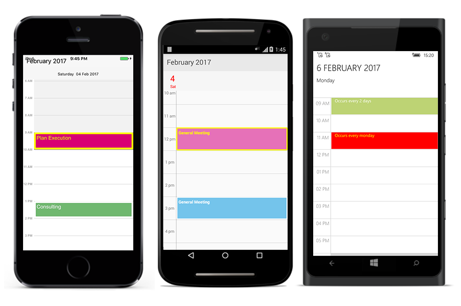
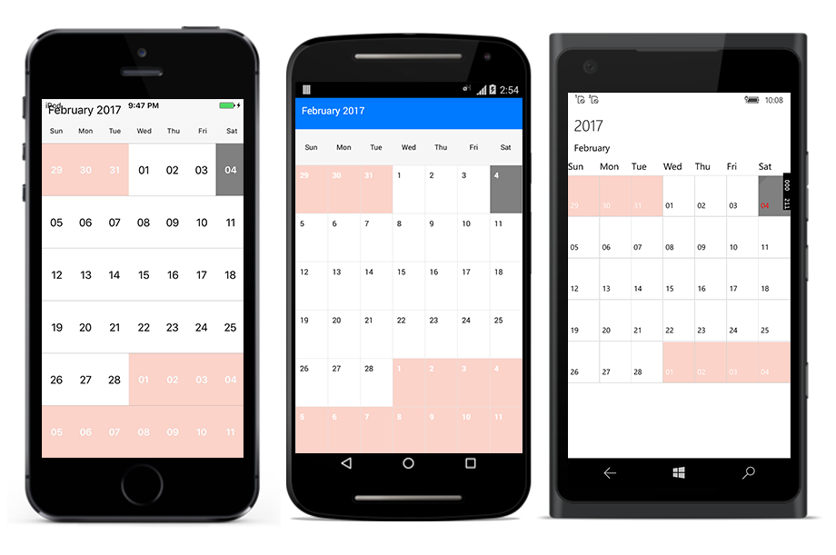
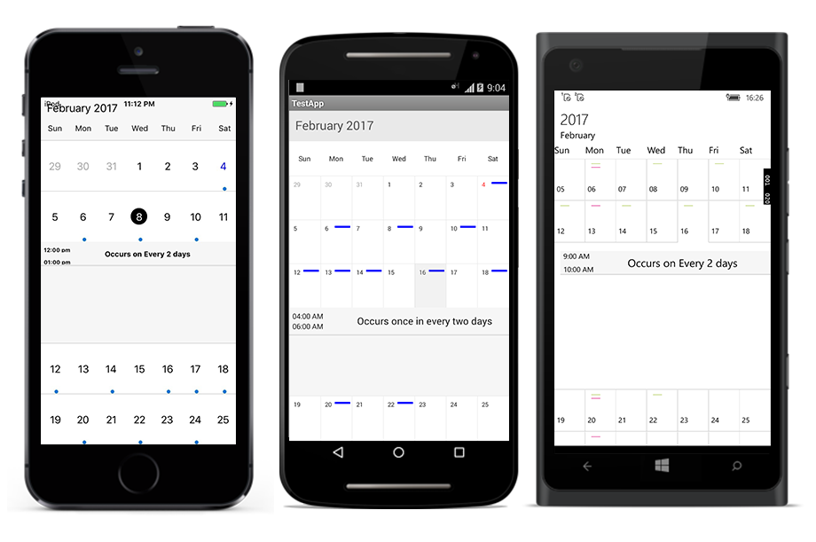
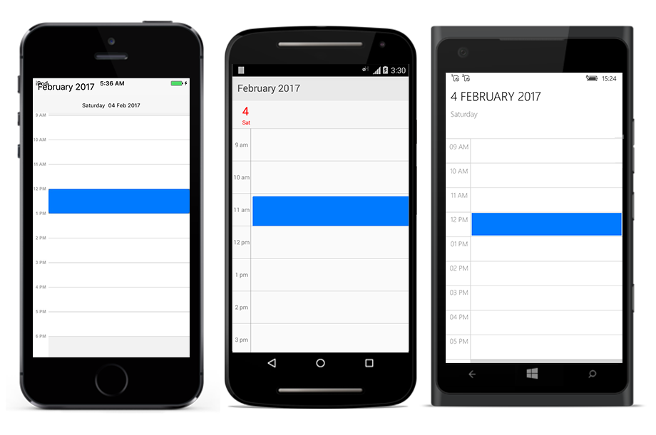

# View Customization

## Appointment Customization.

`ScheduleAppointment` created in schedule are arranged based on its duration, where the appointments viewed through day, week and work week view  are positioned in the timeslots.

### Appointment Style

You can customize the Schedule Appointments in two ways.

* AppointmentStyle property.
* AppointmentLoadedEvent.

**Using AppointmentStyle property**

Schedule Appointment can be customized by setting appointment style properties such as TextColor,TextStyle,BorderColor,BorderCornerRadius,BorderWidth,SelectionBorderColor,SelectionTextColor to the `AppointmentStyle` property of schedule.





	<schedule:AppointmentStyle BorderWidth="10" 
	TextColor="Red"
	BorderCornerRadius="10" 
	TextSize="12"
	SelectionTextColor="Yellow" 
	SelectionBorderColor="Yellow"
	BorderColor="Blue">
	</schedule:AppointmentStyle>





	AppointmentStyle appointmentStyle = new AppointmentStyle();
	appointmentStyle.TextColor = Color.Red;
	appointmentStyle.TextStyle = Font.SystemFontOfSize(15,FontAttributes.Bold);
	appointmentStyle.BorderColor = Color.Blue;
	appointmentStyle.BorderCornerRadius = 12;
	appointmentStyle.BorderWidth = 10;
	appointmentStyle.SelectionBorderColor = Color.Yellow;
	appointmentStyle.SelectionTextColor = Color.Yellow;
	schedule.AppointmentStyle = appointmentStyle;





**Using AppointmentLoaded Event**

You can customize the appointment view during runtime using `OnAppointmentLoaded Event`.In OnAppointmentLoaded event, the properties such as appointmentStyle,appointment,view,Bounds are passed in the `AppointmentLoadedEventArgs`.

ScheduleAppointment can be customized using the `appointmentStyle` property.



	schedule.OnAppointmentLoadedEvent += (object sender, AppointmentLoadedEventArgs args) =>
	{
	args.appointmentStyle.TextColor = Color.Red;
	args.appointmentStyle.TextStyle = Font.SystemFontOfSize(15, FontAttributes.Bold);
	args.appointmentStyle.BorderColor = Color.Blue;
	args.appointmentStyle.BorderCornerRadius = 12;
	args.appointmentStyle.BorderWidth = 10;
	args.appointmentStyle.SelectionBorderColor = Color.Yellow;
	args.appointmentStyle.SelectionTextColor = Color.Yellow;
	};



### View

You can also add an object in the appointment view using `view` property passed through `AppointmentLoadedEventArgs`.



    schedule.OnAppointmentLoadedEvent += (object sender, AppointmentLoadedEventArgs args) =>
    {
    Button button = new Button();
    button.BackgroundColor = Color.Green;
    args.view = button;
    };



>**Note** : You can only get appointment properties such as subject,location,StartTime,EndTime,etc from the `AppointmentLoadedEventArgs`.

## MonthCell Customization

Schedule views are designed as per the native calendar control with some enriched user interface for the control interaction and usability. Month view cell contains the date along with its appointments if available. 

### MonthCell Style

You can customize the MonthView in two ways, 

* MonthViewCellStyle property.
* MonthCellLoadedEvent.

**Using MonthViewCellStyle property**

MonthView can be customized by setting monthViewCellStyle properties such as TextColor,TextStyle,BackgroundColor to the `MonthViewCellStyle` property of schedule.





	<schedule:MonthViewCellStyle BackgroundColor="Gray"
	TextSize="12" 
	TextColor="Blue">
	</schedule:MonthViewCellStyle>





	MonthViewCellStyle monthViewCellStyle = new MonthViewCellStyle();
	monthViewCellStyle.BackgroundColor = Color.Gray;
	monthViewCellStyle.TextColor = Color.Blue;
	monthViewCellStyle.TextSize = 12;
	monthViewCellStyle.TextStyle=Font.SystemFontOfSize(12, FontAttributes.Bold);
	schedule.MonthCellStyle = monthViewCellStyle;





**Using MonthCellLoaded Event**

You can customize the month view during runtime using `OnMonthCellLoaded Event`. In OnMonthCellLoaded event, the properties such as cellStyle,appointments,date,view and boolean properties such as isToday,isPreviousMonthDate,isNextMonthDate,isBlackOutDate are passed in the `MonthCellLoadedEventArgs`.

Month cells can be customized using the `cellStyle` property as follows,



    schedule.OnMonthCellLoadedEvent += (object sender, MonthCellLoadedEventArgs args) =>
    {
    if (args.isToday)
    {
    //setting Month Cell style properties
    args.cellStyle.BackgroundColor = Color.Gray;
    args.cellStyle.TextColor = Color.Blue;
    args.cellStyle.TextSize = 12;
    args.cellStyle.TextStyle = Font.SystemFontOfSize(12, FontAttributes.Bold);
    }
    if (args.isNextMonthDate)
    {
    args.cellStyle.BackgroundColor = Color.FromRgb(251, 211, 201);
    args.cellStyle.TextColor = Color.White;
    args.cellStyle.TextStyle = Font.SystemFontOfSize(15, FontAttributes.Bold);
    }
    if (args.isPreviousMonthDate)
    {
    args.cellStyle.BackgroundColor = Color.FromRgb(251, 211, 201);
    args.cellStyle.TextColor = Color.White;
    args.cellStyle.TextStyle = Font.SystemFontOfSize(15, FontAttributes.Bold);
    }

    };



### View

You can also add an object in the month cell view using `view` property passed through `MonthCellLoadedEventArgs`.



	schedule.OnMonthCellLoadedEvent += (object sender, MonthCellLoadedEventArgs args) =>
	{
	Button button = new Button();
	button.BackgroundColor = Color.Green;
	args.view = button;
	}



## Inline view Customization.

You can able to know the details of appointments in inline using `MonthAppointmentInlineTapped` event in `Schedule`.Details of the selected  appointment and the corresponding date is passed through `MonthInlineAppointmentTappedEventArgs` as `selectedAppointment` and `selectedDate` respectively.

### Inline Style

You can able to customize the inline view style using `MonthInlineLoadedEvent` of schedule.



	schedule.OnMonthInlineLoadedEvent += (object sender, MonthInlineLoadedEventArgs args) =>
	{
	MonthInlineViewStyle monthInlineViewStyle = new MonthInlineViewStyle();
	monthInlineViewStyle.BackgroundColor = Color.Gray;
	monthInlineViewStyle.TextColor = Color.Black;
	monthInlineViewStyle.TextSize = 12;
	monthInlineViewStyle.TimeTextColor = Color.Black;
	monthInlineViewStyle.TimeTextSize = 10;
	args.monthInlineViewStyle = monthInlineViewStyle;
	};



### Inline Custom View

You can also add an object in the month cell view using `View` property passed through `MonthInlineAppointmentLoadedEvent`. 

## Inline Appointment Customization

You can able to know the details of appointments in inline using `OnMonthInlineAppointmentLoadedEvent` event in `Schedule`. Details of the selected  appointment also view can be passed through `OnMonthInlineAppointmentLoadedEvent`.

## Selection

Cells can be selected using customized properties by setting `selectionStyle` property of Schedule.

### Selection Style

Cells can be selected using customized properties such as `BackgroundColor`, `BorderColor`,`BorderThickness`,`BorderCornerRadius` in the `selectionStyle` property of Schedule.



	SelectionStyle selectionStyle = new SelectionStyle();
	selectionStyle.BackgroundColor = Color.Blue;
	selectionStyle.BorderColor = Color.Yellow;
	selectionStyle.BorderThickness = 5;
	schedule.SelectionStyle = selectionStyle;



### Selection View

Also custom view can be passed using the `SelectionView` in Schedule.



	Button button = new Button();
	button.BackgroundColor=Color.Blue;
	schedule.SelectionView = button;



