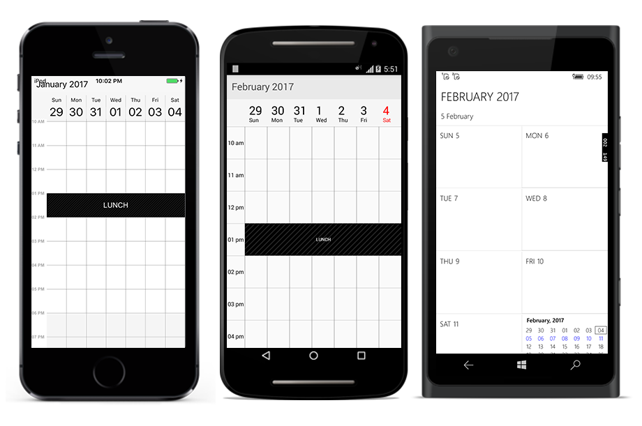
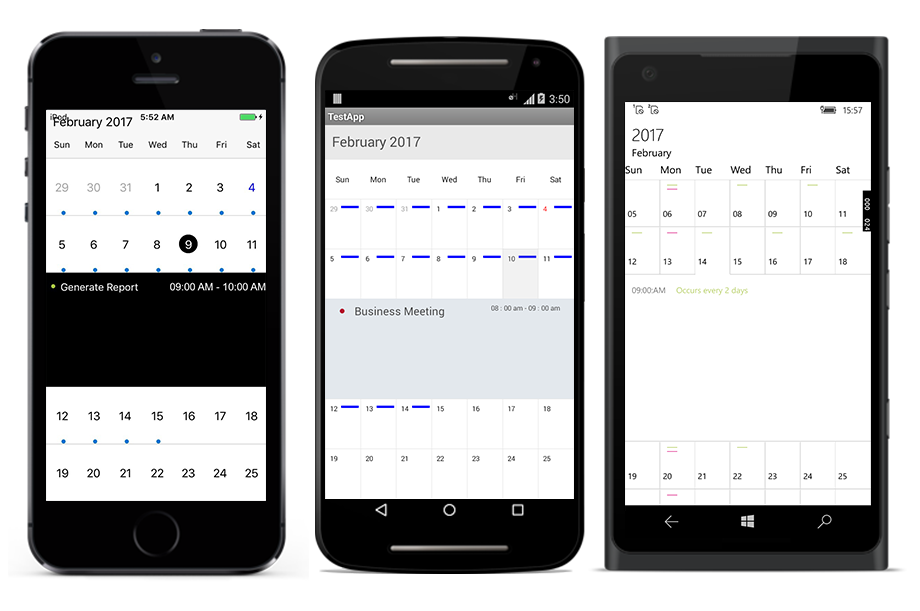
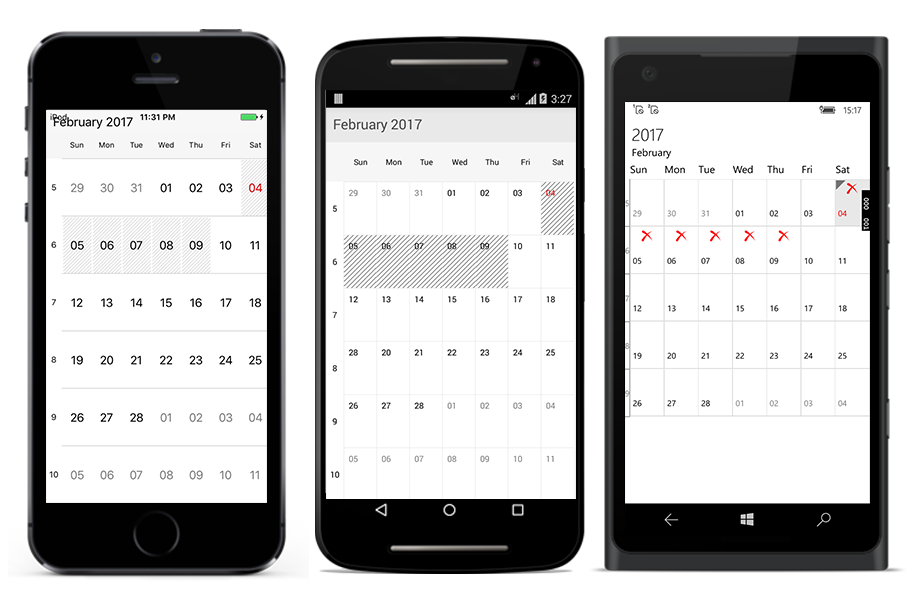

# Views

Schedule control provides four different types of views to display dates. `DayView`, `WeekView`, `WorkWeekView` and `MonthView`. It can be assigned to the schedule control by using `ScheduleView` property. Based on the user’s preference appointments can be viewed in any of the four type of view available. By default schedule control is assigned with day view.

## Day View

DayView is used to display a single day, current day will be visible by default. Appointments on a specific day will be arranged in respective timeslots based on its duration.





	<schedule:SfSchedule
	x:Name="sfschedule" 
	ScheduleView="DayView">
	</schedule:SfSchedule>





	//creating new instance for schedule
	SfSchedule sfschedule= new SfSchedule ();

	//setting schedule view
	sfschedule.ScheduleView = ScheduleView.DayView;

	this.Content= sfschedule;





### Settings

#### Date Time Formatting

You can format the time string in the schedule control using `DayLabelSettings` of `DayViewSettings`. Also you can differentiate the timeslot panel using `VerticalLineColor` and `VerticalLineStrokeWidth` properties of `DayViewSettings`.To know more about customization of timeslot panel refer [Timeslots Customization](/xamarin/sfschedule/appearance-and-styling "Timeslots Customization")





	<schedule:SfSchedule>
	<schedule:SfSchedule.DayViewSettings>
	<!--setting label formats-->
	<schedule:DayViewSettings.DayLabelSettings >
	<schedule:DayLabelSettings TimeFormat="hh a"/>
	</schedule:DayViewSettings.DayLabelSettings>
	</schedule:DayViewSettings>
	</schedule:SfSchedule.DayViewSettings>
	</schedule:SfSchedule>





	DayViewSettings dayViewSettings = new DayViewSettings();
	//setting label size and formats
	DayLabelSettings dayLabelSettings =new DayLabelSettings();
	dayLabelSettings.TimeFormat =("hh a");
	dayViewSettings.DayLabelSettings= dayLabelSettings;
	sfschedule.DayViewSettings = dayViewSettings;
	this.Content = sfschedule;

 



#### Working Hours

You can modify the working hours using `WorkStartHour` and `WorkEndHour` properties of `DayViewSettings`.

You can also differentiate working hours with non-working hour timeslots by its color using `NonWorkingHoursTimeSlotBorderColor`, `NonWorkingHoursTimeSlotColor`, `TimeSlotColor`,`TimeSlotBorderColor` and `TimeSlotBorderStrokeWidth` properties of `DayViewSettings`.To know more about customization of working hours refer [Timeslots Customization](/xamarin/sfschedule/appearance-and-styling "Timeslots Customization")





	<schedule:SfSchedule>
	<schedule:SfSchedule.DayViewSettings>
	<!--setting working hours properties -->
	<schedule:DayViewSettings
	WorkStartHour="10"
	WorkEndHour="18">
	</schedule:DayViewSettings>
	</schedule:SfSchedule.DayViewSettings>
	</schedule:SfSchedule>





	//setting working hours properties 
	DayViewSettings dayViewSettings = new DayViewSettings ();
	dayViewSettings.WorkStartHour = 10;
	dayViewSettings.WorkEndHour = 18;
	sfschedule.DayViewSettings = dayViewSettings;





#### All Day Appointments Color

You can view All Day appointments in separate panel and the panel’s visibility can be enabled by setting `ShowAllDay` property of `DayViewSettings` as true.

Also you can change the all day appointment panel color using the property `AllDayAppointmentLayoutColor`.To know more about customization of all day appointment panel [Timeslots Customization](/xamarin/sfschedule/appearance-and-styling "Timeslots Customization")





	<schedule:SfSchedule.DayViewSettings>
	<schedule:DayViewSettings
	ShowAllDay="true">
	</schedule:DayViewSettings>
	</schedule:SfSchedule.DayViewSettings>





	dayViewSettings.ShowAllDay = true;

 



>**Note**:These properties and customizations are applicable only for Day View. Customizations for other views are discussed under the respective views.

## Week View

To view all the seven days of a particular week, by default if will be current week. Appointments arranged in timeslots based on its duration with respective day of the week.





	<schedule:SfSchedule x:Name="sfschedule" 
	ScheduleView="WeekView">
	</schedule:SfSchedule>





	//creating new instance for schedule
	SfSchedule sfschedule= new SfSchedule ();

	//setting schedule view
	sfschedule.ScheduleView = ScheduleView.WeekView;

	this.Content= sfschedule;





### Settings

#### Date Time Formatting

You can format the time string in the schedule control using `WeekLabelSettings` of `WeekViewSettings`. Also you can differentiate the timeslot panel using `VerticalLineColor` and `VerticalLineStrokeWidth` properties of `WeekViewSettings`.To know more about customization of time slot panel refer [Timeslots Customization](/xamarin/sfschedule/appearance-and-styling "Timeslots Customization")





	<schedule:SfSchedule ScheduleView="WeekView">
	<schedule:SfSchedule.WeekViewSettings>
	<!--setting label formats-->
	<schedule:WeekViewSettings.WeekLabelSettings >
	<schedule:WeekLabelSettings TimeFormat="hh a"/>
	</schedule:WeekViewSettings.WeekLabelSettings>
	</schedule:WeekViewSettings>
	</schedule:SfSchedule.WeekViewSettings>
	</schedule:SfSchedule>





	WeekViewSettings weekViewSettings = new WeekViewSettings ();
	//setting label size and formats
	WeekLabelSettings weekLabelSettings = new WeekLabelSettings (); 
	weekLabelSettings.TimeFormat =("hh a");
	weekViewSettings.WeekLabelSettings = weekLabelSettings;
	sfschedule.WeekViewSettings = weekViewSettings;
	this.Content= sfschedule;





#### Working Hours

You can differentiate working hours with non-working hour timeslots by its color using `WorkStartHour` and `WorkEndHour` properties of `WeekViewSettings`.

You can also differentiate working hours with non-working hour timeslots by its color using `NonWorkingHoursTimeSlotBorderColor`, `NonWorkingHoursTimeSlotColor`, `TimeSlotColor`,`TimeSlotBorderColor` and `TimeSlotBorderStrokeWidth` properties of `WeekViewSettings`.To know more about customization of working hours refer [Timeslots Customization](/xamarin/sfschedule/appearance-and-styling "Timeslots Customization")





	<schedule:SfSchedule ScheduleView="WeekView">
	<schedule:SfSchedule.WeekViewSettings>
	<!--setting week view settings properties -->
	<schedule:WeekViewSettings
	WorkStartHour="10" 
	WorkEndHour="18">
	</schedule:WeekViewSettings>
	</schedule:SfSchedule.WeekViewSettings>
	</schedule:SfSchedule>





	//setting week view settings properties
	WeekViewSettings weekViewSettings = new WeekViewSettings ();
	weekViewSettings.WorkStartHour = 10;
	weekViewSettings.WorkEndHour = 18;
	sfschedule.WeekViewSettings = weekViewSettings;
	this.Content= sfschedule;





#### All Day Appointments Color

You can view All Day appointments in separate panel and the panel’s visibility can be enabled by setting `ShowAllDay` property of `WeekViewSettings` as true. Also you can change the all day appointment panel color using the property `AllDayAppointmentLayoutColor`.To know more about customization of all day appointment panel refer [Timeslots Customization](/xamarin/sfschedule/appearance-and-styling "Timeslots Customization")





	<schedule:SfSchedule ScheduleView="WeekView">
	<schedule:SfSchedule.WeekViewSettings>
	<!--setting week view settings properties -->
	<schedule:WeekViewSettings
	ShowAllDay="true" />
	</schedule:SfSchedule.WeekViewSettings>
	</schedule:SfSchedule>





	//setting week view settings properties
	WeekViewSettings weekViewSettings = new WeekViewSettings ();
	weekViewSettings.ShowAllDay = true;
	sfschedule.WeekViewSettings = weekViewSettings;
	this.Content= sfschedule;





## Work Week View

To view working days of a particular week, by default current work week will be displayed. Saturday and Sunday are the non-working days by default; it can be customized with any days in a WeekView. Appointments arranged in timeslots based on its duration with respective day of the week.





	<schedule:SfSchedule x:Name="sfschedule" 
	ScheduleView="WorkWeekView">
	</schedule:SfSchedule>





	//creating new instance for schedule
	SfSchedule sfschedule= new SfSchedule ();

	//setting schedule view
	sfschedule.ScheduleView = ScheduleView.WorkWeekView;

	this.Content= sfschedule;





### Settings

#### Date Time Formatting

You can format the time string in the schedule control using `WorkWeekLabelSettings` of `WorkWeekViewSettings`. 

Also you can differentiate the timeslot panel using `VerticalLineColor` and `VerticalLineStrokeWidth` properties of `WorkWeekViewSettings`.To know more about customization of time slot panel refer [Timeslots Customization](/xamarin/sfschedule/appearance-and-styling "Timeslots Customization")





	<schedule:SfSchedule ScheduleView="WorkWeekView">
	<schedule:SfSchedule.WorkWeekViewSettings>
	<!--setting label formats-->
	<schedule:WorkWeekViewSettings.WorkWeekLabelSettings >
	<schedule:WorkWeekLabelSettings TimeFormat="hh a"/>
	</schedule:WorkWeekViewSettings.WorkWeekLabelSettings>
	</schedule:WorkWeekViewSettings>
	</schedule:SfSchedule.WorkWeekViewSettings>
	</schedule:SfSchedule>





	WorkWeekViewSettings workWeekViewSettings = new WorkWeekViewSettings ();
	//setting label formats
	WorkWeekLabelSettings workWeekLabelSettings = new WorkWeekLabelSettings();
	workWeekLabelSettings.TimeFormat = "hh a";
	workWeekViewSettings.WorkWeekLabelSettings = workWeekLabelSettings;
	sfschedule.WorkWeekViewSettings = workWeekViewSettings;
	this.Content= sfschedule;





#### Working Hours

You can differentiate working hours with non-working hour timeslots by its color using `WorkStartHour` and `WorkEndHour`  properties of `WorkWeekViewSettings`.

You can also differentiate working hours with non-working hour timeslots by its color using `NonWorkingHoursTimeSlotBorderColor`, `NonWorkingHoursTimeSlotColor`, `TimeSlotColor`,`TimeSlotBorderColor` and `TimeSlotBorderStrokeWidth` properties of `WorkWeekViewSettings`.To know more about customization of time slot panel refer [Timeslots Customization](/xamarin/sfschedule/appearance-and-styling "Timeslots Customization")





	<schedule:SfSchedule ScheduleView="WorkWeekView">
	<schedule:SfSchedule.WorkWeekViewSettings>
	<!--setting workweek view settings properties -->
	<schedule:WorkWeekViewSettings 
	WorkStartHour="10" 
	WorkEndHour="18">
	</schedule:WorkWeekViewSettings>
	</schedule:SfSchedule.WorkWeekViewSettings>
	</schedule:SfSchedule>





	//setting workWeekViewSettings properties
	WorkWeekViewSettings workWeekViewSettings = new WorkWeekViewSettings ();
	workWeekViewSettings.WorkStartHour = 10;
	workWeekViewSettings.WorkEndHour = 18;
	sfschedule.WorkWeekViewSettings = workWeekViewSettings;
	this.Content= sfschedule;





#### All Day Appointments Color

You can view All Day appointments in separate panel and the panel’s visibility can be enabled by setting `ShowAllDay`  property of `WorkWeekViewSettings` as true.

Also you can change the all day appointment panel color using the property `AllDayAppointmentLayoutColor`. To know more about customization of time slot panel refer [Timeslots Customization](/xamarin/sfschedule/appearance-and-styling "Timeslots Customization")





	<schedule:SfSchedule ScheduleView="WorkWeekView">
	<schedule:SfSchedule.WorkWeekViewSettings>
	<!--setting workweek view settings properties -->
	<schedule:WorkWeekViewSettings
	ShowAllDay="true">
	</schedule:WorkWeekViewSettings>
	</schedule:SfSchedule.WorkWeekViewSettings>
	</schedule:SfSchedule>





	//setting workWeekViewSettings properties
	WorkWeekViewSettings workWeekViewSettings = new WorkWeekViewSettings ();
	workWeekViewSettings.ShowAllDay = true;
	schedule.WorkWeekViewSettings = workWeekViewSettings;
	this.Content= schedule;





## Month View

To view entire dates of a particular month, by default current month will be displayed initially. Appointments arranged within the cell based on its duration. Current date is differentiated by some color and rest of the dates in a month will be in different color., Also the color differentiation for dates will be applicable for previous and next month dates.





	<schedule:SfSchedule x:Name="schedule" 
	ScheduleView="MonthView">
	</schedule:SfSchedule>





	//creating new instance for schedule
	SfSchedule schedule= new SfSchedule ();

	//setting schedule view
	schedule.ScheduleView = ScheduleView.MonthView;

	this.Content= schedule;





### Inline

#### Show Appointments Inline 

By enabling `ShowAppointmentsInline` feature in `MonthView`, while touch the month view cell, appointments available in a particular day will be listed in inline View. 





	<schedule:SfSchedule
	x:Name="schedule" 
	ScheduleView="MonthView" 
	ShowAppointmentsInline="true" >
	</schedule:SfSchedule>





	SfSchedule schedule = new SfSchedule();
	schedule.ScheduleView = ScheduleView.MonthView;
	schedule.ShowAppointmentsInline = true;
	this.Content= schedule;





#### Inline View Customization

By enabling the Inline view feature, while tap on the schedule month view cell it will open a inline view which can be customized accordingly. To know more about Inline view customization of Month cell refer [View Customization](/xamarin-android/sfschedule/view-customization "View Customization").

#### Inline Appointment Customization

By enabling the Inline view feature, while tap on the schedule month view cell it will open a inline view which contains list of appointments on a particular day.You can customize the inline appointments. To know more about Inline appointment customization of Month cell refer [View Customization](/xamarin-android/sfschedule/view-customization "View Customization").

#### InlineAppointmentTapped Event

You can able to know the details of appointments in inline using `MonthInlineAppointmentTapped` event in `Schedule`. Details of the selected  appointment and the corresponding date is passed through `InlineAppointmentTappedEventArgs` as `selectedAppointment` and `selectedDate` respectively.



	schedule.MonthInlineAppointmentTapped += (object sender, MonthInlineAppointmentTappedEventArgs args) =>
	{
	    var appointment= args.selectedAppointment;
		var date = args.selectedDate;
	};
			


### Month Navigation Direction

`MonthView` of Schedule can be navigated horizontally and vertically.You can change the direction of navigation through `MonthNavigationDirection` property of `MonthViewSettings`.By default MonthNavigation is `Horizontal`





	<schedule:MonthViewSettings
	MonthNavigationDirection="Vertical">
	</schedule:MonthViewSettings>




	MonthViewSettings monthViewSettings = new MonthViewSettings();
	//To navigate vertically
	monthViewSettings.MonthNavigationDirection =  MonthNavigationDirections.Vertical;
	schedule.MonthViewSettings = monthViewSettings;




### Settings

#### Date Time formatting

You can format the date and day string in the schedule control using 
`MonthLabelSettings` of `MonthViewSettings`.





	<schedule:SfSchedule.MonthViewSettings >
	<!--setting label formats-->
	<schedule:MonthViewSettings.MonthLabelSettings> 
	<schedule:MonthLabelSettings 
	DayFormat="E"
	DateFormat="dd">
	</schedule:MonthLabelSettings>	
	</schedule:MonthViewSettings.MonthLabelSettings>
	</schedule:MonthViewSettings>
	</schedule:SfSchedule.MonthViewSettings>





	//setting month view settings properties
	MonthViewSettings monthViewSettings =  new MonthViewSettings();
	//setting label size and formats
	MonthLabelSettings monthLabelSettings = new MonthLabelSettings();
	monthLabelSettings.DayFormat = "E";
	monthLabelSettings. DateFormat = "dd";
	monthViewSettings.MonthLabelSettings = monthLabelSettings;
	schedule.MonthViewSettings = monthViewSettings;
	this.Content = schedule;





#### Week number

You display the week number of the year in month view by setting `ShowWeekNumber` in property of `MonthViewSettings` are true. By default it is false.





	<schedule:SfSchedule.MonthViewSettings >
	<schedule:MonthViewSettings ShowWeekNumber="False">
	</schedule:MonthViewSettings>
	</schedule:SfSchedule.MonthViewSettings>





	//setting month view settings properties
	MonthViewSettings monthViewSettings =  new MonthViewSettings();
	monthViewSettings.ShowWeekNumber = true;
	schedule.MonthViewSettings = monthViewSettings;
	this.Content = schedule;





### Month cell customization

You can customize the month cells of MonthView using various properties of `MonthCellStyle`. To know more about customization of MonthView refer [View Customization](/xamarin-android/sfschedule/view-customization "View Customization")
