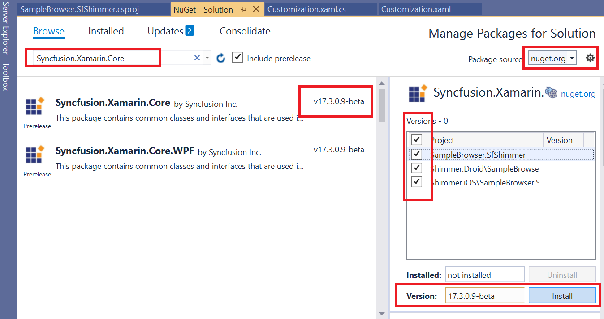

# Getting Started

This section explains the steps required to configure the shimmer.

## Adding SfShimmer reference

You can add SfShimmer reference using one of the following methods:

**Method 1: Adding SfShimmer reference from nuget.org**

Syncfusion Xamarin components are available in [nuget.org](https://www.nuget.org/). To add SfShimmer to your project, open the NuGet package manager in Visual Studio, search for [Syncfusion.Xamarin.Core](https://www.nuget.org/packages/Syncfusion.Xamarin.Core), and then install it.

N> SfShimmer supports for Android and iOS.

**Method 2: Adding SfShimmer reference from toolbox**

Syncfusion also provides Xamarin Toolbox. Using this toolbox, you can drag the SfShimmer control to the XAML page. It will automatically install the required NuGet packages and add the namespace to the page. To install Syncfusion Xamarin Toolbox, refer to [Toolbox](https://help.syncfusion.com/xamarin/utility#toolbox).

**Method 3: Adding SfShimmer assemblies manually from the installed location**

If you prefer to manually reference the assemblies instead referencing from NuGet, add the following assemblies in respective projects.

Location : {Installed location}/{version}/Xamarin/lib

<table>
<tr>
<td>PCL</td>
<td>Syncfusion.Core.XForms.dll Syncfusion.Licensing.dll </td>
</tr>
<tr>
<td>Android</td>
<td>Syncfusion.Core.XForms.dll Syncfusion.Core.XForms.Android.dll Syncfusion.Licensing.dll </td>
</tr>
<tr>
<td>iOS</td>
<td>Syncfusion.Core.XForms.dll Syncfusion.Core.XForms.iOS.dll Syncfusion.Licensing.dll </td>
</tr>
</table>

N> To know more about obtaining our components, refer to these links for [Mac](https://help.syncfusion.com/xamarin/introduction/download-and-installation/mac/) and [Windows](https://help.syncfusion.com/xamarin/introduction/download-and-installation/windows/).

I> Starting with v16.2.0.x, if you reference Syncfusion assemblies from the trial setup or from the NuGet feed, you will have to include a license key in your projects. Refer to [Syncfusion license key](https://help.syncfusion.com/common/essential-studio/licensing/license-key/) to learn about registering Syncfusion license key in your Xamarin application to use our components.

## Launching an application on each platform with SfShimmer

To use the shimmer inside an application, each platform application requires some additional configurations. The configurations vary from platform to platform and are discussed in the following sections:

N> If you are adding the references from toolbox, the following steps are not needed.

### iOS

To launch the shimmer in iOS, call the `SfShimmerRenderer.Init()` method in the FinishedLaunching overridden method of the AppDelegate class after the Xamarin.Forms framework has been initialized and before the `LoadApplication` method is called as demonstrated in the following code sample.

 

public override bool FinishedLaunching(UIApplication app, NSDictionary options)
{
    global::Xamarin.Forms.Forms.Init();
    SfShimmerRenderer.Init();
    LoadApplication(new App());
    return base.FinishedLaunching(app, options);
} 



### Android

Android platform does not require any additional configuration to render the shimmer control.

## Initializing shimmer

Import the [`SfShimmer`]() control namespace in respective page as demonstrated in the following code sample.

 

 

xmlns:shimmer="clr-namespace:Syncfusion.XForms.Shimmer;assembly=Syncfusion.Core.XForms"



 

using Syncfusion.XForms.Shimmer; 





Then initialize shimmer as shown below,

 

 

<shimmer:SfShimmer x:Name="shimmer" VerticalOptions="Fill"
                           IsLoaded="{Binding IsLoaded}">
                        <shimmer:SfShimmer.Content>
                            <StackLayout>
                                <Label Text="Content is loaded!" HorizontalOptions="CenterAndExpand" VerticalOptions="CenterAndExpand"/>
                            </StackLayout>
                        </shimmer:SfShimmer.Content>
</shimmer:SfShimmer>



 

SfShimmer shimmer = new SfShimmer();
shimmer.VerticalOptions = LayoutOptions.Fill;
shimmer.SetBinding(SfShimmer.IsLoadedProperty, "IsLoaded");

var stackLayout = new StackLayout();

var label = new Label();
label.Text = "Content is loaded!";
label.HorizontalOptions = LayoutOptions.CenterAndExpand;
label.VerticalOptions = LayoutOptions.CenterAndExpand;

stackLayout.Children.Add(label);

shimmer.Content = stackLayout;





N> The SfShimmer has different shimmer types. The default shimmer type is [`Persona`]().
