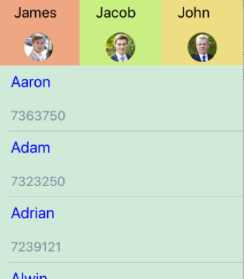

# Custom Header 

When built-in view is not needed, it can be overridden by adding custom views to the header in tabs. The tab view header can be customized by adding different views such as image, button, and label inside the header content. The following code sample demonstrates how to customize the header content as needed.

N> The selection indicator setting properties will not work when using custom header.





<ContentPage xmlns="http://xamarin.com/schemas/2014/forms"
             xmlns:x="http://schemas.microsoft.com/winfx/2009/xaml"
             xmlns:tabView="clr-namespace:Syncfusion.XForms.TabView;assembly=Syncfusion.SfTabView.XForms"
             x:Class="RangeSlider.TabView">
    <ContentPage.Content>
         <tabView:SfTabView BackgroundColor="Aqua">
            <tabView:SfTabItem Title="Call"
                               SelectionColor="Aqua">
                <tabView:SfTabItem.HeaderContent>
                    <Button
                        Text="All Calls" 
                        BackgroundColor="Yellow"
                        FontSize="10"
                        Clicked="Handle_Clicked"/>
                </tabView:SfTabItem.HeaderContent>
                <tabView:SfTabItem.Content>
                    <StackLayout>
                        <Grid BackgroundColor="Green"/>
                        <Button Text="Contacts" WidthRequest="300" />
                        <Button Text="Location" WidthRequest="300" />
                        <Button Text="Email" WidthRequest="300" />
                    </StackLayout>
                </tabView:SfTabItem.Content>
            </tabView:SfTabItem>
            <tabView:SfTabItem Title="Favorites">
                <tabView:SfTabItem.Content>
                    <Grid BackgroundColor="Green" x:Name="FavoritesGrid"/>
                </tabView:SfTabItem.Content>
            </tabView:SfTabItem>
            <tabView:SfTabItem Title="Contacts">
                <tabView:SfTabItem.Content>
                    <Grid BackgroundColor="Blue" x:Name="ContactsGrid" />
                </tabView:SfTabItem.Content>
            </tabView:SfTabItem>
        </tabView:SfTabView>
    </ContentPage.Content>
</ContentPage>





using Syncfusion.XForms.TabView;
using Xamarin.Forms;
using Xamarin.Forms.Xaml;

namespace RangeSlider
{
    [XamlCompilation(XamlCompilationOptions.Compile)]
	public partial class TabView : ContentPage
	{
        SfTabView tabView;
		public TabView ()
		{
			InitializeComponent ();
            tabView = new SfTabView();
            var allContactsGrid = new Grid { BackgroundColor = Color.Red };
            var favoritesGrid = new Grid { BackgroundColor = Color.Green };
            var contactsGrid = new Grid { BackgroundColor = Color.Blue };
            var overflowButtonSettings = new OverflowButtonSettings();
            overflowButtonSettings.BackgroundColor = Color.Yellow;
            overflowButtonSettings.DisplayMode = OverflowButtonDisplayMode.Text;
            overflowButtonSettings.TitleFontSize = 10;
            overflowButtonSettings.TitleFontColor = Color.Blue;
            tabView.OverflowButtonSettings = overflowButtonSettings;
            tabView.EnableSwiping = false;
            var allCallsButton = new Button();
            Xamarin.Forms.Button button = new Xamarin.Forms.Button() 
            { 
                Text = "All Calls",
                BackgroundColor = Color.Yellow,
                FontSize = 10 
            };

            var tabItems = new TabItemCollection
            {
                new SfTabItem()
                {
                    HeaderContent = button,
                    Content = allContactsGrid,
                    SelectionColor = Color.Red
                },
                new SfTabItem()
                {
                    Title = "Favorites",
                    Content = favoritesGrid
                },
                new SfTabItem()
                {
                    Title = "Contacts",
                    Content = contactsGrid
                }
            };
            tabView.Items = tabItems;
            this.Content = tabView;
            tabView.BackgroundColor = Color.Aqua;
            this.Content = tabView;
		}
        void Handle_Clicked(object sender, System.EventArgs e)
        {

        }
	}
}
			




The following code sample demonstrates customizing the header by adding image and label as the header content of the tab view.


<ContentPage xmlns="http://xamarin.com/schemas/2014/forms"
             xmlns:x="http://schemas.microsoft.com/winfx/2009/xaml"
             xmlns:syncfusion="clr-namespace:Syncfusion.XForms.TabView;assembly=Syncfusion.SfTabView.XForms"
             x:Class="RangeSlider.TabView">
    <ContentPage.Content>
        <syncfusion:SfTabView x:Name="tabView" 
                              TabHeight="80" 
                              BackgroundColor="#BEBEBE" 
                              EnableSwiping="False" 
                              VisibleHeaderCount="3"
                              Margin="0,40,0,0">
            <syncfusion:SfTabView.SelectionIndicatorSettings>
                <syncfusion:SelectionIndicatorSettings Color="Green" Position="Fill" StrokeThickness="4"/>
            </syncfusion:SfTabView.SelectionIndicatorSettings>
            <syncfusion:SfTabItem>
                <syncfusion:SfTabItem.HeaderContent>
                    <Grid VerticalOptions="Center"
                          BackgroundColor="#eea782" 
                          HeightRequest="400"
                          WidthRequest="500" 
                          x:Name="ChatsHeader" 
                          StyleId="ChatsHeader"
                          HorizontalOptions="Center">
                        <Grid.RowDefinitions>
                            <RowDefinition Height="Auto" />
                            <RowDefinition Height="Auto" />
                        </Grid.RowDefinitions>
                        <Label Text="James"
                               TextColor="Black"
                               FontSize="23"
                               Grid.Row="0"
                               WidthRequest="80"
                               HeightRequest="50"
                               VerticalOptions="Center"
                               HorizontalOptions="Center"/>
                        <Grid Grid.Row="1">
                            <Image HeightRequest="100"  
                                   WidthRequest="70" 
                                   Source="a0.png"/>
                        </Grid>
                    </Grid>
                </syncfusion:SfTabItem.HeaderContent>
                <syncfusion:SfTabItem.Content>
                    <Grid BackgroundColor="Yellow" x:Name="FavoritesGrid" />
                </syncfusion:SfTabItem.Content>
            </syncfusion:SfTabItem>
            <syncfusion:SfTabItem >
                <syncfusion:SfTabItem.HeaderContent>
                    <Grid VerticalOptions="Center" 
                          BackgroundColor="#C9EE82"
                          HeightRequest="400"
                          WidthRequest="500" 
                          x:Name="ChatsHeader2"
                          StyleId="ChatsHeader"
                          HorizontalOptions="Center">
                        <Grid.RowDefinitions> 
                            <RowDefinition Height="Auto" />
                            <RowDefinition Height="Auto" />
                        </Grid.RowDefinitions>
                        <Label Text="Jacob"
                               TextColor="Black"
                               FontSize="23"
                               Grid.Row="0"
                               WidthRequest="80"
                               HeightRequest="50"
                               VerticalOptions="Center"
                               HorizontalOptions="Center"/>
                        <Grid Grid.Row="1">
                            <Image HeightRequest="100" 
                                   WidthRequest="70" 
                                   Source="a2.png"/>
                        </Grid>
                    </Grid>
                    </syncfusion:SfTabItem.HeaderContent>
                <syncfusion:SfTabItem.Content>
                    <Grid BackgroundColor="Blue"
                          x:Name="ContactsGrid" />
                </syncfusion:SfTabItem.Content>
            </syncfusion:SfTabItem>
            <syncfusion:SfTabItem>
                <syncfusion:SfTabItem.HeaderContent>
                    <Grid VerticalOptions="Center" 
                          BackgroundColor="#eedd82"
                          HeightRequest="400" 
                          WidthRequest="500"
                          x:Name="ChatsHeader3"
                          StyleId="ChatsHeader"
                          HorizontalOptions="Center">
                        <Grid.RowDefinitions>
                            <RowDefinition Height="Auto" />
                            <RowDefinition Height="Auto" />
                        </Grid.RowDefinitions>
                        <Label Text="John"  
                               TextColor="Black"
                               FontSize="23" 
                               Grid.Row="0"
                               WidthRequest="80"
                               HeightRequest="50"
                               VerticalOptions="Center"
                               HorizontalOptions="Center"/>
                        <Grid Grid.Row="1">
                            <Image HeightRequest="100" 
                                   WidthRequest="70" 
                                   Source="a1.png"/>
                        </Grid>
                    </Grid>
                </syncfusion:SfTabItem.HeaderContent>
                <syncfusion:SfTabItem.Content>
                    <ListView x:Name="ContactListView" 
                              ItemsSource="{Binding ContactList}"
                              BackgroundColor="#cfead9"
                              RowHeight="100">
                        <ListView.BindingContext>
                            <local:ContactsViewModel />
                        </ListView.BindingContext>
                        <ListView.ItemTemplate>
                            <DataTemplate>
                                <ViewCell>
                                    <StackLayout Orientation="Vertical">
                                        <Label Text="{Binding Name}"
                                               FontSize="24" 
                                               TextColor="Blue" />
                                        <Label Text="{Binding Number}" 
                                               FontSize="20" 
                                               TextColor="LightSlateGray" />
                                    </StackLayout>
                                </ViewCell>
                            </DataTemplate>
                        </ListView.ItemTemplate>
                    </ListView>
                </syncfusion:SfTabItem.Content>
            </syncfusion:SfTabItem>
        </syncfusion:SfTabView>
    </ContentPage.Content>
</ContentPage>



## How to handle the events for custom view with tab view

When you use the button or similar control with the clicked event, it can be handled directly and set to the `SelectedIndex` property to navigate the clicked view.



private void Button_Clicked(object sender, System.EventArgs e)
{
 tabView.SelectedIndex = 0;
}
			


N> If the click event is not available, it can be achieved by setting the `TapGestureRecognizer` to the custom view.