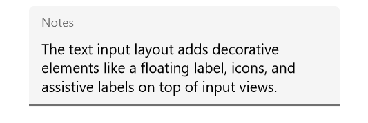

# Supported input views

Input views can be added to the text input layout by setting [InputView](https://help.syncfusion.com/cr/cref_files/xamarin/Syncfusion.Core.XForms~Syncfusion.XForms.TextInputLayout.SfTextInputLayout~InputViewProperty.html) property. In order to reduce the XAML syntax, this property applied with (ContentPropertyAttribute)[https://docs.microsoft.com/en-us/dotnet/api/xamarin.forms.contentpropertyattribute?view=xamarin-forms].

## Entry

To enter single line text input, you can add [Entry](https://docs.microsoft.com/en-us/xamarin/xamarin-forms/user-interface/text/entry).

 

 

<inputLayout:SfTextInputLayout
   Hint="Name"
   HelperText="Enter your name">
   <Entry />
</inputLayout:SfTextInputLayout>  



 

var inputLayout = new SfTextInputLayout();
inputLayout.Hint = "Name"; 
inputLayout.HelperText = "Enter your name"
inputLayout.InputView = new Entry(); 





## Editor

To enter multi line text input, you can add [Editor](https://docs.microsoft.com/en-us/xamarin/xamarin-forms/user-interface/text/editor).

 

 

<inputLayout:SfTextInputLayout
   Hint="Notes">
   <Editor />
</inputLayout:SfTextInputLayout>  



 

var inputLayout = new SfTextInputLayout();
inputLayout.Hint = "Notes"; 
inputLayout.InputView = new Editor(); 





## Masked edit

To initialize masked edit control and launch in each platform refer [getting started with masked edit](https://help.syncfusion.com/xamarin/sfmaskededit/getting-started),

 

 

<inputLayout:SfTextInputLayout
   Hint="Card number"
   HelperText="Required *">
   <maskededit:SfMaskedEdit
        Keyboard="Numeric"
        Mask="0000 0000 0000 0000" />
</inputLayout:SfTextInputLayout>  



 

var inputLayout = new SfTextInputLayout();
inputLayout.Hint = "Card number"; 
inputLayout.HelperText = "Required *"
inputLayout.InputView = new SfMaskedEdit() { Keyboard = Keyboard.Numeric, Mask = "0000 0000 0000 0000" }; 





## Numeric text box

To initialize numeric text box control and launch in each platform refer [getting started with numeric text box](https://help.syncfusion.com/xamarin/sfnumerictextbox/getting-started),

 

 

<inputLayout:SfTextInputLayout
   Hint="Amount"
   HelperText="Required *">
   <numericBox:SfNumericTextBox 
      Value="123.45"
      FormatString="c" />
</inputLayout:SfTextInputLayout>  



 

var inputLayout = new SfTextInputLayout();
inputLayout.Hint = "Amount"; 
inputLayout.HelperText = "Required *"
inputLayout.InputView = new SfNumericTextBox() { Value = 123.45, FormatString="c" }; 





