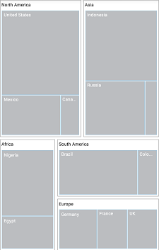

# Layout

You can decide on the visual representation of nodes belonging to all the treemap levels using the [`LayoutType`](https://help.syncfusion.com/cr/cref_files/xamarin/Syncfusion.SfTreeMap.XForms~Syncfusion.SfTreeMap.XForms.SfTreeMap~LayoutType.html) property in tree map.

There are four different layouts in tree map such as

* Squarified
* SliceAndDiceAuto
* SliceAndDiceHorizontal
* SliceAndDiceVertical

## Squarified

**Squarified** layout creates rectangles with best aspect ratio.

  



 <treemap:SfTreeMap x:Name="treeMap"  DataSource="{Binding PopulationDetails}" 
        WeightValuePath="Population" ColorValuePath="Growth" LayoutType="Squarified">
            <treemap:SfTreeMap.LeafItemSettings>
                <treemap:LeafItemSettings  Gap="2" BorderColor="#A9D9F7" LabelPath="Country" >
                </treemap:LeafItemSettings>
            </treemap:SfTreeMap.LeafItemSettings>
            <treemap:SfTreeMap.Levels>
                <treemap:TreeMapFlatLevel  HeaderHeight="20" GroupPath = "Continent" GroupGap =" 5" ShowHeader = "true">
                    <treemap:TreeMapFlatLevel.HeaderStyle>
                        <treemap:Style Color= "Black"/>
                    </treemap:TreeMapFlatLevel.HeaderStyle>
                </treemap:TreeMapFlatLevel>
            </treemap:SfTreeMap.Levels>          

        </treemap:SfTreeMap>
		


 
      
       PopulationViewModel viewModel = new PopulationViewModel();

            SfTreeMap treeMap = new SfTreeMap();
            treeMap.BackgroundColor = Color.White;
            treeMap.ColorValuePath = "Growth";
            treeMap.WeightValuePath = "Population";
            treeMap.LayoutType = LayoutTypes.Squarified;

            LeafItemSettings leafSetting = new LeafItemSettings();
            leafSetting.Gap = 2;
            leafSetting.BorderColor = Color.FromHex("#A9D9F7");
            leafSetting.LabelPath = "Country";
            treeMap.LeafItemSettings = leafSetting;

            TreeMapFlatLevel flatLevel = new TreeMapFlatLevel();
            flatLevel.HeaderHeight = 20;
            flatLevel.GroupPath = "Continent";
            flatLevel.GroupGap = 5;
            flatLevel.ShowHeader = true;
            flatLevel.HeaderStyle = new Syncfusion.SfTreeMap.XForms.Style() { Color = Color.Black };
            treeMap.Levels.Add(flatLevel);
			
            treeMap.DataSource = viewModel.PopulationDetails;
            this.Content = treeMap;



  

## SliceAndDiceAuto

**SliceAndDiceAuto** layout creates rectangles with high aspect ratio and displays them sorted both horizontally and vertically.

  



 <treemap:SfTreeMap x:Name="treeMap"  DataSource="{Binding PopulationDetails}" 
        WeightValuePath="Population" ColorValuePath="Growth" LayoutType="SliceAndDiceAuto">
            <treemap:SfTreeMap.LeafItemSettings>
                <treemap:LeafItemSettings  Gap="2" BorderColor="#A9D9F7" LabelPath="Country" >
                </treemap:LeafItemSettings>
            </treemap:SfTreeMap.LeafItemSettings>
            <treemap:SfTreeMap.Levels>
                <treemap:TreeMapFlatLevel  HeaderHeight="20" GroupPath = "Continent" GroupGap =" 5" ShowHeader = "true">
                    <treemap:TreeMapFlatLevel.HeaderStyle>
                        <treemap:Style Color= "Black"/>
                    </treemap:TreeMapFlatLevel.HeaderStyle>
                </treemap:TreeMapFlatLevel>
            </treemap:SfTreeMap.Levels>          

        </treemap:SfTreeMap>
		


 

   PopulationViewModel viewModel = new PopulationViewModel();

            SfTreeMap treeMap = new SfTreeMap();
            treeMap.BackgroundColor = Color.White;
            treeMap.ColorValuePath = "Growth";
            treeMap.WeightValuePath = "Population";
            treeMap.LayoutType = LayoutTypes.SliceAndDiceAuto;

            LeafItemSettings leafSetting = new LeafItemSettings();
            leafSetting.Gap = 2;
            leafSetting.BorderColor = Color.FromHex("#A9D9F7");
            leafSetting.LabelPath = "Country";
            treeMap.LeafItemSettings = leafSetting;

            TreeMapFlatLevel flatLevel = new TreeMapFlatLevel();
            flatLevel.HeaderHeight = 20;
            flatLevel.GroupPath = "Continent";
            flatLevel.GroupGap = 5;
            flatLevel.ShowHeader = true;
            flatLevel.HeaderStyle = new Syncfusion.SfTreeMap.XForms.Style() { Color = Color.Black };
            treeMap.Levels.Add(flatLevel);
			
            treeMap.DataSource = viewModel.PopulationDetails;
            this.Content = treeMap;



  

## SliceAndDiceHorizontal

**SliceAndDiceHorizontal** layout creates rectangles with high aspect ratio and displays them sorted horizontally.

  



 <treemap:SfTreeMap x:Name="treeMap"  DataSource="{Binding PopulationDetails}" 
        WeightValuePath="Population" ColorValuePath="Growth" LayoutType="SliceAndDiceHorizontal">
            <treemap:SfTreeMap.LeafItemSettings>
                <treemap:LeafItemSettings  Gap="2" BorderColor="#A9D9F7" LabelPath="Country" >
                </treemap:LeafItemSettings>
            </treemap:SfTreeMap.LeafItemSettings>
            <treemap:SfTreeMap.Levels>
                <treemap:TreeMapFlatLevel  HeaderHeight="20" GroupPath = "Continent" GroupGap =" 5" ShowHeader = "true">
                    <treemap:TreeMapFlatLevel.HeaderStyle>
                        <treemap:Style Color= "Black"/>
                    </treemap:TreeMapFlatLevel.HeaderStyle>
                </treemap:TreeMapFlatLevel>
            </treemap:SfTreeMap.Levels>          

        </treemap:SfTreeMap>
		


 

       PopulationViewModel viewModel = new PopulationViewModel();

            SfTreeMap treeMap = new SfTreeMap();
            treeMap.BackgroundColor = Color.White;
            treeMap.ColorValuePath = "Growth";
            treeMap.WeightValuePath = "Population";
            treeMap.LayoutType = LayoutTypes.SliceAndDiceHorizontal;

            LeafItemSettings leafSetting = new LeafItemSettings();
            leafSetting.Gap = 2;
            leafSetting.BorderColor = Color.FromHex("#A9D9F7");
            leafSetting.LabelPath = "Country";
            treeMap.LeafItemSettings = leafSetting;

            TreeMapFlatLevel flatLevel = new TreeMapFlatLevel();
            flatLevel.HeaderHeight = 20;
            flatLevel.GroupPath = "Continent";
            flatLevel.GroupGap = 5;
            flatLevel.ShowHeader = true;
            flatLevel.HeaderStyle = new Syncfusion.SfTreeMap.XForms.Style() { Color = Color.Black };
            treeMap.Levels.Add(flatLevel);
			
            treeMap.DataSource = viewModel.PopulationDetails;
            this.Content = treeMap;



  

## SliceAndDiceVertical

**SliceAndDiceVertical** layout creates rectangles with high aspect ratio and displays them sorted vertical.

  



 <treemap:SfTreeMap x:Name="treeMap"  DataSource="{Binding PopulationDetails}" 
        WeightValuePath="Population" ColorValuePath="Growth" LayoutType="SliceAndDiceVertical">
            <treemap:SfTreeMap.LeafItemSettings>
                <treemap:LeafItemSettings  Gap="2" BorderColor="#A9D9F7" LabelPath="Country" >
                </treemap:LeafItemSettings>
            </treemap:SfTreeMap.LeafItemSettings>
            <treemap:SfTreeMap.Levels>
                <treemap:TreeMapFlatLevel  HeaderHeight="20" GroupPath = "Continent" GroupGap =" 5" ShowHeader = "true">
                    <treemap:TreeMapFlatLevel.HeaderStyle>
                        <treemap:Style Color= "Black"/>
                    </treemap:TreeMapFlatLevel.HeaderStyle>
                </treemap:TreeMapFlatLevel>
            </treemap:SfTreeMap.Levels>          

        </treemap:SfTreeMap>
		


 

       PopulationViewModel viewModel = new PopulationViewModel();

            SfTreeMap treeMap = new SfTreeMap();
            treeMap.BackgroundColor = Color.White;
            treeMap.ColorValuePath = "Growth";
            treeMap.WeightValuePath = "Population";
            treeMap.LayoutType = LayoutTypes.SliceAndDiceVertical;

            LeafItemSettings leafSetting = new LeafItemSettings();
            leafSetting.Gap = 2;
            leafSetting.BorderColor = Color.FromHex("#A9D9F7");
            leafSetting.LabelPath = "Country";
            treeMap.LeafItemSettings = leafSetting;

            TreeMapFlatLevel flatLevel = new TreeMapFlatLevel();
            flatLevel.HeaderHeight = 20;
            flatLevel.GroupPath = "Continent";
            flatLevel.GroupGap = 5;
            flatLevel.ShowHeader = true;
            flatLevel.HeaderStyle = new Syncfusion.SfTreeMap.XForms.Style() { Color = Color.Black };
            treeMap.Levels.Add(flatLevel);
			
            treeMap.DataSource = viewModel.PopulationDetails;
            this.Content = treeMap;



  

