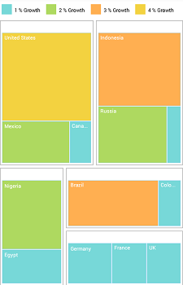
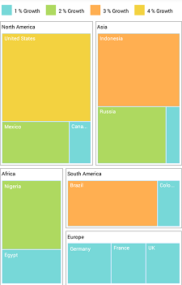
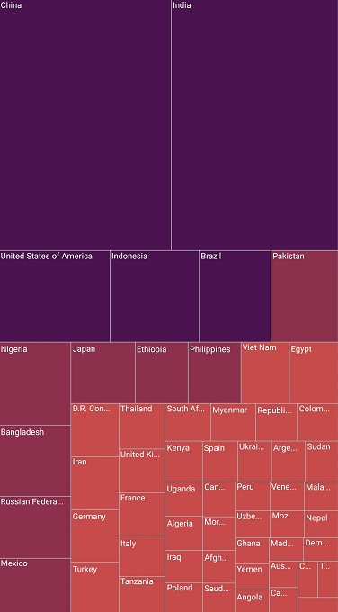
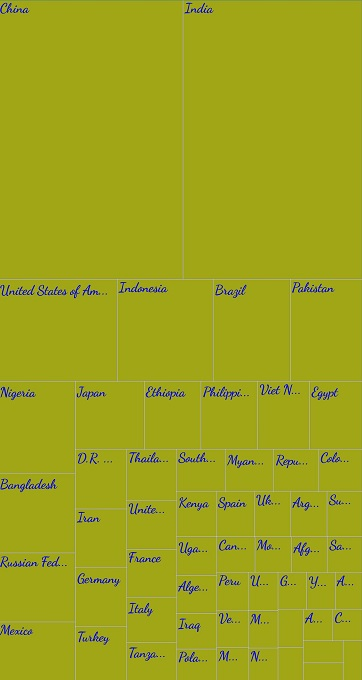

# TreeMap Elements

The TreeMap contains the following elements:

* Legends
* Headers
* Labels

## Legend

You can set the color value of leaf nodes using the [`LegendSettings`](https://help.syncfusion.com/cr/cref_files/xamarin/Syncfusion.SfTreeMap.XForms~Syncfusion.SfTreeMap.XForms.LegendSettings.html) property. This legend is appropriate only for the tree map whose leaf nodes are colored using [`RangeColorMapping`](https://help.syncfusion.com/cr/cref_files/xamarin/Syncfusion.SfTreeMap.XForms~Syncfusion.SfTreeMap.XForms.RangeColorMapping.html).

The visibility of legend can be enabled by setting the [`ShowLegend`](https://help.syncfusion.com/cr/cref_files/xamarin/Syncfusion.SfTreeMap.XForms~Syncfusion.SfTreeMap.XForms.LegendSettings~ShowLegend.html) property to true.

### TreeMap legends

You can set the size of legend icons by setting the [`IconSize`](https://help.syncfusion.com/cr/cref_files/xamarin/Syncfusion.SfTreeMap.XForms~Syncfusion.SfTreeMap.XForms.LegendSettings~IconSize.html) property of `LegendSettings` in TreeMap.

### Labels for legends

You can customize the labels of the legend items using the [`LegendLabel`](https://help.syncfusion.com/cr/cref_files/xamarin/Syncfusion.SfTreeMap.XForms~Syncfusion.SfTreeMap.XForms.Range~LegendLabel.html) property of [`RangeColorMapping`](https://help.syncfusion.com/cr/cref_files/xamarin/Syncfusion.SfTreeMap.XForms~Syncfusion.SfTreeMap.XForms.RangeColorMapping.html). 





  <treemap:SfTreeMap.LegendSettings>
                <treemap:LegendSettings ShowLegend="True"  Size="700,45">
                    <treemap:LegendSettings.LabelStyle>
                        <treemap:Style Color="Black"></treemap:Style>
                    </treemap:LegendSettings.LabelStyle>
                </treemap:LegendSettings>
            </treemap:SfTreeMap.LegendSettings>

 



        LegendSettings legendSettings = new LegendSettings();
            legendSettings.ShowLegend = true;
            legendSettings.Size = new Size(700, 45);
            legendSettings.LabelStyle = new Syncfusion.SfTreeMap.XForms.Style() { Color = Color.Black };
            treeMap.LegendSettings = legendSettings;



 

## Header

You can set headers for each level by setting the [`ShowHeader`](https://help.syncfusion.com/cr/cref_files/xamarin/Syncfusion.SfTreeMap.XForms~Syncfusion.SfTreeMap.XForms.TreeMapLevel~ShowHeader.html) property of each **TreeMap** level. The [`HeaderHeight`](https://help.syncfusion.com/cr/cref_files/xamarin/Syncfusion.SfTreeMap.XForms~Syncfusion.SfTreeMap.XForms.TreeMapLevel~HeaderHeight.html) property helps you set the height of header, and the [`GroupPath`](https://help.syncfusion.com/cr/cref_files/xamarin/Syncfusion.SfTreeMap.XForms~Syncfusion.SfTreeMap.XForms.TreeMapFlatLevel~GroupPath.html) value determines the header value. 





 <treemap:SfTreeMap.Levels>
                <treemap:TreeMapFlatLevel  HeaderHeight="20" GroupPath = "Continent" GroupGap =" 5" ShowHeader = "true">
                    <treemap:TreeMapFlatLevel.HeaderStyle>
                        <treemap:Style Color= "Black"/>
                    </treemap:TreeMapFlatLevel.HeaderStyle>
                </treemap:TreeMapFlatLevel>
            </treemap:SfTreeMap.Levels>

 



            TreeMapFlatLevel flatLevel = new TreeMapFlatLevel();
            flatLevel.HeaderHeight = 20;
            flatLevel.GroupPath = "Continent";
            flatLevel.GroupGap = 5;
            flatLevel.ShowHeader = true;
            flatLevel.HeaderStyle = new Syncfusion.SfTreeMap.XForms.Style() { Color = Color.Black };
            treeMap.Levels.Add(flatLevel);   

 

 

## Data labels

The [`ShowLabels`](https://help.syncfusion.com/cr/cref_files/xamarin/Syncfusion.SfTreeMap.XForms~Syncfusion.SfTreeMap.XForms.LeafItemSettings~ShowLabels.html) property is used to enable or disable the labels in leaf nodes. The [`LabelPath`](https://help.syncfusion.com/cr/cref_files/xamarin/Syncfusion.SfTreeMap.XForms~Syncfusion.SfTreeMap.XForms.LeafItemSettings~LabelPath.html) property allows you to set values to labels.





            <treeMap:SfTreeMap.LeafItemSettings>
                <treeMap:LeafItemSettings  LabelPath="Country" ShowLabels="True">
                </treeMap:LeafItemSettings>
            </treeMap:SfTreeMap.LeafItemSettings>





            treeMap.LeafItemSettings.ShowLabels = true;
            treeMap.LeafItemSettings.LabelPath = "Country";
 

 

### Avoid overlap in data labels

The [`OverflowMode`](https://help.syncfusion.com/cr/cref_files/xamarin/Syncfusion.SfTreeMap.XForms~Syncfusion.SfTreeMap.XForms.LeafItemSettings~OverflowMode.html) property aligns data labels within leaf node boundaries using the `Trim`, `Wrap`, and `Hide` options. The default value of the `OverflowMode` property is Trim.

#### Trim

You can trim the data labels inside the leaf node boundaries using the `Trim` option.





            <treeMap:SfTreeMap.LeafItemSettings>
                <treeMap:LeafItemSettings  LabelPath="Country" OverFlowMode="Trim">
                </treeMap:LeafItemSettings>
            </treeMap:SfTreeMap.LeafItemSettings>





    treeMap.LeafItemSettings.OverFlowMode = LabelOverflowMode.Trim;
 



#### Wrap

You can wrap the data labels inside the leaf node boundaries using the `Wrap` option.





            <treeMap:SfTreeMap.LeafItemSettings>
                <treeMap:LeafItemSettings  LabelPath="Country" OverFlowMode="Wrap">
                </treeMap:LeafItemSettings>
            </treeMap:SfTreeMap.LeafItemSettings>





    treeMap.LeafItemSettings.OverFlowMode = LabelOverflowMode.Wrap;
 



#### Hide

You can hide the data labels inside the leaf node boundaries using the `Hide` option. 





            <treeMap:SfTreeMap.LeafItemSettings>
                <treeMap:LeafItemSettings  LabelPath="Country" OverFlowMode="Hide">
                </treeMap:LeafItemSettings>
            </treeMap:SfTreeMap.LeafItemSettings>





    treeMap.LeafItemSettings.OverFlowMode = LabelOverflowMode.Hide;
 



### Customize data labels

You can customize the data labels using the [`LabelStyle`](https://help.syncfusion.com/cr/cref_files/xamarin/Syncfusion.SfTreeMap.XForms~Syncfusion.SfTreeMap.XForms.LeafItemSettings~LabelStyle.html) property of LeafItemSettings. The font color, font size, font attribute, and font family can be customized using the `Color`, `FontSize`, `FontAttributes`, and `FontFamily` properties.





            <treeMap:SfTreeMap.LeafItemSettings>
                <treeMap:LeafItemSettings  LabelPath="Country" OverFlowMode="Trim">
                    <treeMap:LeafItemSettings.LabelStyle>
                        <treeMap:Style Color="Blue" FontSize="15" FontAttributes="Bold">
                            <treeMap:Style.FontFamily>
                                <OnPlatform x:TypeArguments="x:String" iOS="Chalkduster" Android="cursive" WinPhone="Chiller" />
                            </treeMap:Style.FontFamily>
                        </treeMap:Style>
                    </treeMap:LeafItemSettings.LabelStyle>
                </treeMap:LeafItemSettings>
            </treeMap:SfTreeMap.LeafItemSettings>





            treeMap.LeafItemSettings.LabelStyle.FontSize = 15;
            treeMap.LeafItemSettings.LabelStyle.FontAttributes = FontAttributes.Bold;
            treeMap.LeafItemSettings.LabelStyle.FontFamily = Device.RuntimePlatform == Device.iOS ? "Chalkduster" : Device.RuntimePlatform == Device.Android ? "cursive" : "Chiller";
            treeMap.LeafItemSettings.LabelStyle.Color = Color.Blue;
 




