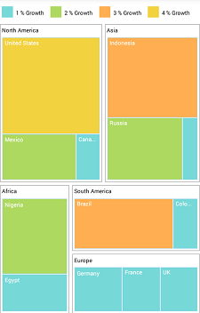
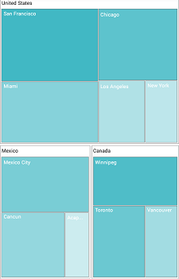

# TreeMap Levels

The levels of tree map can be categorized into the following two types:

* Flat level
* Hierarchical level

## Flat Level

### GroupPath

You can use the [`GroupPath`](https://help.syncfusion.com/cr/cref_files/xamarin/Syncfusion.SfTreeMap.XForms~Syncfusion.SfTreeMap.XForms.TreeMapFlatLevel~GroupPath.html) property for every flat level in the TreeMap control. It is a path to a field on the source object that serves as “Group” for the level specified. You can group the data based on the `GroupPath` property. When `GroupPath` is not specified, the items will not be grouped, and the data will be displayed in the order specified in [`DataSource`](https://help.syncfusion.com/cr/cref_files/xamarin/Syncfusion.SfTreeMap.XForms~Syncfusion.SfTreeMap.XForms.SfTreeMap~DataSource.html).

### GroupGap

You can use the [`GroupGap`](https://help.syncfusion.com/cr/cref_files/xamarin/Syncfusion.SfTreeMap.XForms~Syncfusion.SfTreeMap.XForms.TreeMapFlatLevel~GroupGap.html) property to separate items from every flat level and differentiate the levels mentioned in the TreeMap control.

  



 <treemap:SfTreeMap x:Name="treeMap"  DataSource="{Binding PopulationDetails}" WeightValuePath="Population" ColorValuePath="Growth">
            <treemap:SfTreeMap.LeafItemSettings>
                <treemap:LeafItemSettings  Gap="2" BorderColor="#A9D9F7" LabelPath="Country" >
                </treemap:LeafItemSettings>
            </treemap:SfTreeMap.LeafItemSettings>
            <treemap:SfTreeMap.Levels>
                <treemap:TreeMapFlatLevel  HeaderHeight="20" GroupPath = "Continent" GroupGap =" 5" ShowHeader = "true">
                </treemap:TreeMapFlatLevel>
            </treemap:SfTreeMap.Levels>

            <treemap:SfTreeMap.LegendSettings>
                <treemap:LegendSettings ShowLegend="True"  Size="700,45">
                    <treemap:LegendSettings.LabelStyle>
                        <treemap:Style Color="Black"></treemap:Style>
                    </treemap:LegendSettings.LabelStyle>
                </treemap:LegendSettings>
            </treemap:SfTreeMap.LegendSettings>

            <treemap:SfTreeMap.LeafItemColorMapping>
                <treemap:RangeColorMapping>
                    <treemap:RangeColorMapping.Ranges>
                        <treemap:Range LegendLabel = "1 % Growth" From = "0" To = "1" Color =  "#77D8D8"  />
                        <treemap:Range LegendLabel = "2 % Growth" From = "0" To = "2" Color =  "#AED960"  />
                        <treemap:Range LegendLabel = "3 % Growth" From = "0" To = "3" Color =  "#FFAF51"  />
                        <treemap:Range LegendLabel = "4 % Growth" From = "0" To = "4" Color =  "#F3D240"  />
                    </treemap:RangeColorMapping.Ranges>
                </treemap:RangeColorMapping>
            </treemap:SfTreeMap.LeafItemColorMapping>

        </treemap:SfTreeMap>



  

    PopulationViewModel viewModel = new PopulationViewModel();
            
            SfTreeMap treeMap = new SfTreeMap();
            treeMap.DataSource = viewModel.PopulationDetails;
            treeMap.ColorValuePath = "Growth";
            treeMap.WeightValuePath = "Population";

            LeafItemSettings leafSetting = new LeafItemSettings();
            leafSetting.Gap = 2;
            leafSetting.BorderColor = Color.FromHex("#A9D9F7");
            leafSetting.LabelPath = "Country";
            treeMap.LeafItemSettings = leafSetting;

            TreeMapFlatLevel flatLevel = new TreeMapFlatLevel();
            flatLevel.HeaderHeight = 20;
            flatLevel.GroupPath = "Continent";
            flatLevel.GroupGap = 5;
            flatLevel.ShowHeader = true;
            treeMap.Levels.Add(flatLevel);

            LegendSettings legendSettings = new LegendSettings();
            legendSettings.ShowLegend = true;
            legendSettings.Size = new Size(700, 45);
            legendSettings.LabelStyle = new Syncfusion.SfTreeMap.XForms.Style() { Color = Color.Black };
            treeMap.LegendSettings = legendSettings;

            RangeColorMapping rangeColorMapping = new RangeColorMapping();

            Range range1 = new Range();
            range1.From = 0;
            range1.To = 1;
            range1.Color = Color.FromHex("#77D8D8");
            range1.LegendLabel = "1 % Growth";

            Range range2 = new Range();
            range2.From = 0;
            range2.To = 2;
            range2.Color = Color.FromHex("#AED960");
            range2.LegendLabel = "2 % Growth";

            Range range3 = new Range();
            range3.From = 0;
            range3.To = 3;
            range3.Color = Color.FromHex("#FFAF51");
            range3.LegendLabel = "3 % Growth";

            Range range4 = new Range();
            range4.From = 0;
            range4.To = 4;
            range4.Color = Color.FromHex("#F3D240");
            range4.LegendLabel = "4 % Growth";

            rangeColorMapping.Ranges.Add(range1);
            rangeColorMapping.Ranges.Add(range2);
            rangeColorMapping.Ranges.Add(range3);
            rangeColorMapping.Ranges.Add(range4);

            treeMap.LeafItemColorMapping = rangeColorMapping;

            this.Content = treeMap;



  

## Hierarchical Level

Hierarchical level is used to define levels for hierarchical data collection that contains tree-structured data.

  



<ContentPage.BindingContext>
        <local:CountrySalesCollection></local:CountrySalesCollection>
    </ContentPage.BindingContext>

  <treemap:SfTreeMap  x:Name="TreeMap"  HorizontalOptions="FillAndExpand" DataSource="{Binding CountrySales}"
      VerticalOptions="FillAndExpand" WeightValuePath="Sales" ColorValuePath="Expense" BackgroundColor="White"   >

            <treemap:SfTreeMap.LeafItemSettings>
                <treemap:LeafItemSettings LabelPath="Name"/>
            </treemap:SfTreeMap.LeafItemSettings>

            <treemap:SfTreeMap.LeafItemColorMapping>
                <treemap:DesaturationColorMapping Color="#41B8C4" From="1" To=" 0.2"/>
            </treemap:SfTreeMap.LeafItemColorMapping>

            <treemap:SfTreeMap.Levels>

                <treemap:TreeMapHierarchicalLevel  ChildPadding="4" ChildBackground="White" ShowHeader = "true"  HeaderHeight = "20" 
                                                   HeaderPath = "Name"  ChildPath = "RegionalSales" >
                    
                    <treemap:TreeMapHierarchicalLevel.HeaderStyle>
                        <treemap:Style Color= "Black"/>
                    </treemap:TreeMapHierarchicalLevel.HeaderStyle>
                    
                </treemap:TreeMapHierarchicalLevel>

            </treemap:SfTreeMap.Levels>

        </treemap:SfTreeMap>



  

                     SfTreeMap tree = new SfTreeMap ();
		             tree.WeightValuePath = "Sales";
                     tree.DataSource = new CountrySalesCollection ();
                     
       public CountrySalesCollection()
		{
			this.Add(new CountrySale() { Name = "United States", Sales = 98456, Expense = 87000 });
			this.Add(new CountrySale() { Name = "Canada", Sales = 43523, Expense = 40000 });
			this.Add(new CountrySale() { Name = "Mexico", Sales = 45634, Expense = 46000 });

			this[0].RegionalSales.Add(new RegionSale() { Country = "United States", Name = "New York", Sales = 2353, Expense = 2000 });
			this[0].RegionalSales.Add(new RegionSale() { Country = "United States", Name = "Los Angeles", Sales = 3453, Expense = 3000 });
			this[0].RegionalSales.Add(new RegionSale() { Country = "United States", Name = "San Francisco", Sales = 8456, Expense = 8000 });
			this[0].RegionalSales.Add(new RegionSale() { Country = "United States", Name = "Chicago", Sales = 6785, Expense = 7000 });
			this[0].RegionalSales.Add(new RegionSale() { Country = "United States", Name = "Miami", Sales = 7045, Expense = 6000 });

			this[1].RegionalSales.Add(new RegionSale() { Country = "Canada", Name = "Toronto", Sales = 7045, Expense = 7000 });
			this[1].RegionalSales.Add(new RegionSale() { Country = "Canada", Name = "Vancouver", Sales = 4352, Expense = 4000 });
			this[1].RegionalSales.Add(new RegionSale() { Country = "Canada", Name = "Winnipeg", Sales = 7843, Expense = 7500 });

			this[2].RegionalSales.Add(new RegionSale() { Country = "Mexico", Name = "Mexico City", Sales = 7843, Expense = 6500 });
			this[2].RegionalSales.Add(new RegionSale() { Country = "Mexico", Name = "Cancun", Sales = 6683, Expense = 6000 });
			this[2].RegionalSales.Add(new RegionSale() { Country = "Mexico", Name = "Acapulco", Sales = 2454, Expense = 2000 });
		}



  

