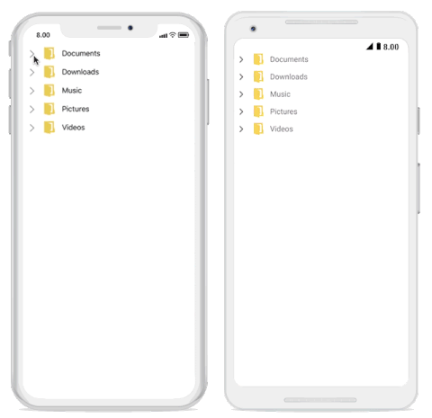

# Appearance

The TreeView allows customizing appearance of the underlying data, and provides different functionalities to the end-user.

## ItemTemplate

A template can be used to present the data in a way that makes sense for the application by using different controls.

The TreeView allows you to customize the appearance of content view and expander view by setting the [ItemTemplate](https://help.syncfusion.com/cr/xamarin/Syncfusion.SfTreeView.XForms~Syncfusion.XForms.TreeView.SfTreeView~ItemTemplate.html) and [ExpanderTemplate](https://help.syncfusion.com/cr/xamarin/Syncfusion.SfTreeView.XForms~Syncfusion.XForms.TreeView.SfTreeView~ExpanderTemplate.html) properties.

                                             


<?xml version="1.0" encoding="utf-8" ?>
<ContentPage xmlns:syncfusion="clr-namespace:Syncfusion.XForms.TreeView;assembly=Syncfusion.SfTreeView.XForms"
             xmlns:treeviewengine="clr-namespace:Syncfusion.TreeView.Engine;assembly=Syncfusion.SfTreeView.XForms"
             xmlns:local="clr-namespace:GettingStarted"
             x:Class="GettingStarted.MainPage">
    <ContentPage.BindingContext>
       <local:FileManagerViewModel x:Name="viewModel"></local:FileManagerViewModel>
    </ContentPage.BindingContext>
    <ContentPage.Content>
       <syncfusion:SfTreeView x:Name="treeView"
                              ChildPropertyName="SubFiles"
                              ItemsSource="{Binding ImageNodeInfo}"/>
             <syncfusion:SfTreeView.ItemTemplate>
                <DataTemplate>
                    <Grid Padding="5,0,0,0">
                        <Label Text="{Binding ItemName}" 
                               VerticalTextAlignment="Center"/>
                   </Grid>
                </DataTemplate>
            </syncfusion:SfTreeView.ItemTemplate>
       </syncfusion:SfTreeView>
    </ContentPage.Content>
</ContentPage>


public class MainPage : ContentPage
{
    SfTreeView treeView;
    public MainPage()
    {
        treeView = new SfTreeView();
        FileManagerViewModel viewModel = new FileManagerViewModel ();
        treeView.ChildPropertyName = "SubFiles";
        treeView.ItemsSource = viewModel.ImageNodeInfo; 
        treeView.ItemTemplate = new DataTemplate(() => {
            var grid = new Grid ();
            var itemName = new Label;
            itemName.SetBinding(Label.TextProperty, new Binding("ItemName"));
            grid.Children.Add(itemName);
            return grid;
        });
    }
}



## BindingContext for ItemTemplate

By default, the binding context of tree view item will be the data model object for Bound Mode and [TreeViewNode](https://help.syncfusion.com/cr/cref_files/xamarin/Syncfusion.SfTreeView.XForms~Syncfusion.TreeView.Engine.TreeViewNode.html) for Unbound Mode.

For Bound Mode, you can change the binding context of the treeview items by using [ItemTemplateContextType](https://help.syncfusion.com/cr/xamarin/Syncfusion.SfTreeView.XForms~Syncfusion.XForms.TreeView.SfTreeView~ItemTemplateContextType.html) property.



<?xml version="1.0" encoding="utf-8" ?>
<ContentPage xmlns:syncfusion="clr-namespace:Syncfusion.XForms.TreeView;assembly=Syncfusion.SfTreeView.XForms"
             xmlns:treeviewengine="clr-namespace:Syncfusion.TreeView.Engine;assembly=Syncfusion.SfTreeView.XForms"                          xmlns:local="clr-namespace:GettingStartedBound"
             x:Class="GettingStarted.MainPage">
    <ContentPage.BindingContext>
       <local:FileManagerViewModel x:Name="viewModel"></local:FileManagerViewModel>
    </ContentPage.BindingContext>
    <ContentPage.Content>
       <syncfusion:SfTreeView x:Name="treeView"
                              ItemTemplateContextType="Node"
                              ChildPropertyName="SubFiles"
                              ItemsSource="{Binding ImageNodeInfo}"/>
             <syncfusion:SfTreeView.ItemTemplate>
                <DataTemplate>
                    <Grid Padding="5,0,0,0">
                        <Label Text="{Binding Content.ItemName}" 
                               VerticalTextAlignment="Center"/>
                   </Grid>
                </DataTemplate>
            </syncfusion:SfTreeView.ItemTemplate>
       </syncfusion:SfTreeView>
    </ContentPage.Content>
</ContentPage>


public class MainPage : ContentPage
{
    SfTreeView treeView;
    public MainPage()
    {
        treeView = new SfTreeView();
        FileManagerViewModel viewModel = new FileManagerViewModel ();
        treeView.ChildPropertyName = "SubFiles";
        treeView.ItemTemplateContextType = ItemTemplateContextType.Node;
        treeView.ItemsSource = viewModel.ImageNodeInfo; 
        treeView.ItemTemplate = new DataTemplate(() => {
            var grid = new Grid ();
            var itemName = new Label;
            itemName.SetBinding(Label.TextProperty, new Binding("Content.ItemName"));
            grid.Children.Add(itemName);
            return grid;
        });
    }
}



Similarly, you can customize the expander view by using `ExpanderTemplate` property like above example. 

## ItemTemplate Selector

The TreeView allows you to customize the appearance of each item with different templates based on specific constraints by using the [DataTemplateSelector](https://docs.microsoft.com/en-us/dotnet/api/Xamarin.Forms.DataTemplateSelector?view=xamarin-forms). You can choose a [DataTemplate](https://docs.microsoft.com/en-us/dotnet/api/xamarin.forms.datatemplate?view=xamarin-forms) for each item at runtime based on the value of data-bound property using `DataTemplateSelector`.

### Create a data template selector

Create custom class that inherits from [DataTemplateSelector](https://docs.microsoft.com/en-us/dotnet/api/Xamarin.Forms.DataTemplateSelector?view=xamarin-forms), and override the [OnSelectTemplate](https://docs.microsoft.com/en-us/dotnet/api/xamarin.forms.datatemplateselector.onselecttemplate?view=xamarin-forms#Xamarin_Forms_DataTemplateSelector_OnSelectTemplate_System_Object_Xamarin_Forms_BindableObject_) method to return the [DataTemplate](https://docs.microsoft.com/en-us/dotnet/api/xamarin.forms.datatemplate?view=xamarin-forms) for that item. At runtime, the TreeView invokes the `OnSelectTemplate` method for each item and passes the data object as parameter.

Create different templates and by using `DataTemplateSelector`, load those templates using `OnSelectTemplate` based on requirements.



public class ItemTemplateSelector : DataTemplateSelector
{
    public DataTemplate Template1 { get; set; }
    public DataTemplate Template2 { get; set; }
    public ItemTemplateSelector()
    {
        this.Template1 = new DataTemplate(typeof(Template1));
        this.Template2 = new DataTemplate(typeof(Template2));
    }
    protected override DataTemplate OnSelectTemplate(object item, BindableObject container)
    {
        var treeviewNode = item as TreeViewNode;
        if (treeviewNode == null)
            return null;
        if (treeviewNode.Level == 0)
            return Template1;
        else
            return Template2;
    }
}



### Applying a data template selector 

Assign custom [DataTemplateSelector](https://docs.microsoft.com/en-us/dotnet/api/Xamarin.Forms.DataTemplateSelector?view=xamarin-forms) to the [ItemTemplate](https://help.syncfusion.com/cr/xamarin/Syncfusion.SfTreeView.XForms~Syncfusion.XForms.TreeView.SfTreeView~ItemTemplate.html) either in XAML or C#.

Following code example illustrates to load the different templates for treeview items using `DataTemplateSelector` based on different levels.



<ContentPage xmlns:syncfusion="clr-namespace:Syncfusion.XForms.TreeView;assembly=Syncfusion.SfTreeView.XForms"
             xmlns:treeviewengine="clr-namespace:Syncfusion.TreeView.Engine;assembly=Syncfusion.SfTreeView.XForms"
             x:Class="TemplateSelector.MainPage"
             xmlns:local="clr-namespace:TemplateSelector;assembly=TemplateSelector">
  <ContentPage.Resources>
    <ResourceDictionary>
      <local:ItemTemplateSelector x:Key="ItemTemplateSelector" />
    </ResourceDictionary>
  </ContentPage.Resources>
     <ContentPage.Content>
        <syncfusion:SfTreeView x:Name="treeView" 
                               ItemTemplate="{StaticResource ItemTemplateSelector}"/>
    </ContentPage.Content>
</ContentPage>


SfTreeView treeView = new SfTreeView();
treeView.ItemTemplate = new ItemTemplateSelector()



You can also download the entire source code of this demo from [here](http://www.syncfusion.com/downloads/support/directtrac/general/ze/TemplateSelector70341606)

Similarly, you can provide `DataTemplateSelector` for [ExpanderTemplate](https://help.syncfusion.com/cr/xamarin/Syncfusion.SfTreeView.XForms~Syncfusion.XForms.TreeView.SfTreeView~ExpanderTemplate.html) property.

## Indentation

The TreeView allows customizing the indent spacing of items by setting the [Indentation](https://help.syncfusion.com/cr/cref_files/xamarin/Syncfusion.SfTreeView.XForms~Syncfusion.XForms.TreeView.SfTreeView~Indentation.html) property. The default value of this property is `40`. This property can be customized at runtime.



<syncfusion:SfTreeView x:Name="treeView" Indentation="40">


SfTreeView treeView = new SfTreeView();
treeView.Indentation = 40; 



## ItemHeight

The TreeView allows customizing the height of items by setting the [ItemHeight](https://help.syncfusion.com/cr/cref_files/xamarin/Syncfusion.SfTreeView.XForms~Syncfusion.XForms.TreeView.SfTreeView~ItemHeight.html) property. The default value of this property is `40`. This property can be customized at runtime.



<syncfusion:SfTreeView x:Name="treeView" ItemHeight="40">


SfTreeView treeView = new SfTreeView();
treeView.ItemHeight = 40; 



## ExpanderWidth

The TreeView allows customizing the width of expander view by setting the [ExpanderWidth](https://help.syncfusion.com/cr/cref_files/xamarin/Syncfusion.SfTreeView.XForms~Syncfusion.XForms.TreeView.SfTreeView~ExpanderWidth.html) property. The default value of this property is `40`. This property can be customized at runtime.



<syncfusion:SfTreeView x:Name="treeView" ExpanderWidth="40">


SfTreeView treeView = new SfTreeView();
treeView.ExpanderWidth = 40; 



## ExpanderPosition

The TreeView allows you change the position of expander view by setting the [ExpanderPosition](https://help.syncfusion.com/cr/xamarin/Syncfusion.SfTreeView.XForms~Syncfusion.XForms.TreeView.SfTreeView~ExpanderPosition.html) property. The default value of this property is `Start`.This property has following two positions:

* `Start`: Allows displaying the expander view at the start position.
* `End`: Allows displaying the expander view at the end position.



<syncfusion:SfTreeView x:Name="treeView" ExpanderPosition="End">


SfTreeView treeView = new SfTreeView();
treeView.ExpanderPosition = ExpanderPosition.End;; 



## Level based styling

The TreeView allows you to customize the style of `TreeViewItem` based on different levels by using [IValueConverter](https://docs.microsoft.com/en-us/dotnet/api/xamarin.forms.ivalueconverter?view=xamarin-forms).



<ContentPage.Resources>
    <ResourceDictionary>
        <local:FontAttributeConverter x:Key="FontAttributeConverter"/>
    </ResourceDictionary>
</ContentPage.Resources>
<ContentPage.Content>
    <syncfusion:SfTreeView x:Name="treeView"
                           ChildPropertyName="SubFolder"
                           AutoExpandMode="AllNodesExpanded"
                           ItemTemplateContextType="Node"
                           ExpanderWidth="0"
                           ItemsSource="{Binding Folders}">
        <syncfusion:SfTreeView.ItemTemplate>
            <DataTemplate>
                <ViewCell>
                    <ViewCell.View>
                        <Label LineBreakMode="NoWrap"
                               Text="{Binding Content.FolderName}"
                               FontSize="Medium"
                               FontAttributes="{Binding Level,Converter={x:StaticResource FontAttributeConverter}}"/>
                    </ViewCell.View>
                </ViewCell>
            </DataTemplate>
        </syncfusion:SfTreeView.ItemTemplate>
    </syncfusion:SfTreeView>
</ContentPage.Content>





public class FontAttributeConverter : IValueConverter
{
    public object Convert(object value, Type targetType, object parameter, CultureInfo culture)
    {
        var level = (int)value;
        return level == 0 ? FontAttributes.Bold : FontAttributes.Italic;
    }

    public object ConvertBack(object value, Type targetType, object parameter, CultureInfo culture)
    {
        throw new NotImplementedException();
    }
}



Now, run the application to render the below output:

You can also download the entire source code of this demo from [here](http://www.syncfusion.com/downloads/support/directtrac/general/ze/Styling239740457).

## Animation

The `SfTreeView` supports to animate expanding or collapsing the [TreeViewNode](https://help.syncfusion.com/cr/cref_files/xamarin/Syncfusion.SfTreeView.XForms~Syncfusion.TreeView.Engine.TreeViewNode.html). To enable/disable the animation use [IsAnimationEnabled](https://help.syncfusion.com/cr/cref_files/xamarin/Syncfusion.SfTreeView.XForms~Syncfusion.XForms.TreeView.SfTreeView~IsAnimationEnabled.html) property of `SfTreeView`.
 
N> The default value of the `IsAnimationEnabled` property is `false`.



<syncfusion:SfTreeView x:Name="treeView" IsAnimationEnabled="true">


SfTreeView treeView = new SfTreeView();
treeView.IsAnimationEnabled = true;



