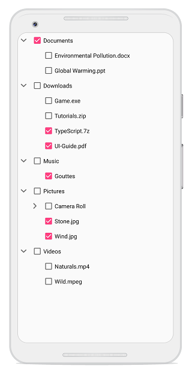
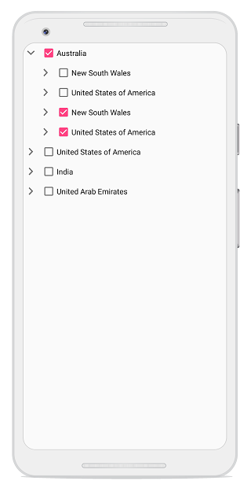

# Checkbox

SfTreeView provides support for loading [CheckBox](https://help.syncfusion.com/xamarin/sfcheckbox/getting-started) in each node, and allows users to check/uncheck the corresponding node. So, you should add checkbox in the [ItemTemplate](https://help.syncfusion.com/cr/xamarin/Syncfusion.SfTreeView.XForms~Syncfusion.XForms.TreeView.SfTreeView~ItemTemplate.html) of the `SfTreeView` and bind the [IsChecked](https://help.syncfusion.com/cr/xamarin/Syncfusion.SfTreeView.XForms~Syncfusion.TreeView.Engine.TreeViewNode~IsChecked.html) property of the [TreeViewNode](https://help.syncfusion.com/cr/cref_files/xamarin/Syncfusion.SfTreeView.XForms~Syncfusion.TreeView.Engine.TreeViewNode.html).

## Working with Checkbox in BoundMode

When you are populating treeview nodes from [ItemsSource](https://help.syncfusion.com/cr/xamarin/Syncfusion.SfTreeView.XForms~Syncfusion.XForms.TreeView.SfTreeView~ItemsSource.html), then you can get or set the checked items by using [CheckedItems](https://help.syncfusion.com/cr/xamarin/Syncfusion.SfTreeView.XForms~Syncfusion.XForms.TreeView.SfTreeView~CheckedItems.html) property.

SfTreeView supports to check multiple items through binding the [CheckedItems](https://help.syncfusion.com/cr/xamarin/Syncfusion.SfTreeView.XForms~Syncfusion.XForms.TreeView.SfTreeView~CheckedItems.html) property from view model with `ObservableCollection<object>` type.

N> Set [ItemTemplateContextType](https://help.syncfusion.com/cr/xamarin/Syncfusion.SfTreeView.XForms~Syncfusion.XForms.TreeView.SfTreeView~ItemTemplateContextType.html) as `Node` to bind the `TreeViewNode.IsChecked` property to `CheckBox` in `ItemTemplate`. To know more about `ItemTemplateContextType` click [here](https://help.syncfusion.com/xamarin/sftreeview/apperance#bindingcontext-for-itemtemplate). 

N> TreeView process and sets [TreeViewNode.IsChecked]((https://help.syncfusion.com/cr/xamarin/Syncfusion.SfTreeView.XForms~Syncfusion.TreeView.Engine.TreeViewNode~IsChecked.html)) based on `CheckedItems` only when you are binding `ItemsSource`.



<?xml version="1.0" encoding="utf-8" ?>
<ContentPage xmlns="http://xamarin.com/schemas/2014/forms"
             xmlns:x="http://schemas.microsoft.com/winfx/2009/xaml"
             xmlns:local="clr-namespace:BoundMode_CheckBox"
             x:Class="BoundMode_CheckBox.MainPage"
             xmlns:TreeView="clr-namespace:Syncfusion.XForms.TreeView;assembly=Syncfusion.SfTreeView.XForms"
             xmlns:SfButtons="clr-namespace:Syncfusion.XForms.Buttons;assembly=Syncfusion.Buttons.XForms"
             xmlns:TreeViewEngine="clr-namespace:Syncfusion.TreeView.Engine;assembly=Syncfusion.SfTreeView.XForms">

    <ContentPage.BindingContext>
        <local:FileManagerViewModel />
    </ContentPage.BindingContext>

    <TreeView:SfTreeView x:Name="SfTreeView"
                         ItemsSource="{Binding Folders}"
                         AutoExpandMode="RootNodesExpanded"
                         ItemTemplateContextType="Node"
                         CheckBoxMode="Recursive"
                         CheckedItems="{Binding CheckedItems}">
        
        <TreeView:SfTreeView.HierarchyPropertyDescriptors>
            <TreeViewEngine:HierarchyPropertyDescriptor TargetType="{x:Type local:Folder}" ChildPropertyName="Files"/>
            <TreeViewEngine:HierarchyPropertyDescriptor TargetType="{x:Type local:File}" ChildPropertyName="SubFiles"/>
        </TreeView:SfTreeView.HierarchyPropertyDescriptors>
        
        <TreeView:SfTreeView.ItemTemplate>
            <DataTemplate>
                <ViewCell>
                    <ViewCell.View>
                        <Grid Padding="5">
                            <SfButtons:SfCheckBox 
                            x:Name="CheckBox"
                            Text="{Binding Content.FileName}"
                            IsChecked="{Binding IsChecked, Mode=TwoWay}"/>
                        </Grid>
                    </ViewCell.View>
                </ViewCell>
            </DataTemplate>
        </TreeView:SfTreeView.ItemTemplate>
    </TreeView:SfTreeView>
</ContentPage>


public class FileManagerViewModel
{
    private ObservableCollection<object> checkedItems;

    public ObservableCollection<object> CheckedItems
    {
        get { return checkedItems; }
        set { this.checkedItems = value; }
    }

    public ObservableCollection<Folder> Folders { get; set; }

    public FileManagerViewModel()
    {
        this.Folders = GetFiles();
    }

    private ObservableCollection<Folder> GetFiles()
    {
        var nodeImageInfo = new ObservableCollection<Folder>();
        Assembly assembly = typeof(MainPage).GetTypeInfo().Assembly;

        var doc = new Folder() { FileName = "Documents"};
        var download = new Folder() { FileName = "Downloads",};
        var mp3 = new Folder() { FileName = "Music"};
        var pictures = new Folder() { FileName = "Pictures"};
        var video = new Folder() { FileName = "Videos"};

        var pollution = new File() { FileName = "Environmental Pollution.docx"};
        var globalWarming = new File() { FileName = "Global Warming.ppt"};

        var games = new File() { FileName = "Game.exe"};
        var tutorials = new File() { FileName = "Tutorials.zip"};
        var TypeScript = new File() { FileName = "TypeScript.7z"};
        var uiGuide = new File() { FileName = "UI-Guide.pdf"};

        var song = new File() { FileName = "Gouts"};

        var camera = new File() { FileName = "Camera Roll"};
        var stone = new File() { FileName = "Stone.jpg"};
        var wind = new File() { FileName = "Wind.jpg"};

        var img0 = new SubFile() { FileName = "WIN_20160726_094117.JPG"};
        var img1 = new SubFile() { FileName = "WIN_20160726_094118.JPG"};

        var video1 = new File() { FileName = "Naturals.mp4"};
        var video2 = new File() { FileName = "Wild.mpg"};

        doc.Files = new ObservableCollection<File>
            {
                pollution,
                globalWarming
            };

        download.Files = new ObservableCollection<File>
            {
                games,
                tutorials,
                TypeScript,
                uiGuide
            };

        mp3.Files = new ObservableCollection<File>
            {
                song
            };

        pictures.Files = new ObservableCollection<File>
            {
                camera,
                stone,
                wind
            };
        camera.SubFiles = new ObservableCollection<SubFile>
            {
                img0,
                img1
            };

        video.Files = new ObservableCollection<File>
            {
                video1,
                video2
            };

        nodeImageInfo.Add(doc);
        nodeImageInfo.Add(download);
        nodeImageInfo.Add(mp3);
        nodeImageInfo.Add(pictures);
        nodeImageInfo.Add(video);

        checkedItems = new ObservableCollection<object>();
        checkedItems.Add(doc);
        checkedItems.Add(TypeScript);
        checkedItems.Add(uiGuide);
        checkedItems.Add(stone);
        checkedItems.Add(wind);
        checkedItems.Add(song);

        return nodeImageInfo;
    }
}



You can download the entire source of this demo from [here](https://github.com/SyncfusionExamples/checkbox_bound_mode)

## Working with Checkbox in UnboundMode

You can directly set the checkbox state by setting the [TreeViewNode.IsChecked](https://help.syncfusion.com/cr/xamarin/Syncfusion.SfTreeView.XForms~Syncfusion.TreeView.Engine.TreeViewNode~IsChecked.html) property value while creating nodes.



<?xml version="1.0" encoding="utf-8" ?>
<ContentPage xmlns="http://xamarin.com/schemas/2014/forms"
             xmlns:x="http://schemas.microsoft.com/winfx/2009/xaml"
             xmlns:local="clr-namespace:UnboundMode_Checkbox"
             x:Class="UnboundMode_Checkbox.MainPage"
             xmlns:treeviewengine="clr-namespace:Syncfusion.TreeView.Engine;assembly=Syncfusion.SfTreeView.XForms"
             xmlns:SfCheckBox="clr-namespace:Syncfusion.XForms.Buttons;assembly=Syncfusion.Buttons.XForms"
             xmlns:syncfusion="clr-namespace:Syncfusion.XForms.TreeView;assembly=Syncfusion.SfTreeView.XForms">

    <ContentPage.Content>
        <syncfusion:SfTreeView CheckBoxMode="Recursive">
            <syncfusion:SfTreeView.Nodes>
                <treeviewengine:TreeViewNode Content="Australia" IsChecked="True" IsExpanded="True">
                    <treeviewengine:TreeViewNode.ChildNodes>
                        <treeviewengine:TreeViewNode x:Name="newSouthWales" Content="New South Wales">
                            <treeviewengine:TreeViewNode.ChildNodes>
                                <treeviewengine:TreeViewNode Content="Sydney"/>
                                <treeviewengine:TreeViewNode Content="New York">
                                    <treeviewengine:TreeViewNode.ChildNodes>
                                        <treeviewengine:TreeViewNode Content="San Francisco"/>
                                    </treeviewengine:TreeViewNode.ChildNodes>
                                </treeviewengine:TreeViewNode>
                            </treeviewengine:TreeViewNode.ChildNodes>
                        </treeviewengine:TreeViewNode>
                        <treeviewengine:TreeViewNode Content="United States of America">
                            <treeviewengine:TreeViewNode.ChildNodes>
                                <treeviewengine:TreeViewNode Content="New York">
                                    <treeviewengine:TreeViewNode.ChildNodes>
                                        <treeviewengine:TreeViewNode Content="San Francisco"/>
                                    </treeviewengine:TreeViewNode.ChildNodes>
                                </treeviewengine:TreeViewNode>
                                <treeviewengine:TreeViewNode Content="California">
                                    <treeviewengine:TreeViewNode.ChildNodes>
                                        <treeviewengine:TreeViewNode Content="San Francisco"/>
                                    </treeviewengine:TreeViewNode.ChildNodes>
                                </treeviewengine:TreeViewNode>
                            </treeviewengine:TreeViewNode.ChildNodes>
                        </treeviewengine:TreeViewNode>
                        <treeviewengine:TreeViewNode Content="New South Wales" IsChecked="True">
                            <treeviewengine:TreeViewNode.ChildNodes>
                                <treeviewengine:TreeViewNode Content="Sydney"/>
                                <treeviewengine:TreeViewNode Content="New York">
                                    <treeviewengine:TreeViewNode.ChildNodes>
                                        <treeviewengine:TreeViewNode Content="San Francisco"/>
                                    </treeviewengine:TreeViewNode.ChildNodes>
                                </treeviewengine:TreeViewNode>

                            </treeviewengine:TreeViewNode.ChildNodes>
                        </treeviewengine:TreeViewNode>
                        <treeviewengine:TreeViewNode Content="United States of America" IsChecked="True">
                            <treeviewengine:TreeViewNode.ChildNodes>
                                <treeviewengine:TreeViewNode Content="New York">
                                    <treeviewengine:TreeViewNode.ChildNodes>
                                        <treeviewengine:TreeViewNode Content="San Francisco"/>
                                    </treeviewengine:TreeViewNode.ChildNodes>
                                </treeviewengine:TreeViewNode>
                                <treeviewengine:TreeViewNode Content="California">
                                    <treeviewengine:TreeViewNode.ChildNodes>
                                        <treeviewengine:TreeViewNode Content="San Francisco"/>
                                    </treeviewengine:TreeViewNode.ChildNodes>
                                </treeviewengine:TreeViewNode>
                            </treeviewengine:TreeViewNode.ChildNodes>
                        </treeviewengine:TreeViewNode>
                    </treeviewengine:TreeViewNode.ChildNodes>
                </treeviewengine:TreeViewNode>
                <treeviewengine:TreeViewNode x:Name="America" Content="United States of America">
                    <treeviewengine:TreeViewNode.ChildNodes>
                        <treeviewengine:TreeViewNode Content="New York"/>
                        <treeviewengine:TreeViewNode Content="California">
                            <treeviewengine:TreeViewNode.ChildNodes>
                                <treeviewengine:TreeViewNode Content="San Francisco"/>
                            </treeviewengine:TreeViewNode.ChildNodes>
                        </treeviewengine:TreeViewNode>
                    </treeviewengine:TreeViewNode.ChildNodes>
                </treeviewengine:TreeViewNode>
                <treeviewengine:TreeViewNode x:Name="India" Content="India">
                    <treeviewengine:TreeViewNode.ChildNodes>
                        <treeviewengine:TreeViewNode Content="TamilNadu">
                            <treeviewengine:TreeViewNode.ChildNodes>
                                <treeviewengine:TreeViewNode Content="Chennai"/>
                            </treeviewengine:TreeViewNode.ChildNodes>
                        </treeviewengine:TreeViewNode>
                    </treeviewengine:TreeViewNode.ChildNodes>
                </treeviewengine:TreeViewNode>
                <treeviewengine:TreeViewNode Content="United Arab Emirates">
                    <treeviewengine:TreeViewNode.ChildNodes>
                        <treeviewengine:TreeViewNode Content="Abu Dhabi"/>
                        <treeviewengine:TreeViewNode Content="Dubai">
                            <treeviewengine:TreeViewNode.ChildNodes>
                                <treeviewengine:TreeViewNode Content="Burj Khalifa"/>
                            </treeviewengine:TreeViewNode.ChildNodes>
                        </treeviewengine:TreeViewNode>
                    </treeviewengine:TreeViewNode.ChildNodes>
                </treeviewengine:TreeViewNode>
            </syncfusion:SfTreeView.Nodes>

            <syncfusion:SfTreeView.ItemTemplate>
                <DataTemplate>
                    <ViewCell>
                        <ViewCell.View>
                            <Grid Padding="5">
                                <SfCheckBox:SfCheckBox 
                                    Text="{Binding Content}"
                                    IsChecked="{Binding IsChecked, Mode=TwoWay}" />
                            </Grid>
                        </ViewCell.View>
                    </ViewCell>
                </DataTemplate>
            </syncfusion:SfTreeView.ItemTemplate>
        </syncfusion:SfTreeView>
    </ContentPage.Content>
</ContentPage>



You can download the entire source of this demo [here](https://github.com/SyncfusionExamples/checkbox_unbound_mode)

## CheckBox State

SfTreeView process [IsChecked]((https://help.syncfusion.com/cr/xamarin/Syncfusion.SfTreeView.XForms~Syncfusion.TreeView.Engine.TreeViewNode~IsChecked.html)) property (checkbox state) of `TreeViewNode` based on [CheckBoxMode](https://help.syncfusion.com/cr/xamarin/Syncfusion.SfTreeView.XForms~Syncfusion.XForms.TreeView.SfTreeView~CheckBoxMode.html) property. `CheckBoxMode` defines how parent and child node's checkbox state updates when user check or un-check the node. By default, its value is `None`. Checkbox contains the following three states:

* `None`: Check and uncheck are updates only in the view, but it will not affect the CheckedItems collection.
* `Individual`: Checkbox state affect individual node only, and it does not affect the parent node or child nodes checkbox state or `IsChecked` property value.
* `Recursive`: Check and uncheck the node value affects the parent and child nodes checkbox state. For example, If parent nodes checkbox state is check/uncheck then the all of its child nodes checkbox state is check/uncheck. If all the child nodes are check/uncheck within the parent node, then parent node will be check/uncheck. If any of the child node is check, then the parent node will be in intermediate state.



<syncfusion:SfTreeView x:Name="TreeView" CheckBoxMode="Recursive"/>


TreeView.CheckBoxMode = CheckBoxMode.Recursive;



N> In recursive mode, the parent nodes checkbox state or `IsChecked` property value is updated only in UI interaction.

## Get or Set Checked Items

### Get or Set Checked Items in Bound Mode

You can get or set list of items to be checked or un-checked by using [CheckedItems](https://help.syncfusion.com/cr/xamarin/Syncfusion.SfTreeView.XForms~Syncfusion.XForms.TreeView.SfTreeView~CheckedItems.html) property.

When the [CheckBoxMode](https://help.syncfusion.com/cr/xamarin/Syncfusion.SfTreeView.XForms~Syncfusion.XForms.TreeView.SfTreeView~CheckBoxMode.html) is other than `None`, the individual `TreeViewNode` or collection of `TreeViewNode` can be checked from the code by setting the  `CheckedItems`, or adding items to the `CheckedItems` property based on the `CheckBoxMode`.

N> Programmatically adding or removing the node value not affects their parent and child nodes checkbox state.




treeView.CheckedItems.Add(viewModel.Folders[2]);
treeView.CheckedItems.Add(viewModel.Folders[3]);




### Get or Set Checked Nodes in Unbound Mode

You can get the list of checked nodes by using [GetCheckedNodes](https://help.syncfusion.com/cr/xamarin/Syncfusion.SfTreeView.XForms~Syncfusion.XForms.TreeView.SfTreeView~GetCheckedNodes.html) method. You can set checkbox state by setting [TreeViewNode.IsChecked](https://help.syncfusion.com/cr/xamarin/Syncfusion.SfTreeView.XForms~Syncfusion.TreeView.Engine.TreeViewNode~IsChecked.html) property.



treeView.GetCheckedNodes();



## Events

### NodeChecked event

The [NodeChecked](https://help.syncfusion.com/cr/cref_files/xamarin/Syncfusion.SfTreeView.XForms~Syncfusion.XForms.TreeView.SfTreeView~NodeChecked_EV.html) event raised when checking and unchecking the checkbox at run time. The [NodeCheckedEventArgs](https://help.syncfusion.com/cr/cref_files/xamarin/Syncfusion.SfTreeView.XForms~Syncfusion.XForms.TreeView.NodeCheckedEventArgs.html) has the following members, which provide information for the `NodeChecked` event.

* `Node`: Gets the `TreeViewNode` and data associated with the checked item as its arguments.



treeView.NodeChecked += TreeView_NodeChecked;

private void TreeView_NodeChecked(object sender, Syncfusion.XForms.TreeView.NodeCheckedEventArgs e)
{
     
}



N> `NodeChecked` event occurs only in UI interactions.
