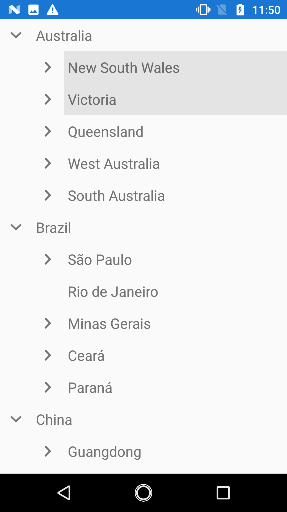

# Selection

This section explains how to perform selection and its related operations in the TreeView.
The TreeView allows selecting items either programmatically or touch interactions by setting the [SelectionMode](https://help.syncfusion.com/cr/xamarin/Syncfusion.SfTreeView.XForms~Syncfusion.XForms.TreeView.SfTreeView~SelectionMode.html) property value to other than None.

## Selection Modes

TreeView has different [SelectionModes](https://help.syncfusion.com/cr/xamarin/Syncfusion.SfTreeView.XForms~Syncfusion.XForms.TreeView.SelectionMode.html) to perform selection operations.

None: Allows disabling selection.
Single: Allows selecting single item only. When clicking on the selected item, selection not will not be cleared. This is the default value for TreeView.SelectionMode.
SingleDeselect: Allows selecting single item only. When clicking on the selected item, selection gets cleared.
Multiple: Allows selecting more than one item. Selection is not cleared when selecting more than one items. When clicking on the selected item, selection gets cleared.
Extended: Allows to select multiple items with use of keyboard and mouse interactions using shift, ctrl, navigation arrow keys and mouse.




<syncfusion:SfTreeView x:Name="TreeView" SelectionMode="Multiple"/>




TreeView.SelectionMode = SelectionMode.Multiple;




## Programmatic Selection

When the [SelectionMode](https://help.syncfusion.com/cr/xamarin/Syncfusion.SfTreeView.XForms~Syncfusion.XForms.TreeView.SfTreeView~SelectionMode.html) is other than None, the item or items in the TreeView can be selected from the code by setting the [SelectedItem](https://help.syncfusion.com/cr/xamarin/Syncfusion.SfTreeView.XForms~Syncfusion.XForms.TreeView.SfTreeView~SelectedItem.html), or adding items to the [SelectedItems](https://help.syncfusion.com/cr/xamarin/Syncfusion.SfTreeView.XForms~Syncfusion.XForms.TreeView.SfTreeView~SelectedItems.html) property based on the `SelectionMode`.

The TreeView gets all the selected items through the `SelectedItems` property and gets the single item by using the `SelectedItem` property.

W> If you select an item when `SelectionMode` is none or if you select multiple items when `SelectionMode` is single or single deselect, exception will be thrown.

### Selected Item
When the selection mode is `Single` or `SingleDeselect`, programmatically select an item by setting the underlying object to the [SelectedItem](https://help.syncfusion.com/cr/xamarin/Syncfusion.SfTreeView.XForms~Syncfusion.XForms.TreeView.SfTreeView~SelectedItem.html) property.




// CountriesViewModel.cs
 public class CountriesViewModel
    {
        public CountriesViewModel()
        {
            GenerateCountriesInfo();
        }
        public ObservableCollection<Countries> CountriesInfo { get; set; }

        public Countries SelectedPlace { get; set; }

        private void GenerateCountriesInfo()
        {
            var australia = new Countries() { Name = "Australia" };
            var _NSW = new Countries() { Name = "New South Wales" };
            var _Sydney = new Countries() { Name = "Sydney" };
            australia.States = new ObservableCollection<Countries>();
            australia.States.Add(_NSW);
            _NSW.States = new ObservableCollection<Countries>();
            _NSW.States.Add(_Sydney);
            var usa = new Countries() { Name = "United States of America" };
            var _California = new Countries() { Name = "California" };
            var _LosAngeles = new Countries() { Name = "Los Angeles" };
            usa.States = new ObservableCollection<Countries>();
            usa.States.Add(_California);
            _California.States = new ObservableCollection<Countries>();
            _California.States.Add(_LosAngeles);
         
            this.CountriesInfo = new ObservableCollection<Countries>();
            CountriesInfo.Add(australia);
            CountriesInfo.Add(usa);

            SelectedPlace=_NSW
        }
    }


  



<syncfusion:SfTreeView x:Name="treeView"
                       SelectionMode="Single"
                       ChildPropertyName="States" 
                       ItemsSource="{Binding CountriesInfo}"
                       SelectedItem="{Binding SelectedPlace}"/>
                       



treeView.SelectionMode = SelectionMode.Single;
treeView.ChildPropertyName = "States";
treeView.ItemsSource = CountriesViewModel.CountriesInfo;
treeView.SelectedItem = CountriesViewModel.SelectedPlace;




### Selected Items
When the selection mode is Multiple, programmatically select more than one item by adding the underlying object to the [SelectedItems](https://help.syncfusion.com/cr/xamarin/Syncfusion.SfTreeView.XForms~Syncfusion.XForms.TreeView.SfTreeView~SelectedItems.html) property.



// CountriesViewModel.cs
public class CountriesViewModel
{
    public CountriesViewModel()
    {
        GenerateCountriesInfo();
    }

    public ObservableCollection<Countries> CountriesInfo { get; set; }

    public ObservableCollection<object> SelectedCountries { get; set; }

    private void GenerateCountriesInfo()
    {
        var australia = new Countries() { Name = "Australia" };
        var _NSW = new Countries() { Name = "New South Wales" };
        var _Sydney = new Countries() { Name = "Sydney" };
        var _Victoria = new Countries() { Name = "Victoria" };
        australia.States = new ObservableCollection<Countries>();
        australia.States.Add(_NSW);
        australia.States.Add(_Victoria);
        _NSW.States = new ObservableCollection<Countries>();
        _NSW.States.Add(_Sydney);
        var usa = new Countries() { Name = "United States of America" };
        var _California = new Countries() { Name = "California" };
        usa.States = new ObservableCollection<Countries>();
        usa.States.Add(_California);
      
        this.CountriesInfo = new ObservableCollection<Countries>();
        CountriesInfo.Add(australia);
        CountriesInfo.Add(usa);

        SelectedCountries = new ObservableCollection<object>();
        SelectedCountries.Add(_NSW);
        SelectedCountries.Add(_Victoria);
    }
}    





<syncfusion:SfTreeView x:Name="treeView"
                       SelectionMode="Multiple"
                       ChildPropertyName="States" 
                       ItemsSource="{Binding CountriesInfo}"
                       SelectedItems="{Binding SelectedCountries}">



treeView.SelectionMode = SelectionMode.Multiple;
treeView.ChildPropertyName = "States";
treeView.ItemsSource = CountriesViewModel.CountriesInfo;
treeView.SelectedItem = CountriesViewModel.SelectedCountries;




Now, run the application to render the below output:

You can also download the entire source code of this demo from [here](http://www.syncfusion.com/downloads/support/directtrac/general/ze/Selection148873057).

### Clear selected items
The selected items can be cleared by calling the `SelectedItems.Clear()` method.




treeView.SelectedItems.Clear();




### CurrentItem 
The TreeView gets the selected item by using the [SelectedItem](https://help.syncfusion.com/cr/xamarin/Syncfusion.SfTreeView.XForms~Syncfusion.XForms.TreeView.SfTreeView~SelectedItem.html) and [CurrentItem](https://help.syncfusion.com/cr/xamarin/Syncfusion.SfTreeView.XForms~Syncfusion.XForms.TreeView.SfTreeView~CurrentItem.html) properties. Both `SelectedItem` and `CurrentItem` returns the same data object when selecting single item. When selecting more than one item, the `SelectedItem` property returns the first selected item, and the `CurrentItem` property returns the last selected item.

### Selection Events
TreeView exposes [SelectionChanging](https://help.syncfusion.com/cr/cref_files/xamarin/Syncfusion.SfTreeView.XForms~Syncfusion.XForms.TreeView.SfTreeView~SelectionChanging_EV.html) and [SelectionChanged](https://help.syncfusion.com/cr/cref_files/xamarin/Syncfusion.SfTreeView.XForms~Syncfusion.XForms.TreeView.SfTreeView~SelectionChanged_EV.html) events to handle selection process.

`SelectionChanging` is a cancelable event and it occurs while selecting items.
`SelectionChanged` events occurs once selection is completed for an item.

N> By setting Cancel property to true to cancel the `SelectionChanging` event.If event is handled Selection process for the particular gets canceled.

## Selected item customization
The TreeView supports customizing the selection color by using the [SelectionBackgroundColor](https://help.syncfusion.com/cr/cref_files/xamarin/Syncfusion.SfTreeView.XForms~Syncfusion.XForms.TreeView.SfTreeView~SelectionBackgroundColor.html) property. Additionally, for unbound mode, you can change the selection fore ground color of the text by using the [SelectionForegroundColor](https://help.syncfusion.com/cr/cref_files/xamarin/Syncfusion.SfTreeView.XForms~Syncfusion.XForms.TreeView.SfTreeView~SelectionForegroundColor.html) property.

## Keyboard Interaction
TreeView support select items with keyboard interactions with the use of shift, ctrl and navigation arrow keys selection can be performed.
