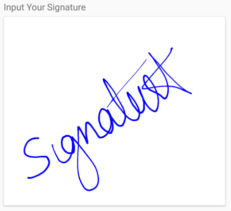

# Getting Started with SfSignaturePad

This section explains the steps required to configure the [`SfSignaturePad`].

## Adding SfSignaturePad reference

You can add the `SfSignaturePad` reference using one of the following methods:

**Method 1: Adding SfSignaturePad reference from nuget.org**

Syncfusion Xamarin components are available in [nuget.org](https://www.nuget.org/). To add `SfSignaturePad` to your project, open the NuGet package manager in Visual Studio, search for [Syncfusion.Xamarin.SfSignaturePad](https://www.nuget.org/packages/Syncfusion.Xamarin.SfSignaturePad), and then install it.

N> Install the same version of `SfSignaturePad NuGet` in all the projects.

**Method 2: Adding SfSignaturePad reference from toolbox**

Syncfusion also provides Xamarin Toolbox. Using this toolbox, you can drag the `SfSignaturePad` control to the XAML page. It will automatically install the required NuGet packages and add the namespace to the page. To install Syncfusion Xamarin Toolbox, refer to this [Toolbox](https://help.syncfusion.com/xamarin/utility#toolbox).

**Method 3: Adding SfSignaturePad assemblies manually from the installed location**

If you prefer to manually reference the assemblies instead of referencing from NuGet, add the following assemblies in respective projects.

Location: {Installed location}/{version}/Xamarin/lib

<table>
<tr>
<td>PCL</td>
<td>Syncfusion.SfSignaturePad.XForms.dll Syncfusion.Core.XForms.dll </td>
</tr>
<tr>
<td>Android</td>
<td>Syncfusion.SfSignaturePad.XForms.dll Syncfusion.SfSignaturePad.XForms.Android.dll Syncfusion.Core.XForms.dll
 Syncfusion.Core.XForms.Android.dll </td>
</tr>
<tr>
<td>iOS</td>
<td>Syncfusion.SfSignaturePad.XForms.dll Syncfusion.SfSignaturePad.XForms.iOS.dll Syncfusion.Core.XForms.dll Syncfusion.Core.XForms.iOS.dll </td>
</tr>
</table>

N> To know more about obtaining our components, refer to these links for [Mac](https://help.syncfusion.com/xamarin/introduction/download-and-installation/mac/) and [Windows](https://help.syncfusion.com/xamarin/introduction/download-and-installation/windows/).

## Launching the application on each platform with SignaturePad

To use the `SignaturePad` in an application, each platform requires some additional configurations. The configurations vary from platform to platform and is discussed in the following sections:

N> If you are adding the references from toolbox, this step is not needed.

### iOS

To launch the `SignaturePad` in iOS, call the `SfSignaturePadRenderer.Init()` in the `FinishedLaunching overridden` method of the AppDelegate class after the Xamarin.Forms framework has been initialized and before the LoadApplication is called as demonstrated in the following code sample.

 

 public override bool FinishedLaunching(UIApplication app, NSDictionary options)
 {
            global::Xamarin.Forms.Forms.Init();
            LoadApplication(new App());
            // Add below line if you are using SfSignaturePad.
            Syncfusion.XForms.iOS.SignaturePad.SfSignaturePadRenderer.Init();
            return base.FinishedLaunching(app, options);
 }



### Android

The Android platform does not require any additional configurations to render the `SfSignaturePad`.

N> `SignaturePad` support has not been provided for UWP Platform.

N> User have to install the [Nuget](https://www.nuget.org/packages/SkiaSharp.Views.Forms/2.80.0-preview.14) for `SignaturePad`.

## Adding a namespace

Add the following namespace.





    xmlns:sign="clr-namespace:Syncfusion.XForms.SignaturePad;assembly=Syncfusion.SfSignaturePad.XForms"





    using Syncfusion.XForms.SignaturePad;





## Initializing a SfSignaturePad control

Create an instance for the signature control, and add it as content.





<sign:SfSignaturePad>        
</sign:SfSignaturePad>





//Initializing the signaturepad.
SfSignaturePad sign = new SfSignaturePad();
Content = sign;
	




## Creating a SfSignaturePad control

The `SfSignaturePad` control is configured entirely in C# code or in XAML markup. The following steps explain how to create a `SfSignaturePad` and configure their elements.





<?xml version="1.0" encoding="utf-8" ?>
<ContentPage xmlns="http://xamarin.com/schemas/2014/forms"
             xmlns:x="http://schemas.microsoft.com/winfx/2009/xaml"
             xmlns:d="http://xamarin.com/schemas/2014/forms/design"
             xmlns:mc="http://schemas.openxmlformats.org/markup-compatibility/2006"
             mc:Ignorable="d"
             xmlns:sign="clr-namespace:Syncfusion.XForms.SignaturePad;assembly=Syncfusion.SfSignaturePad.XForms"
             x:Class="SfSignaturePad1.MainPage">

    <StackLayout Padding="10,40,10,10">
        <Label Text="Input Your Signature"/>
        <Frame>
            <sign:SfSignaturePad HeightRequest="250"/>
        </Frame>
    </StackLayout>

</ContentPage>





using System.ComponentModel;
using Xamarin.Forms;
using Syncfusion.XForms.SignaturePad;

namespace SfSignaturePad1
{
    // Learn more about making custom code visible in the Xamarin.Forms previewer
    // by visiting https://aka.ms/xamarinforms-previewer
    [DesignTimeVisible(false)]
    public partial class MainPage : ContentPage
    {
        public MainPage()
        {
            InitializeComponent();

            StackLayout stack = new StackLayout();
            stack.Padding = new Thickness(10, 40, 10, 10);
            Label text = new Label() { Text = "Input Your Signature" };
            Frame frame = new Frame();
            SfSignaturePad sign = new SfSignaturePad();
            sign.HeightRequest = 250;
            frame.Content = sign;
            stack.Children.Add(text);
            stack.Children.Add(frame);
            this.Content = stack;
        }
    }
}
	




You can find the complete getting started sample from this [`link`](https://github.com/SyncfusionExamples/xamarin-sfsignaturepad-examples/tree/master/Samples/SfSignaturePadGettingStarted).