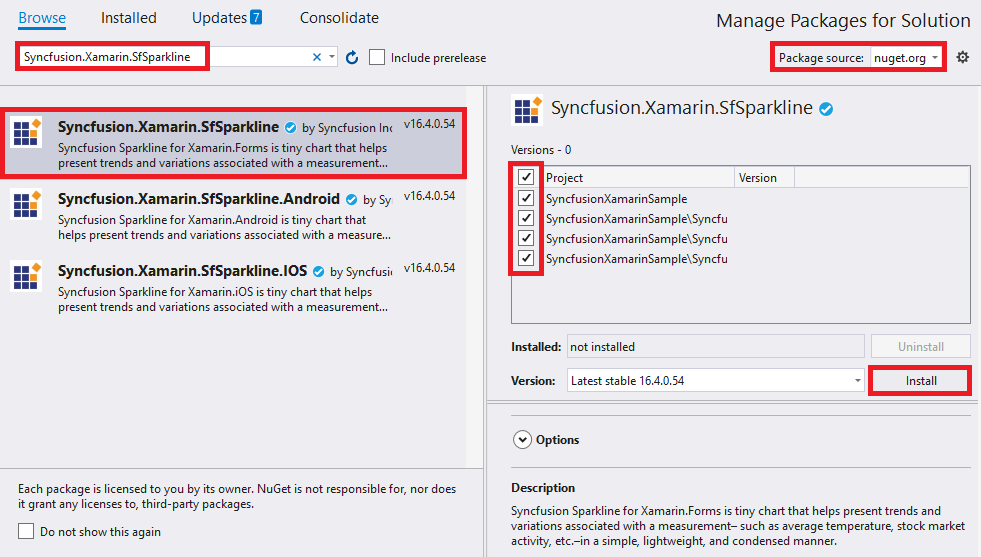

# Getting Started

This section explains you the steps required to populate the Sparkline with data. 

## Adding SfSparkline reference

You can add SfSparkline reference using one of the following methods:

**Method 1: Adding SfSparkline reference from nuget.org**

Syncfusion Xamarin components are available in [nuget.org](https://www.nuget.org/). To add SfSparkline to your project, open the NuGet package manager in Visual Studio, search for [Syncfusion.Xamarin.SfSparkline](https://www.nuget.org/packages/Syncfusion.Xamarin.SfSparkline), and then install it.

N> Install the same version of SfSparkline NuGet in all the projects.

**Method 2: Adding SfSparkline reference from toolbox**

Syncfusion also provides Xamarin Toolbox. Using this toolbox, you can drag the SfSparkline control to the XAML page. It will automatically install the required NuGet packages and add the namespace to the page. To install Syncfusion Xamarin Toolbox, refer to [Toolbox](https://help.syncfusion.com/xamarin/utility#toolbox).

**Method 3: Adding SfSparkline assemblies manually from the installed location**

If you prefer to manually reference the assemblies instead referencing from NuGet, add the following assemblies in respective projects.

Location: {Installed location}/{version}/Xamarin/lib

<table>
<tr>
<td>PCL</td>
<td>Syncfusion.SfSparkline.XForms.dll Syncfusion.Core.XForms.dll Syncfusion.Licensing.dll </td>
</tr>
<tr>
<td>Android</td>
<td>Syncfusion.SfSparkline.Android.dll Syncfusion.SfSparkline.XForms.Android.dll Syncfusion.SfSparkline.XForms.dll Syncfusion.Core.XForms.dll Syncfusion.Core.XForms.Android.dll Syncfusion.Licensing.dll </td>
</tr>
<tr>
<td>iOS</td>
<td>Syncfusion.SfSparkline.iOS.dll Syncfusion.SfSparkline.XForms.iOS.dll Syncfusion.SfSparkline.XForms.dll Syncfusion.Core.XForms.dll Syncfusion.Core.XForms.iOS.dll Syncfusion.Licensing.dll </td>
</tr>
<tr>
<td>UWP</td>
<td>Syncfusion.SfSparkline.UWP.dll Syncfusion.SfSparkline.XForms.UWP.dll Syncfusion.SfSparkline.XForms.dll Syncfusion.Core.XForms.dll Syncfusion.Core.XForms.UWP.dll Syncfusion.Licensing.dll </td>
</tr>
</table>

N> To know more about obtaining our components, refer to these links for [Mac](https://help.syncfusion.com/xamarin/introduction/download-and-installation/mac/) and [Windows](https://help.syncfusion.com/xamarin/introduction/download-and-installation/windows/).

I> Starting with v16.2.0.x, if you reference Syncfusion assemblies from the trial setup or from the NuGet feed, you also have to include a license key in your projects. Please refer to [Syncfusion license key](https://help.syncfusion.com/common/essential-studio/licensing/license-key/) to know about registering Syncfusion license key in your Xamarin application to use our components.

## Launching an application on each platform with SfSparkline.

To use the SfSparkline control inside an application, each platform requires some additional configurations. The configurations vary from platform to platform and is discussed in the following sections:

N> If you are adding the references from toolbox, this step is not needed.

### iOS

To launch the SfSparkline in iOS, call the `SfSparklineRenderer.Init()` in the `FinishedLaunching` overridden method of the AppDelegate class after the Xamarin.Forms Framework has been initialized and before the LoadApplication is called, as demonstrated in the following code example.


public override bool FinishedLaunching(UIApplication app, NSDictionary options)
{
    …
    global::Xamarin.Forms.Forms.Init ();
    Syncfusion.SfSparkline.XForms.iOS.SfSparklineRenderer.Init();
    LoadApplication (new App ());
    …
}
 

### Universal Windows Platform (UWP)

You need to initialize the sparkline view assemblies in App.xaml.cs in UWP project as demonstrated in the following code samples. This is required to deploy the application with sparkline in Release mode in UWP platform.


// In App.xaml.cs

protected override void OnLaunched(LaunchActivatedEventArgs e)
    {
        …
    	    rootFrame.NavigationFailed += OnNavigationFailed;
    
        // Add `using System.Reflection;`
        List<Assembly> assembliesToInclude = new List<Assembly>();
    
        // Now, add all the assemblies your app uses                 
        assembliesToInclude.Add(typeof(Syncfusion.SfSparkline.XForms.UWP.SfSparklineRenderer).GetTypeInfo().Assembly);
		
        // Replaces Xamarin.Forms.Forms.Init(e);        
        Xamarin.Forms.Forms.Init(e, assembliesToInclude);	
        …     
    }



### Android

The Android platform does not require any additional configuration to render the sparkline.

## Initialize view model

Now, let us define a simple data model that represents a data point in [`SfSparkline`](https://help.syncfusion.com/cr/xamarin/Syncfusion.SfSparkline.XForms.SfLineSparkline.html).


public class Model   
{   
    public double Performance { get; set; }
}
 

Next, create a view model class and initialize a list of `Model` objects as shown below,


public class ViewModel  
{
      public List<Model> Data { get; set; }      

      public ViewModel()       
      {
            Data = new List<Model>()
            {
                new Model { Performance = 3000 },
                new Model { Performance = 5000 },
                new Model { Performance = -3000 },
                new Model { Performance = -4000 },
                new Model { Performance = 2000 },
                new Model { Performance = 3000 }
            }; 
       }
 }
 

Set the `ViewModel` instance as the `BindingContext` of your Page; this is done to bind properties of `ViewModel` to [`SfSparkline`.](https://help.syncfusion.com/cr/xamarin/Syncfusion.SfSparkline.XForms.SfLineSparkline.html)
 
N> Add namespace of `ViewModel` class in your XAML page if you prefer to set `BindingContext` in XAML.

 

 
<ContentPage xmlns="http://xamarin.com/schemas/2014/forms"

             xmlns:x="http://schemas.microsoft.com/winfx/2009/xaml"

             x:Class=" SparklineDemo.MainPage"

             xmlns:sparkline="clr-namespace:Syncfusion.SfSparkline.XForms;assembly=Syncfusion.SfSparkline.XForms" 

             xmlns:local="clr-namespace:SparklineDemo">    

	<ContentPage.BindingContext>       

		<local:ViewModel></local:ViewModel>  

	</ContentPage.BindingContext>
 
</ContentPage>


 
this.BindingContext = new ViewModel();


 

## Populate Sparkline with data

Import the [`SfSparkline`](https://help.syncfusion.com/cr/xamarin/Syncfusion.SfSparkline.XForms.SfLineSparkline.html) namespace as shown below in your respective page,

   


xmlns:sparkline="clr-namespace:Syncfusion.SfSparkline.XForms;assembly=Syncfusion.SfSparkline.XForms"



using Syncfusion.SfSparkline.XForms;


 

Bind the Data property of the above `ViewModel` to the [`SfSparkline.ItemsSource`](https://help.syncfusion.com/cr/xamarin/Syncfusion.SfSparkline.XForms.SfSparklineBase.html#Syncfusion_SfSparkline_XForms_SfSparklineBase_ItemsSource) property as shown below.

N> You need to set [`YBindingPath`](https://help.syncfusion.com/cr/xamarin/Syncfusion.SfSparkline.XForms.SfSparklineBase.html#Syncfusion_SfSparkline_XForms_SfSparklineBase_YBindingPath) property, so that [`SfSparkline`](https://help.syncfusion.com/cr/xamarin/Syncfusion.SfSparkline.XForms.SfLineSparkline.html) would fetch values from the respective property in the data model to plot the Sparkline.

   


<sparkline:SfLineSparkline ItemsSource="{Binding Data}" YBindingPath="Performance"> 

</sparkline:SfLineSparkline >



SfLineSparkline lineSparkline = new SfLineSparkline(); 

lineSparkline.YBindingPath = "Performance";

lineSparkline.SetBinding(SfSparklineBase.ItemsSourceProperty, "Data");


 

You can find the complete getting started sample from this [link.](http://www.syncfusion.com/downloads/support/directtrac/general/ze/SparkLineSample295325469)

## See also

[How to resolve SfSparkline not rendering issue in iOS and UWP](https://www.syncfusion.com/kb/7713/how-to-resolve-sfsparkline-not-rendering-issue-in-ios-and-uwp)
