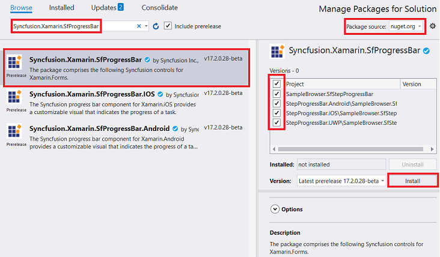

# Getting Started with Xamarin StepProgressBar (SfStepProgressBar)

This section explains the steps required to work with the StepProgressBar control for Xamarin.Forms.

## Assembly deployment

After installing [Essential Studio for Xamarin](https://www.syncfusion.com/downloads/xamarin), you can find all the required assemblies in the installation folders, {Syncfusion Essential Studio Installed location} \Essential Studio\{Version #}\Xamarin\lib.

E.g.: C:\Program Files (x86) \Syncfusion\Essential Studio\19.1.0.54\Xamarin\lib

N> Assemblies can be found in unzipped package location(Documents/Syncfusion/{Version #}/Xamarin/lib) in Mac.

## Adding SfStepProgressBar reference

You can add SfStepProgressBar reference using one of the following methods:

**Method 1: Adding SfStepProgressBar reference from nuget.org**

Syncfusion Xamarin components are available in [nuget.org](https://www.nuget.org/). To add SfStepProgressBar to your project, open the NuGet package manager in Visual Studio, search for [Syncfusion.Xamarin.SfProgressBar](https://www.nuget.org/packages/Syncfusion.Xamarin.SfProgressBar), and then install it.

N> Install the same version of SfProgressBar NuGet in all the projects.

**Method 2: Adding SfStepProgressBar reference from toolbox**

Syncfusion also provides Xamarin Toolbox. Using this toolbox, you can drag the StepProgressBar control to the XAML page. It will automatically install the required NuGet packages and add the namespace to the page. To install Syncfusion Xamarin Toolbox, refer to [Toolbox](https://help.syncfusion.com/xamarin/utility#toolbox).

**Method 3: Adding SfStepProgressBar assemblies manually from the installed location**

If you prefer to manually reference the assemblies instead referencing from the NuGet, add the following assemblies in respective projects.

Location: {Installed location}/{version}/Xamarin/lib

<table>
<tr>
<td>PCL</td>
<td>Syncfusion.SfProgressBar.XForms.dll Syncfusion.Core.XForms.dll Syncfusion.Licensing.dll </td>
</tr>
<tr>
<td>Android</td>
<td>Syncfusion.SfProgressBar.XForms.Android.dll Syncfusion.SfProgressBar.XForms.dll Syncfusion.Core.XForms.dll Syncfusion.Core.XForms.Android.dll Syncfusion.Licensing.dll </td>
</tr>
<tr>
<td>iOS</td>
<td>Syncfusion.SfProgressBar.XForms.iOS.dll Syncfusion.SfProgressBar.XForms.dll Syncfusion.Core.XForms.dll Syncfusion.Core.XForms.iOS.dll Syncfusion.Licensing.dll </td>
</tr>
<tr>
<td>UWP</td>
<td>Syncfusion.SfProgressBar.XForms.UWP.dll Syncfusion.SfProgressBar.XForms.dll Syncfusion.Core.XForms.dll Syncfusion.Core.XForms.UWP.dll Syncfusion.Licensing.dll </td>
</tr>
</table>

N> To learn more about obtaining Syncfusion components, refer to [Mac](https://help.syncfusion.com/xamarin/introduction/download-and-installation/mac/) and [Windows](https://help.syncfusion.com/xamarin/introduction/download-and-installation/windows/).

I> Starting with v16.2.0.x, if you reference Syncfusion assemblies from the trial setup or from the NuGet feed, you also have to include a license key in your projects. Refer the [Syncfusion license key](https://help.syncfusion.com/common/essential-studio/licensing/license-key/) to learn about registering Syncfusion license key in your Xamarin application to use Syncfusion components.

## Launching the application on each platform with StepProgressBar

To use the StepProgressBar in an application, each platform requires some additional configurations. The configurations vary from platform to platform and is discussed in the following sections:

N> If you are adding the references from toolbox, this step is not required.

### iOS

To launch the StepProgressBar in iOS, call the 'SfLinearProgressBarRenderer.Init()' and 'SfBorderRenderer.Init()' in the FinishedLaunching overridden method of the AppDelegate class after the Xamarin.Forms framework has been initialized and before the LoadApplication is called as demonstrated in the following code sample.

 

public override bool FinishedLaunching(UIApplication app, NSDictionary options) 
{ 
    … 
    global::Xamarin.Forms.Forms.Init();

    // Add the below line for using SfLinearProgressBar.
    Syncfusion.XForms.iOS.ProgressBar.SfLinearProgressBarRenderer.Init();

    // Add the below line for using SfBorder.
    Syncfusion.XForms.iOS.Border.SfBorderRenderer.Init();

    LoadApplication(new App()); 
    …
}



### Universal Windows Platform (UWP)

To launch the StepProgressBar in UWP, initialize the progress bar assemblies in App.xaml.cs in UWP project as demonstrated in the following code samples. This is required to deploy the application with progress bar in `Release` mode in UWP platform.

 

// In App.xaml.cs 
protected override void OnLaunched(LaunchActivatedEventArgs e)
{ 
   … 
   if (rootFrame == null) 
   { 
      List<Assembly> assembliesToInclude = new List<Assembly>();

      // Add the below line for using SfLinearProgressBar.
      assembliesToInclude.Add(typeof(Syncfusion.XForms.UWP.ProgressBar.SfLinearProgressRenderer).GetTypeInfo().Assembly);

      // Add the below line for using SfBorder.
      assembliesToInclude.Add(typeof(Syncfusion.XForms.UWP.Border.SfBorderRenderer).GetTypeInfo().Assembly);

      Xamarin.Forms.Forms.Init(e, assembliesToInclude); 
   } 
… 
}



### Android

The Android platform does not require any additional configuration to render the StepProgressBar.

## Initializing the StepProgressBar

Import the progress bar namespace as demonstrated in the following code sample in your respective page.

 

 
xmlns:progressBar="clr-namespace:Syncfusion.XForms.ProgressBar;assembly=Syncfusion.SfProgressBar.XForms"



 

using Syncfusion.XForms.ProgressBar;



 

Then, initialize the SfStepProgressBar as shown in the following code:

 

 

<Grid>
    <progressBar:SfStepProgressBar HorizontalOptions="Center" VerticalOptions="Center">
        <progressBar:StepView PrimaryText="Step 1" />
        <progressBar:StepView PrimaryText="Step 2" />
        <progressBar:StepView PrimaryText="Step 3" />
		<progressBar:StepView PrimaryText="Step 4" Status="InProgress" />
        <progressBar:StepView PrimaryText="Step 5" />
    </progressBar:SfStepProgressBar>        
</Grid>



 

public MainPage()
{
    InitializeComponent();

    Grid mainGrid = new Grid();

    // Create StepProgressBar control
    SfStepProgressBar stepProgressBar = new SfStepProgressBar();
    stepProgressBar.VerticalOptions = LayoutOptions.Center;
    stepProgressBar.HorizontalOptions = LayoutOptions.Center;

    stepProgressBar.Children.Add(new StepView() { PrimaryText = "Step 1" });
    stepProgressBar.Children.Add(new StepView() { PrimaryText = "Step 2" });
    stepProgressBar.Children.Add(new StepView() { PrimaryText = "Step 3" });
	stepProgressBar.Children.Add(new StepView() { PrimaryText = "Step 4", Status = StepStatus.InProgress });
    stepProgressBar.Children.Add(new StepView() { PrimaryText = "Step 5" });

    mainGrid.Children.Add(stepProgressBar);
    this.Content = mainGrid;

}



 

The complete Getting Started sample is available in this [link](https://www.syncfusion.com/downloads/support/directtrac/general/ze/GettingStarted1516836824.zip).