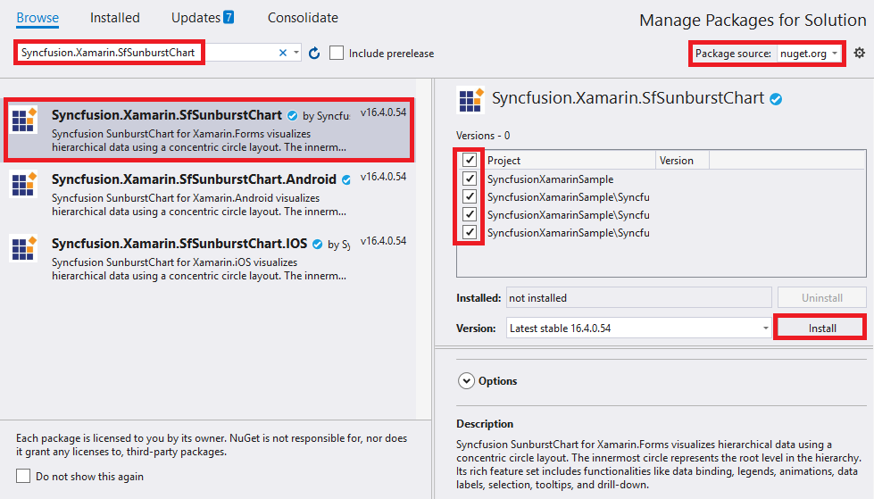
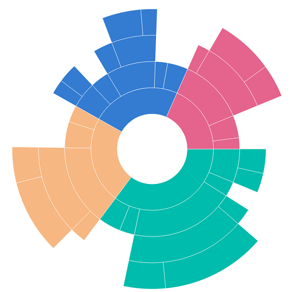
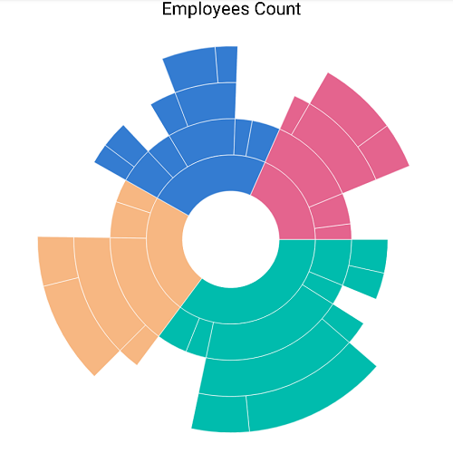
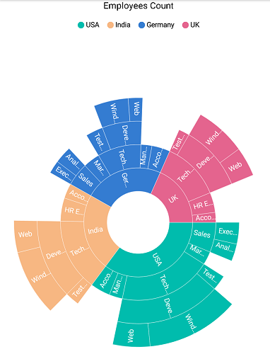

# Getting Started with Xamarin Sunburst Chart (SfSunburstChart)

This section explains the steps required to configure the [`SfSunburstChart`](https://help.syncfusion.com/cr/xamarin/Syncfusion.SfSunburstChart.XForms.SfSunburstChart.html) and populate it with data, data labels, legends, and title. This section covers only the minimal features that needed to get started with the sunburst chart. 

## Assembly deployment

After installing [Essential Studio for Xamarin](https://www.syncfusion.com/downloads/xamarin), you can find all the required assemblies in the installation folders, {Syncfusion Essential Studio Installed location} \Essential Studio\{Version #}\Xamarin\lib.

E.g.: C:\Program Files (x86) \Syncfusion\Essential Studio\19.1.0.54\Xamarin\lib

N> Assemblies can be found in unzipped package location(Documents/Syncfusion/{Version #}/Xamarin/lib) in Mac.

## Adding SfSunburstChart reference

You can add SfSunburstChart reference using one of the following methods:

**Method 1: Adding SfSunburstChart reference from nuget.org**

Syncfusion Xamarin components are available in [nuget.org](https://www.nuget.org/). To add SfSunburstChart to your project, open the NuGet package manager in Visual Studio, search for [Syncfusion.Xamarin.SfSunburstChart](https://www.nuget.org/packages/Syncfusion.Xamarin.SfSunburstChart), and then install it.

N> Install the same version of SfSunburstChart NuGet in all the projects.

**Method 2: Adding SfSunburstChart reference from toolbox**

Syncfusion also provides Xamarin Toolbox. Using this toolbox, you can drag the SfSunburstChart control to the XAML page. It will automatically install the required NuGet packages and add the namespace to the page. To install Syncfusion Xamarin Toolbox, refer to [Toolbox](https://help.syncfusion.com/xamarin/utility#toolbox).

**Method 3: Adding SfSunburstChart assemblies manually from the installed location**

If you prefer to manually reference the assemblies instead referencing from NuGet, add the following assemblies in respective projects.

Location: {Installed location}/{version}/Xamarin/lib

<table>
<tr>
<td>PCL</td>
<td>Syncfusion.SfSunburstChart.XForms.dll Syncfusion.Core.XForms.dll Syncfusion.Licensing.dll </td>
</tr>
<tr>
<td>Android</td>
<td>Syncfusion.SfSunburstChart.Android.dll Syncfusion.SfSunburstChart.XForms.Android.dll Syncfusion.SfSunburstChart.XForms.dll Syncfusion.Core.XForms.dll Syncfusion.Core.XForms.Android.dll Syncfusion.Licensing.dll </td>
</tr>
<tr>
<td>iOS</td>
<td>Syncfusion.SfSunburstChart.iOS.dll Syncfusion.SfSunburstChart.XForms.iOS.dll Syncfusion.SfSunburstChart.XForms.dll Syncfusion.Core.XForms.dll Syncfusion.Core.XForms.iOS.dll Syncfusion.Licensing.dll </td>
</tr>
<tr>
<td>UWP</td>
<td>Syncfusion.SfSunburstChart.UWP.dll Syncfusion.SfSunburstChart.XForms.UWP.dll Syncfusion.SfSunburstChart.XForms.dll Syncfusion.Core.XForms.dll Syncfusion.Core.XForms.UWP.dll Syncfusion.Licensing.dll </td>
</tr>
</table>

N> To know more about obtaining our components, refer to these links for [Mac](https://help.syncfusion.com/xamarin/introduction/download-and-installation/mac/) and [Windows](https://help.syncfusion.com/xamarin/introduction/download-and-installation/windows/).

I> Starting with v16.2.0.x, if you reference Syncfusion assemblies from the trial setup or from the NuGet feed, you also have to include a license key in your projects. Please refer to [Syncfusion license key](https://help.syncfusion.com/common/essential-studio/licensing/license-key/) to know about registering Syncfusion license key in your Xamarin application to use our components.

## Launching an application on each platform with SfSunburstChart.

To use the SfSunburstChart control inside an application, each platform requires some additional configurations. The configurations vary from platform to platform and is discussed in the following sections:

N> If you are adding the references from toolbox, this step is not needed.

### iOS

To launch the SfSunburstChart in iOS, call the `SfSunburstChartRenderer.Init()` in the `FinishedLaunching` overridden method of the AppDelegate class after the Xamarin.Forms Framework has been initialized and before the LoadApplication is called, as demonstrated in the following code example.


public override bool FinishedLaunching(UIApplication app, NSDictionary options)
{
    …
    global::Xamarin.Forms.Forms.Init ();
    Syncfusion.SfSunburstChart.XForms.iOS.SfSunburstChartRenderer.Init();
    LoadApplication (new App ());
    …
}
 

### Universal Windows Platform (UWP)

You need to initialize the sunburst view assemblies in App.xaml.cs in UWP project as demonstrated in the following code samples. This is required to deploy the application with sunburst in Release mode in UWP platform.


// In App.xaml.cs

protected override void OnLaunched(LaunchActivatedEventArgs e)
    {
        …
    	    rootFrame.NavigationFailed += OnNavigationFailed;
    
        // Add `using System.Reflection;`
        List<Assembly> assembliesToInclude = new List<Assembly>();
    
        // Now, add all the assemblies your app uses                 
        assembliesToInclude.Add(typeof(Syncfusion.SfSunburstChart.XForms.UWP.SfSunburstChartRenderer).GetTypeInfo().Assembly);
		
        // Replaces Xamarin.Forms.Forms.Init(e);        
        Xamarin.Forms.Forms.Init(e, assembliesToInclude);	
        …     
    }



### Android

The Android platform does not require any additional configuration to render the sunburst.

## Initialize sunburst chart

Import the [`SfSunburstChart`](https://help.syncfusion.com/cr/xamarin/Syncfusion.SfSunburstChart.XForms.SfSunburstChart.html) namespace as shown as follows.

 

 

  xmlns:sunburst="clr-namespace:Syncfusion.SfSunburstChart.XForms;assembly=Syncfusion.SfSunburstChart.XForms"



 

  using Syncfusion.SfSunburstChart.XForms;



 

Then, initialize an empty sunburst chart as shown as follows.

 

 

  <sunburst:SfSunburstChart>
    
  </sunburst:SfSunburstChart>



 

  SfSunburstChart sunburst = new SfSunburstChart();

  this.Content = sunburst;
  


 

## Initialize view model

In this section, data in the following table is used for demonstration.

<table>
<tr>
<th>
Country
</th>
<th>
Job description
</th>
<th>
Job group
</th>
<th>
Job role
</th>
<th>
Employees count
</th>
</tr>
<tr>
<td>
United States
</td>
<td>
Sales
</td>
<td>
Executive
</td>
<td>
</td>
<td>
50
</td>
</tr>
<tr>
<td>
United States
</td>
<td>
Sales
</td>
<td>
Analyst
</td>
<td>
</td>
<td>
40
</td>
</tr>
<tr>
<td>
United States
</td>
<td>
Marketing
</td>
<td>
</td>
<td>
</td>
<td>
40
</td>
</tr>
<tr>
<td>
United States
</td>
<td>
Technical
</td>
<td>
Testers
</td>
<td>
</td>
<td>
35
</td>
</tr>
<tr>
<td>
United States
</td>
<td>
Technical
</td>
<td>
Developers
</td>
<td>
Windows
</td>
<td>
175
</td>
</tr>
<tr>
<td>
United States
</td>
<td>
Technical
</td>
<td>
Developers
</td>
<td>
Web
</td>
<td>
70
</td>
</tr>
<tr>
<td>
United States
</td>
<td>
Management
</td>
<td>
</td>
<td>
</td>
<td>
40
</td>
</tr>
<tr>
<td>
United States
</td>
<td>
Accounts
</td>
<td>
</td>
<td>
</td>
<td>
60
</td>
</tr>
<tr>
<td>
India
</td>
<td>
Technical
</td>
<td>
Testers
</td>
<td>
</td>
<td>
33
</td>
</tr>
<tr>
<td>
India
</td>
<td>
Technical
</td>
<td>
Developers
</td>
<td>
Windows
</td>
<td>
125
</td>
</tr>
<tr>
<td>
India
</td>
<td>
Technical
</td>
<td>
Developers
</td>
<td>
Web
</td>
<td>
60
</td>
</tr>
<tr>
<td>
India
</td>
<td>
HR Executives
</td>
<td>
</td>
<td>
</td>
<td>
70
</td>
</tr>
<tr>
<td>
India
</td>
<td>
Accounts
</td>
<td>
</td>
<td>
</td>
<td>
45
</td>
</tr>
<tr>
<td>
Germany
</td>
<td>
Sales
</td>
<td>
Executive
</td>
<td>
</td>
<td>
30
</td>
</tr>
<tr>
<td>
Germany
</td>
<td>
Sales
</td>
<td>
Analyst
</td>
<td>
</td>
<td>
40
</td>
</tr>
<tr>
<td>
Germany
</td>
<td>
Marketing
</td>
<td>
</td>
<td>
</td>
<td>
50
</td>
</tr>
<tr>
<td>
Germany
</td>
<td>
Technical
</td>
<td>
Testers
</td>
<td>
</td>
<td>
40
</td>
</tr>
<tr>
<td>
Germany
</td>
<td>
Technical
</td>
<td>
Developers
</td>
<td>
Windows
</td>
<td>
65
</td>
</tr>
<tr>
<td>
Germany
</td>
<td>
Technical
</td>
<td>
Developers
</td>
<td>
Web
</td>
<td>
27
</td>
</tr>
<tr>
<td>
Germany
</td>
<td>
Management
</td>
<td>
</td>
<td>
</td>
<td>
33
</td>
</tr>
<tr>
<td>
Germany
</td>
<td>
Accounts
</td>
<td>
</td>
<td>
</td>
<td>
55
</td>
</tr>
<tr>
<td>
UK
</td>
<td>
Technical
</td>
<td>
Testers
</td>
<td>
</td>
<td>
25
</td>
</tr>
<tr>
<td>
UK
</td>
<td>
Technical
</td>
<td>
Developers
</td>
<td>
Windows
</td>
<td>
96
</td>
</tr>
<tr>
<td>
UK
</td>
<td>
Technical
</td>
<td>
Developers
</td>
<td>
Web
</td>
<td>
55
</td>
</tr>
<tr>
<td>
UK
</td>
<td>
HR executives
</td>
<td>
</td>
<td>
</td>
<td>
60
</td>
</tr>
<tr>
<td>
UK
</td>
<td>
Accounts
</td>
<td>
</td>
<td>
</td>
<td>
30
</td>
</tr>
</table>

Define a data model that represents the above data in [`SfSunburstChart`](https://help.syncfusion.com/cr/xamarin/Syncfusion.SfSunburstChart.XForms.SfSunburstChart.html).

 



 public class SunburstModel
 {
    public string JobDescription { get; set; }
    public string JobGroup { get; set; }
    public string JobRole { get; set; }
    public double EmployeesCount { get; set; }
    public string Country { get; set; }
 }
    
 

 

Then, create a view model class, and initialize a list of SunburstModel objects as follows.

 



 public class SunburstViewModel
 {
        public ObservableCollection<SunburstModel> DataSource { get; set; }
        public SunburstViewModel()
        {
            this.DataSource = new ObservableCollection<SunburstModel>
            {
                new SunburstModel { Country = "USA", JobDescription = "Sales", JobGroup="Executive", EmployeesCount = 50 },
                new SunburstModel { Country = "USA", JobDescription = "Sales", JobGroup = "Analyst", EmployeesCount = 40 },
                new SunburstModel { Country = "USA", JobDescription = "Marketing", EmployeesCount = 40 },
                new SunburstModel { Country = "USA", JobDescription = "Technical", JobGroup = "Testers", EmployeesCount = 35 },
                new SunburstModel { Country = "USA", JobDescription = "Technical", JobGroup = "Developers", JobRole = "Windows", EmployeesCount = 175 },
                new SunburstModel { Country = "USA", JobDescription = "Technical", JobGroup = "Developers", JobRole = "Web", EmployeesCount = 70 },
                new SunburstModel { Country = "USA", JobDescription = "Management", EmployeesCount = 40 },
                new SunburstModel { Country = "USA", JobDescription = "Accounts", EmployeesCount = 60 },

                new SunburstModel { Country = "India", JobDescription = "Technical", JobGroup = "Testers", EmployeesCount = 33 },
                new SunburstModel { Country = "India", JobDescription = "Technical", JobGroup = "Developers", JobRole = "Windows", EmployeesCount = 125 },
                new SunburstModel { Country = "India", JobDescription = "Technical", JobGroup = "Developers", JobRole = "Web", EmployeesCount = 60 },
                new SunburstModel { Country = "India", JobDescription = "HR Executives", EmployeesCount = 70 },
                new SunburstModel { Country = "India", JobDescription = "Accounts", EmployeesCount = 45 },

                new SunburstModel { Country = "Germany", JobDescription = "Sales", JobGroup = "Executive", EmployeesCount = 30 },
                new SunburstModel { Country = "Germany", JobDescription = "Sales", JobGroup = "Analyst", EmployeesCount = 40 },
                new SunburstModel { Country = "Germany", JobDescription = "Marketing", EmployeesCount = 50 },
                new SunburstModel { Country = "Germany", JobDescription = "Technical", JobGroup = "Testers", EmployeesCount = 40 },
                new SunburstModel { Country = "Germany", JobDescription = "Technical", JobGroup = "Developers", JobRole = "Windows", EmployeesCount = 65 },
                new SunburstModel { Country = "Germany", JobDescription = "Technical", JobGroup = "Developers", JobRole = "Web", EmployeesCount = 27 },
                new SunburstModel { Country = "Germany", JobDescription = "Management", EmployeesCount = 33 },
                new SunburstModel { Country = "Germany", JobDescription = "Accounts", EmployeesCount = 55 },

                new SunburstModel { Country = "UK", JobDescription = "Technical", JobGroup = "Testers", EmployeesCount = 25 },
                new SunburstModel { Country = "UK", JobDescription = "Technical", JobGroup = "Developers", JobRole = "Windows", EmployeesCount = 96 },
                new SunburstModel { Country = "UK", JobDescription = "Technical", JobGroup = "Developers", JobRole = "Web", EmployeesCount = 55 },
                new SunburstModel { Country = "UK", JobDescription = "HR Executives", EmployeesCount = 60 },
                new SunburstModel { Country = "UK", JobDescription = "Accounts", EmployeesCount = 30 }
            };
        }
 }

 

 

Set the `SunburstViewModel` instance as the `BindingContext` of your page to bind the properties of `SunburstViewModel` to [`SfSunburstChart`](https://help.syncfusion.com/cr/xamarin/Syncfusion.SfSunburstChart.XForms.SfSunburstChart.html).
 
N> Add the namespace of `SunburstViewModel` class in your XAML page if you set the `BindingContext` in XAML.

 

 

  <ContentPage xmlns="http://xamarin.com/schemas/2014/forms"
             xmlns:x="http://schemas.microsoft.com/winfx/2009/xaml"
             xmlns:local="clr-namespace:SunburstDemo"
             xmlns:sunburst="clr-namespace:Syncfusion.SfSunburstChart.XForms;assembly=Syncfusion.SfSunburstChart.XForms"
             x:Class="SunburstDemo.MainPage">

	  <ContentPage.BindingContext>
          <local:SunburstViewModel></local:SunburstViewModel>
      </ContentPage.BindingContext>
 
  </ContentPage>


 

  this.BindingContext = new SunburstViewModel();



 

## Populate sunburst chart with data

Bind the DataSource property of the above SunburstViewModel to the [`ItemsSource`](https://help.syncfusion.com/cr/xamarin/Syncfusion.SfSunburstChart.XForms.SfSunburstChart.html#Syncfusion_SfSunburstChart_XForms_SfSunburstChart_ItemsSource) property. 
Then, add the [`SunburstHierarchicalLevel`](https://help.syncfusion.com/cr/xamarin/Syncfusion.SfSunburstChart.XForms.SunburstHierarchicalLevel.html) to [`Levels`](https://help.syncfusion.com/cr/xamarin/Syncfusion.SfSunburstChart.XForms.SfSunburstChart.html#Syncfusion_SfSunburstChart_XForms_SfSunburstChart_Levels) collection. Each hierarchy level is formed based on the property specified in [`GroupMemberPath`](https://help.syncfusion.com/cr/xamarin/Syncfusion.SfSunburstChart.XForms.SunburstHierarchicalLevel.html#Syncfusion_SfSunburstChart_XForms_SunburstHierarchicalLevel_GroupMemberPath) property, and each arc segment size is calculated using the [`ValueMemberPath`](https://help.syncfusion.com/cr/xamarin/Syncfusion.SfSunburstChart.XForms.SfSunburstChart.html#Syncfusion_SfSunburstChart_XForms_SfSunburstChart_ValueMemberPath) property.

   



  <sunburst:SfSunburstChart x:Name="sunburstChart" ItemsSource="{Binding DataSource}"
                                  ValueMemberPath="EmployeesCount">

     <sunburst:SfSunburstChart.Levels>
         <sunburst:SunburstHierarchicalLevel GroupMemberPath="Country"/>
         <sunburst:SunburstHierarchicalLevel GroupMemberPath="JobDescription"/>
         <sunburst:SunburstHierarchicalLevel GroupMemberPath="JobGroup"/>
         <sunburst:SunburstHierarchicalLevel GroupMemberPath="JobRole"/>
    </sunburst:SfSunburstChart.Levels>

  </sunburst:SfSunburstChart>





  SfSunburstChart sunburstChart = new SfSunburstChart();           
  sunburstChart.SetBinding(SfSunburstChart.ItemsSourceProperty, "DataSource");
  sunburstChart.ValueMemberPath = "EmployeesCount";
  sunburstChart.Levels.Add(new SunburstHierarchicalLevel() { GroupMemberPath = "Country" });
  sunburstChart.Levels.Add(new SunburstHierarchicalLevel() { GroupMemberPath = "JobDescription" });
  sunburstChart.Levels.Add(new SunburstHierarchicalLevel() { GroupMemberPath = "JobGroup" });
  sunburstChart.Levels.Add(new SunburstHierarchicalLevel() { GroupMemberPath = "JobRole" });
  this.Content = sunburstChart;





## Add title

You can add title to the sunburst chart to provide information to users about the data being plotted in the chart. You can set title using the [`SfSunburstChart.Title`](https://help.syncfusion.com/cr/xamarin/Syncfusion.SfSunburstChart.XForms.SfSunburstChart.html#Syncfusion_SfSunburstChart_XForms_SfSunburstChart_Title) property.

 



  <sunburst:SfSunburstChart>    

      <sunburst:SfSunburstChart.Title>
         <sunburst:SunburstChartTitle x:Name="title" Text="Employees Count"></sunburst:SunburstChartTitle>
      </sunburst:SfSunburstChart.Title> 

  </sunburst:SfSunburstChart>





  SfSunburstChart sunburstChart = new SfSunburstChart();
  sunburstChart.Title = new SunburstChartTitle();
  sunburstChart.Title.Text = "Employees Count";
  this.Content = sunburstChart;  





## Add legend

You can enable legend using the [`SfSunburstChart.Legend`](https://help.syncfusion.com/cr/xamarin/Syncfusion.SfSunburstChart.XForms.SfSunburstChart.html#Syncfusion_SfSunburstChart_XForms_SfSunburstChart_Legend) property.

 



  <sunburst:SfSunburstChart>

      <sunburst:SfSunburstChart.Legend>
            <sunburst:SunburstChartLegend x:Name="legend" IsVisible="True" >                      
            </sunburst:SunburstChartLegend>
      </sunburst:SfSunburstChart.Legend>

  </sunburst:SfSunburstChart>




  SfSunburstChart sunburstChart = new SfSunburstChart();
  sunburstChart.Legend = new SunburstChartLegend();
  sunburstChart.Legend.IsVisible = true;
  this.Content = sunburstChart;



 

## Add data labels

You can add data labels to improve the readability of the sunburst chart. Data labels can be added using the [`SfSunburstChart.DataLabel`](https://help.syncfusion.com/cr/xamarin/Syncfusion.SfSunburstChart.XForms.SfSunburstChart.html#Syncfusion_SfSunburstChart_XForms_SfSunburstChart_DataLabel) property.

 


      
  <sunburst:SfSunburstChart>

       <sunburst:SfSunburstChart.DataLabel>
           <sunburst:SunburstChartDataLabel x:Name="dataLabel" ShowLabel="True">
           </sunburst:SunburstChartDataLabel>
       </sunburst:SfSunburstChart.DataLabel>

  </sunburst:SfSunburstChart>





  SfSunburstChart sunburstChart = new SfSunburstChart();  
  sunburstChart.DataLabel = new SunburstChartDataLabel();
  sunburstChart.DataLabel.ShowLabel = true;
  this.Content = sunburstChart;



 

Below snippet is the complete code for generating the final output.

 


      
  <sunburst:SfSunburstChart x:Name="sunburstChart" ItemsSource="{Binding DataSource}"
            ValueMemberPath="EmployeesCount">

      <sunburst:SfSunburstChart.Levels>
          <sunburst:SunburstHierarchicalLevel GroupMemberPath="Country"/>
          <sunburst:SunburstHierarchicalLevel GroupMemberPath="JobDescription"/>
          <sunburst:SunburstHierarchicalLevel GroupMemberPath="JobGroup"/>
          <sunburst:SunburstHierarchicalLevel GroupMemberPath="JobRole"/>
      </sunburst:SfSunburstChart.Levels>

      <sunburst:SfSunburstChart.Title>
          <sunburst:SunburstChartTitle x:Name="title" Text="Employees Count" ></sunburst:SunburstChartTitle>
      </sunburst:SfSunburstChart.Title>

      <sunburst:SfSunburstChart.Legend>
          <sunburst:SunburstChartLegend x:Name="legend" IsVisible="True" >
          </sunburst:SunburstChartLegend>
      </sunburst:SfSunburstChart.Legend>

      <sunburst:SfSunburstChart.DataLabel>
          <sunburst:SunburstChartDataLabel x:Name="dataLabel" ShowLabel="True"></sunburst:SunburstChartDataLabel>
      </sunburst:SfSunburstChart.DataLabel>

  </sunburst:SfSunburstChart>





  this.BindingContext = new SunburstViewModel();

  SfSunburstChart sunburstChart = new SfSunburstChart();

  sunburstChart.SetBinding(SfSunburstChart.ItemsSourceProperty, "DataSource");
  sunburstChart.ValueMemberPath = "EmployeesCount";
  sunburstChart.Levels.Add(new SunburstHierarchicalLevel() { GroupMemberPath = "Country" });
  sunburstChart.Levels.Add(new SunburstHierarchicalLevel() { GroupMemberPath = "JobDescription" });
  sunburstChart.Levels.Add(new SunburstHierarchicalLevel() { GroupMemberPath = "JobGroup" });
  sunburstChart.Levels.Add(new SunburstHierarchicalLevel() { GroupMemberPath = "JobRole" });
                       
  sunburstChart.Title = new SunburstChartTitle();
  sunburstChart.Title.Text = "Employees Count";

  sunburstChart.Legend = new SunburstChartLegend();
  sunburstChart.Legend.IsVisible = true;

  sunburstChart.DataLabel = new SunburstChartDataLabel();
  sunburstChart.DataLabel.ShowLabel = true;

  this.Content = sunburstChart;



 

The following screenshot depicts the final output.

You can find the complete getting started sample from this [`link`](https://github.com/SyncfusionExamples/Getting-Started-Sunburst-Chart-Xamarin).

## See also

[How to make SfSunburstChart to work in UWP in release mode when .NET Native tool chain is enabled](https://www.syncfusion.com/kb/7715/how-to-make-syncfusion-xamarin-forms-sfsunburstchart-to-work-in-uwp-in-release-mode-when)

[How to resolve SfSunburstChart not rendering issue in iOS and UWP](https://www.syncfusion.com/kb/7714/how-to-resolve-sfsunburstchart-not-rendering-issue-in-ios-and-uwp)
