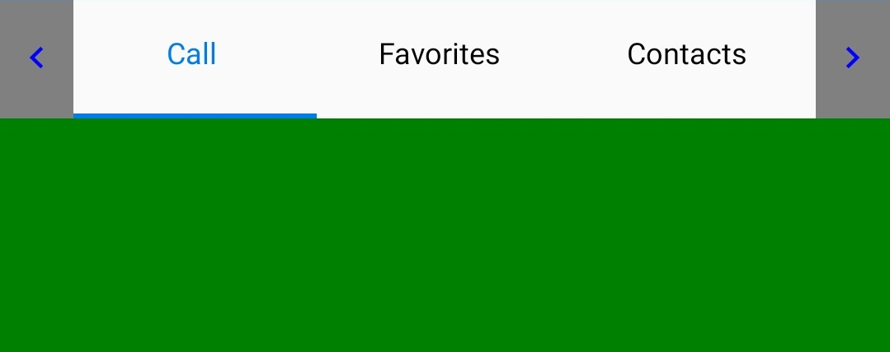

# Scroll Buttons on Tab Header

Buttons can be used to scroll the items in the header of the tabview by setting the `IsScrollEnabled` property of `SfTabView`.

N> The `IsScrollEnabled` is working only when `OverFlowMode` is set as `Scroll`.





<ContentPage xmlns="http://xamarin.com/schemas/2014/forms"
             xmlns:x="http://schemas.microsoft.com/winfx/2009/xaml"
             xmlns:tabView="clr-namespace:Syncfusion.XForms.TabView;assembly=Syncfusion.SfTabView.XForms"
             x:Class="TabView.TabView">
    <ContentPage.Content>
       <tabView:SfTabView OverflowMode="Scroll" 
                          IsScrollButtonEnabled="True">
                <!--Add TabItems-->
            </tabView:SfTabView>
    </ContentPage.Content>
</ContentPage>
			




using Syncfusion.XForms.TabView;
using Xamarin.Forms;
using Xamarin.Forms.Xaml;

namespace TabView
{
    [XamlCompilation(XamlCompilationOptions.Compile)]
	public partial class TabView : ContentPage
	{
        SfTabView tabView;
		public TabView ()
		{
			InitializeComponent ();
            tabView = new SfTabView();        
            var tabItems = new TabItemCollection
            {
               //Add TabItems
            };
            tabView.Items = tabItems;
            tabView.OverflowMode = OverflowMode.Scroll;
            tabView.IsScrollButtonEnabled = true;
            this.Content = tabView;
		}
	}
}
			




## ScrollButtonBackgroundColor and ScrollButtonForegroundColor

Change the color of the Scroll buttons foreground and background color by usign the `ScrollButtonBackgroundColor` and `ScrollButtonForegroundColor` properties





<ContentPage xmlns="http://xamarin.com/schemas/2014/forms"
             xmlns:x="http://schemas.microsoft.com/winfx/2009/xaml"
             xmlns:tabView="clr-namespace:Syncfusion.XForms.TabView;assembly=Syncfusion.SfTabView.XForms"
             x:Class="TabView.TabView">
    <ContentPage.Content>
       <tabView:SfTabView OverflowMode="Scroll"   
                          IsScrollButtonEnabled="True"
                          ScrollButtonBackgroundColor="Gray" ScrollButtonForegroundColor="Blue">
                <!--Add TabItems-->
            </tabView:SfTabView>
    </ContentPage.Content>
</ContentPage>





using Syncfusion.XForms.TabView;
using Xamarin.Forms;
using Xamarin.Forms.Xaml;

namespace TabView
{
    [XamlCompilation(XamlCompilationOptions.Compile)]
	public partial class TabView : ContentPage
	{
        SfTabView tabView;
		public TabView ()
		{
			InitializeComponent ();
            tabView = new SfTabView();        
            var tabItems = new TabItemCollection
            {
               //Add TabItems
            };
            tabView.Items = tabItems;
            tabView.OverflowMode = OverflowMode.Scroll;
            tabView.IsScrollButtonEnabled = true;
            tabView.ScrollButtonBackgroundColor = Color.Gray;
            tabView.ScrollButtonForegroundColor = Color.Blue;
            this.Content = tabView;
		}
	}
}
	



