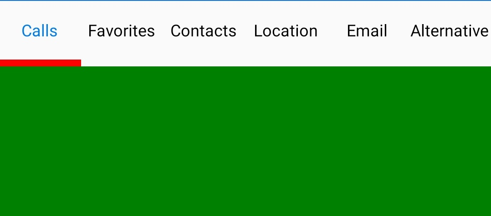
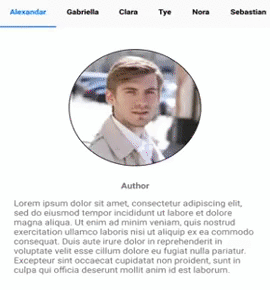

# TabView Header Customization in Xamarin Tabbed View (SfTabView)

Tab items can be configured in tab view through the `Items` property of `SfTabView`, which holds the collection of `SfTabItem` through `TabItemsCollection`.





<ContentPage xmlns="http://xamarin.com/schemas/2014/forms"
             xmlns:x="http://schemas.microsoft.com/winfx/2009/xaml"
             xmlns:tabView="clr-namespace:Syncfusion.XForms.TabView;assembly=Syncfusion.SfTabView.XForms"
             x:Class="TabViewAutomationSample.TabViewAutomationSample">
    <ContentPage.Content>
        <tabView:SfTabView BackgroundColor="White">
                    <tabView:SfTabItem Title="Call">
                        <tabView:SfTabItem.Content>
                            <Grid BackgroundColor="Gray" x:Name="AllContactsGrid" />
                        </tabView:SfTabItem.Content>
                    </tabView:SfTabItem>
                    <tabView:SfTabItem Title="Favorites">
                        <tabView:SfTabItem.Content>
                            <Grid BackgroundColor="Green" x:Name="FavoritesGrid" />
                        </tabView:SfTabItem.Content>
                    </tabView:SfTabItem>
                    <tabView:SfTabItem Title="Contacts">
                        <tabView:SfTabItem.Content>
                            <Grid BackgroundColor="Blue" x:Name="ContactsGrid" />
                        </tabView:SfTabItem.Content>
                    </tabView:SfTabItem>
        </tabView:SfTabView>
    </ContentPage.Content>
</ContentPage>





using Syncfusion.XForms.TabView;
using Xamarin.Forms;
using Xamarin.Forms.Xaml;

namespace TabViewAutomationSample
{
    [XamlCompilation(XamlCompilationOptions.Compile)]
	public partial class TabView : ContentPage
	{
        SfTabView tabView;
		public TabView ()
		{
			InitializeComponent ();
            var tabView = new SfTabView();
            var allContactsGrid = new Grid {BackgroundColor = Color.Gray};
            var favoritesGrid = new Grid {BackgroundColor = Color.Green};
            var contactsGrid = new Grid {BackgroundColor = Color.Blue};
            var tabItems = new TabItemCollection
            {
                new SfTabItem()
                {
                    Title = "Calls",
                    Content = allContactsGrid
                },
                new SfTabItem()
                {
                    Title = "Favorites",
                    Content = favoritesGrid
                },
                new SfTabItem()
                {
                    Title = "Contacts",
                    Content = contactsGrid
                }
            };
            tabView.Items = tabItems;
            this.Content = tabView;
		}
	}
}





## Share the header space equally

To share the header space to the tabs equally, set the number of tabs that can be distributed in the available space though the [VisibleHeaderCount](https://help.syncfusion.com/cr/xamarin/Syncfusion.XForms.TabView.SfTabView.html#Syncfusion_XForms_TabView_SfTabView_VisibleHeaderCount) of SfTabView.





<ContentPage xmlns="http://xamarin.com/schemas/2014/forms"
             xmlns:x="http://schemas.microsoft.com/winfx/2009/xaml"
             xmlns:tabView="clr-namespace:Syncfusion.XForms.TabView;assembly=Syncfusion.SfTabView.XForms"
             x:Class="TabViewAutomationSample.TabViewAutomationSample">
    <ContentPage.Content>
        <tabView:SfTabView BackgroundColor="White" VisibleHeaderCount="3">
            <tabView:SfTabItem Title="Call">
                <tabView:SfTabItem.Content>
                    <Grid BackgroundColor="Gray" x:Name="AllContactsGrid" />
                </tabView:SfTabItem.Content>
            </tabView:SfTabItem>
            <tabView:SfTabItem Title="Favorites">
                <tabView:SfTabItem.Content>
                    <Grid BackgroundColor="Green" x:Name="FavoritesGrid" />
                </tabView:SfTabItem.Content>
            </tabView:SfTabItem>
            <tabView:SfTabItem Title="Contacts">
                <tabView:SfTabItem.Content>
                    <Grid BackgroundColor="Blue" x:Name="ContactsGrid" />
                </tabView:SfTabItem.Content>
            </tabView:SfTabItem>
            <tabView:SfTabItem Title="Email">
                <tabView:SfTabItem.Content>
                    <Grid BackgroundColor="Olive" x:Name="EmailGrid" />
                </tabView:SfTabItem.Content>
            </tabView:SfTabItem>
        </tabView:SfTabView>
    </ContentPage.Content>
</ContentPage>
	




using Syncfusion.XForms.TabView;
using Xamarin.Forms;
using Xamarin.Forms.Xaml;

namespace TabViewAutomationSample
{
    [XamlCompilation(XamlCompilationOptions.Compile)]
	public partial class TabView : ContentPage
	{
        SfTabView tabView;
		public TabView ()
		{
			InitializeComponent ();
            var tabView = new SfTabView();
            var allContactsGrid = new Grid {BackgroundColor = Color.Red};
            var favoritesGrid = new Grid {BackgroundColor = Color.Green};
            var contactsGrid = new Grid {BackgroundColor = Color.Blue};
            var emailGrid = new Grid {BackgroundColor = Color.Olive};
            tabView.VisibleHeaderCount = 3;
            var tabItems = new TabItemCollection
            {
                new SfTabItem()
                {
                    Title = "Calls",
                    Content = allContactsGrid
                },
                new SfTabItem()
                {
                    Title = "Favorites",
                    Content = favoritesGrid
                },
                new SfTabItem()
                {
                    Title = "Contacts",
                    Content = contactsGrid
                },
                new SfTabItem()
                {
                    Title = "Email",
                    Content = emailGrid
                }
            };
            tabView.Items = tabItems;
            this.Content = tabView;
		}
	}
}





## Add all tab items in a single view 

When you set the [VisibleHeaderCount](https://help.syncfusion.com/cr/xamarin/Syncfusion.XForms.TabView.SfTabView.html#Syncfusion_XForms_TabView_SfTabView_VisibleHeaderCount) to -1, you get all the tab items in a single view based on the width of the visible area in the control and tab count.





<ContentPage xmlns="http://xamarin.com/schemas/2014/forms"
             xmlns:x="http://schemas.microsoft.com/winfx/2009/xaml"
             xmlns:tabView="clr-namespace:Syncfusion.XForms.TabView;assembly=Syncfusion.SfTabView.XForms"
             x:Class="TabViewAutomationSample.TabViewAutomationSample">
    <ContentPage.Content>
        <tabView:SfTabView BackgroundColor="White" VisibleHeaderCount="-1">
            <tabView:SfTabItem Title="Call">
                <tabView:SfTabItem.Content>
                    <Grid BackgroundColor="Gray" x:Name="AllContactsGrid" />
                </tabView:SfTabItem.Content>
            </tabView:SfTabItem>
            <tabView:SfTabItem Title="Favorites">
                <tabView:SfTabItem.Content>
                    <Grid BackgroundColor="Green" x:Name="FavoritesGrid" />
                </tabView:SfTabItem.Content>
            </tabView:SfTabItem>
            <tabView:SfTabItem Title="Contacts">
                <tabView:SfTabItem.Content>
                    <Grid BackgroundColor="Blue" x:Name="ContactsGrid" />
                </tabView:SfTabItem.Content>
            </tabView:SfTabItem>
             <tabView:SfTabItem Title="Location">
                <tabView:SfTabItem.Content>
                    <Grid BackgroundColor="Aqua" x:Name="Location" />
                </tabView:SfTabItem.Content>
            <tabView:SfTabItem Title="Email">
                <tabView:SfTabItem.Content>
                    <Grid BackgroundColor="Olive" x:Name="EmailGrid" />
                </tabView:SfTabItem.Content>
            </tabView:SfTabItem>
            <tabView:SfTabItem Title="Alternative">
                <tabView:SfTabItem.Content>
                     <Grid BackgroundColor="Blue" x:Name="AlternativeGrid" />
                </tabView:SfTabItem.Content>
            </tabView:SfTabItem>
        </tabView:SfTabView>
    </ContentPage.Content>
</ContentPage>
	




using Syncfusion.XForms.TabView;
using Xamarin.Forms;
using Xamarin.Forms.Xaml;

namespace TabViewAutomationSample
{
	public partial class TabView : ContentPage
	{
        SfTabView tabView;
		public TabView ()
		{
			InitializeComponent ();
            var tabView = new SfTabView();
            var allContactsGrid = new Grid {BackgroundColor = Color.Red};
            var favoritesGrid = new Grid {BackgroundColor = Color.Green};
            var contactsGrid = new Grid {BackgroundColor = Color.Blue};
            var emailGrid = new Grid {BackgroundColor = Color.Olive};
            tabView.VisibleHeaderCount = -1;
            var tabItems = new TabItemCollection
            {
                new SfTabItem()
                {
                    Title = "Calls",
                    Content = allContactsGrid
                },
                new SfTabItem()
                {
                    Title = "Favorites",
                    Content = favoritesGrid
                },
                new SfTabItem()
                {
                    Title = "Contacts",
                    Content = contactsGrid
                },
                new SfTabItem()
                {
                    Title = "Location",
                    Content = favoritesGrid
                },
                new SfTabItem()
                {
                    Title = "Email",
                    Content = emailGrid
                },
                new tabview.SfTabItem()
                {
                    Title = "Alternative",
                    Content = allContactsGrid
                }
            };
            tabView.Items = tabItems;
            this.Content = tabView;
		}
	}
}





N> The nullable support for [VisibleHeaderCount](https://help.syncfusion.com/cr/xamarin/Syncfusion.XForms.TabView.SfTabView.html#Syncfusion_XForms_TabView_SfTabView_VisibleHeaderCount) only works when [OverFlowMode](https://help.syncfusion.com/cr/xamarin/Syncfusion.XForms.TabView.SfTabView.html#Syncfusion_XForms_TabView_SfTabView_OverflowMode) is set to `Scroll` or `DropDown`. 

## Add tab items at auto size

When you set the `IsAutoTabWidth` property as true, tab width gets the auto size based on the length of the tab item `Title` string.





<ContentPage xmlns="http://xamarin.com/schemas/2014/forms"
             xmlns:x="http://schemas.microsoft.com/winfx/2009/xaml"
             xmlns:tabView="clr-namespace:Syncfusion.XForms.TabView;assembly=Syncfusion.SfTabView.XForms"
             x:Class="TabViewAutomationSample.TabViewAutomationSample">
    <ContentPage.Content>
        <tabView:SfTabView BackgroundColor="White" IsAutoTabWidth="True">
            <tabView:SfTabItem Title="Call">
                <tabView:SfTabItem.Content>
                    <Grid BackgroundColor="Gray"/>
                </tabView:SfTabItem.Content>
            </tabView:SfTabItem>
            <tabView:SfTabItem Title="Favorites">
                <tabView:SfTabItem.Content>
                    <Grid BackgroundColor="Green" />
                </tabView:SfTabItem.Content>
            </tabView:SfTabItem>
            <tabView:SfTabItem Title="Contacts">
                <tabView:SfTabItem.Content>
                    <Grid BackgroundColor="Blue"/>
                </tabView:SfTabItem.Content>
            </tabView:SfTabItem>
             <tabView:SfTabItem Title="Location">
                <tabView:SfTabItem.Content>
                    <Grid BackgroundColor="Aqua"/>
                </tabView:SfTabItem.Content>
            <tabView:SfTabItem Title="Email">
                <tabView:SfTabItem.Content>
                    <Grid BackgroundColor="Olive"/>
                </tabView:SfTabItem.Content>
            </tabView:SfTabItem>
            <tabView:SfTabItem Title="Alternative">
                <tabView:SfTabItem.Content>
                     <Grid BackgroundColor="Blue" />
                </tabView:SfTabItem.Content>
            </tabView:SfTabItem>
        </tabView:SfTabView>
    </ContentPage.Content>
</ContentPage>
	



using Syncfusion.XForms.TabView;
using Xamarin.Forms;
using Xamarin.Forms.Xaml;

namespace TabViewAutomationSample
{
    public partial class TabView : ContentPage
    {
        SfTabView tabView;
        public TabView()
        {
            InitializeComponent();
            var tabView = new SfTabView();
            var allContactsGrid = new Grid { BackgroundColor = Color.Red };
            var favoritesGrid = new Grid { BackgroundColor = Color.Green };
            var contactsGrid = new Grid { BackgroundColor = Color.Blue };
            var emailGrid = new Grid { BackgroundColor = Color.Olive };
            tabView.IsAutoTabWidth = true;
            var tabItems = new TabItemCollection
            {
                new SfTabItem()
                {
                    Title = "Calls",
                    Content = allContactsGrid
                },
                new SfTabItem()
                {
                    Title = "Favorites",
                    Content = favoritesGrid
                },
                new SfTabItem()
                {
                    Title = "Contacts",
                    Content = contactsGrid
                },
                new SfTabItem()
                {
                    Title = "Location",
                    Content = favoritesGrid
                },
                new SfTabItem()
                {
                    Title = "Email",
                    Content = emailGrid
                },
                new tabview.SfTabItem()
                {
                    Title = "Alternative",
                    Content = allContactsGrid
                }
            };

            tabView.Items = tabItems;
            this.Content = tabView;
        }
    }
}





N> The IsAutoTabWidth is supported only when the [VisibleHeaderCount](https://help.syncfusion.com/cr/xamarin/Syncfusion.XForms.TabView.SfTabView.html#Syncfusion_XForms_TabView_SfTabView_VisibleHeaderCount) is not set and [OverFlowMode](https://help.syncfusion.com/cr/xamarin/Syncfusion.XForms.TabView.SfTabView.html#Syncfusion_XForms_TabView_SfTabView_OverflowMode) is set to `Scroll`. 