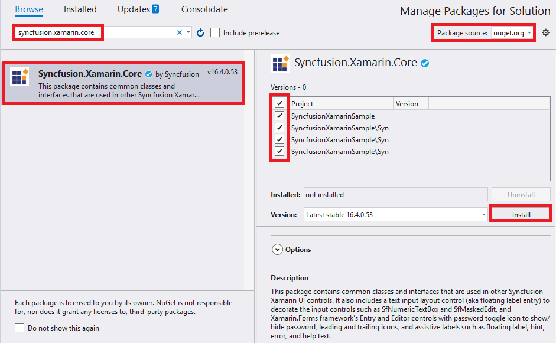

# Getting Started with Xamarin Text Input Layout (SfTextInputLayout)

This section explains the steps required to configure the text input layout control with floating label.

## Adding SfTextInputLayout reference

You can add SfTextInputLayout reference using one of the following methods:

**Method 1: Adding SfTextInputLayout reference from nuget.org**

Syncfusion Xamarin components are available in [nuget.org](https://www.nuget.org/). To add SfTextInputLayout to your project, open the NuGet package manager in Visual Studio, search for [Syncfusion.Xamarin.Core](https://www.nuget.org/packages/Syncfusion.Xamarin.Core), and then install it.

N> Install the same version of SfTextInputLayout NuGet in all the projects.

**Method 2: Adding SfTextInputLayout reference from toolbox**

Syncfusion also provides Xamarin Toolbox. Using this toolbox, you can drag the SfTextInputLayout control to the XAML page. It will automatically install the required NuGet packages and add the namespace to the page. To install Syncfusion Xamarin Toolbox, refer to [Toolbox](https://help.syncfusion.com/xamarin/utility#toolbox).

**Method 3: Adding SfTextInputLayout assemblies manually from the installed location**

If you prefer to manually reference the assemblies instead referencing from NuGet, add the following assemblies in respective projects.

Location : {Installed location}/{version}/Xamarin/lib

<table>
<tr>
<td>PCL</td>
<td>Syncfusion.Core.XForms.dll Syncfusion.Licensing.dll </td>
</tr>
<tr>
<td>Android</td>
<td>Syncfusion.Core.XForms.dll Syncfusion.Core.XForms.Android.dll Syncfusion.Licensing.dll </td>
</tr>
<tr>
<td>iOS</td>
<td>Syncfusion.Core.XForms.dll Syncfusion.Core.XForms.iOS.dll Syncfusion.Licensing.dll </td>
</tr>
<tr>
<td>UWP</td>
<td>Syncfusion.Core.XForms.dll Syncfusion.Core.XForms.UWP.dll Syncfusion.Licensing.dll </td>
</tr>
<tr>
<td>WPF</td>
<td>Syncfusion.Core.XForms.dll Syncfusion.Core.XForms.WPF.dll Syncfusion.Licensing.dll </td>
</tr>
</table>

N> To know more about obtaining our components, refer to these links for [Mac](https://help.syncfusion.com/xamarin/introduction/download-and-installation/mac/) and [Windows](https://help.syncfusion.com/xamarin/introduction/download-and-installation/windows/).

I> Starting with v16.2.0.x, if you reference Syncfusion assemblies from the trial setup or from the NuGet feed, you also have to include a license key in your projects. Please refer to [Syncfusion license key](https://help.syncfusion.com/common/essential-studio/licensing/license-key/) to know about registering Syncfusion license key in your Xamarin application to use our components.

## Launching an application on each platform with text input layout

To use the text input layout inside an application, each platform application requires some additional configurations. The configurations vary from platform to platform and are discussed in the following sections:

N> If you are adding the references from toolbox, below steps are not needed.

### iOS

To launch the text input layout in iOS, call the `SfTextInputLayoutRenderer.Init()` method in the FinishedLaunching overridden method of the AppDelegate class after the Xamarin.Forms framework has been initialized and before the `LoadApplication` method is called as demonstrated in the following code sample.

 

public override bool FinishedLaunching(UIApplication app, NSDictionary options)
{
    global::Xamarin.Forms.Forms.Init();
    SfTextInputLayoutRenderer.Init();
    LoadApplication(new App());
    return base.FinishedLaunching(app, options);
} 



### Universal Windows Platform (UWP)

To deploy the text input layout in `Release` mode, initialize the core assemblies in the App.xaml.cs file in the UWP project as demonstrated in the following code samples.

 

// In App.xaml.cs 
protected override void OnLaunched(LaunchActivatedEventArgs e)
{ 
   … 
   if (rootFrame == null) 
   { 
      List<Assembly> assembliesToInclude = new List<Assembly>();
      assembliesToInclude.Add(typeof(SfTextInputLayoutRenderer).GetTypeInfo().Assembly);
      Xamarin.Forms.Forms.Init(e, assembliesToInclude);
   } 
   … 
}



### Android

Android platform does not require any additional configuration to render the text input layout control.

## Initializing text input layout

Import the [SfTextInputLayout](https://help.syncfusion.com/cr/xamarin/Syncfusion.Core.XForms~Syncfusion.XForms.TextInputLayout.SfTextInputLayout.html) control namespace in respective page as demonstrated in the following code sample.

 

 

xmlns:inputLayout="clr-namespace:Syncfusion.XForms.TextInputLayout;assembly=Syncfusion.Core.XForms"  



 

using Syncfusion.XForms.TextInputLayout; 





Add any input view control such as [Entry](https://docs.microsoft.com/en-us/xamarin/xamarin-forms/user-interface/text/entry), [Editor](https://docs.microsoft.com/en-us/xamarin/xamarin-forms/user-interface/text/editor), [SfNumericTextBox](https://help.syncfusion.com/xamarin/sfnumerictextbox/overview), [SfNumericUpDown](https://help.syncfusion.com/xamarin/numericupdown/overview), [SfMaskedEdit](https://help.syncfusion.com/xamarin/sfmaskededit/overview), [SfAutoComplete](https://help.syncfusion.com/xamarin/autocomplete/overview), [SfComboBox](https://help.syncfusion.com/xamarin/combobox/overview), [Picker](https://docs.microsoft.com/en-us/xamarin/xamarin-forms/user-interface/picker/),[DatePicker](https://docs.microsoft.com/en-us/xamarin/xamarin-forms/user-interface/datepicker) or [TimePicker](https://docs.microsoft.com/en-us/xamarin/xamarin-forms/user-interface/timepicker) and add hint label (floating label).

 

 

<inputLayout:SfTextInputLayout>
   <Entry />
</inputLayout:SfTextInputLayout>  



 

var inputLayout = new SfTextInputLayout();
inputLayout.InputView = new Entry(); 





### Adding hint
Floating label for the text input layout can be added by setting the [Hint](https://help.syncfusion.com/cr/cref_files/xamarin/Syncfusion.Core.XForms~Syncfusion.XForms.TextInputLayout.SfTextInputLayout~Hint.html) property. Visibility of the hint can be collapsed by setting the [ShowHint](https://help.syncfusion.com/cr/cref_files/xamarin/Syncfusion.Core.XForms~Syncfusion.XForms.TextInputLayout.SfTextInputLayout~ShowHint.html) property to `false`. By default, this property is set to `true`.

 

 

<inputLayout:SfTextInputLayout
   Hint="Name">
   <Entry />
</inputLayout:SfTextInputLayout>  



 

var inputLayout = new SfTextInputLayout();
inputLayout.Hint = "Name"; 
inputLayout.InputView = new Entry(); 





When focusing the input view, the hint label will be moved to the top position; it will be returned to the original position when proceeding further (on unfocused) without entering any value.

The default translate animation for the hint can be disabled by setting the [EnableHintAnimation](https://help.syncfusion.com/cr/cref_files/xamarin/Syncfusion.Core.XForms~Syncfusion.XForms.TextInputLayout.SfTextInputLayout~EnableHintAnimation.html) property to `false`. Instead translate animation in hint, you can use the alpha animation by setting the [EnableFloating](https://help.syncfusion.com/cr/cref_files/xamarin/Syncfusion.Core.XForms~Syncfusion.XForms.TextInputLayout.SfTextInputLayout~EnableFloating.html) property to `false`.

Run the project, and check if you get following output to make sure that the project has been configured properly to add the text input layout control.

## Enabling password visibility toggle

The password visibility toggle is used to show or hide the visibility of characters in the input view added to the control. You can enable this toggle by setting the [EnablePasswordVisibilityToggle](https://help.syncfusion.com/cr/cref_files/xamarin/Syncfusion.Core.XForms~Syncfusion.XForms.TextInputLayout.SfTextInputLayout~EnablePasswordVisibilityToggle.html) property to `true`.

 

 

<inputLayout:SfTextInputLayout
    Hint="Name"
    EnablePasswordVisibilityToggle="true">
    <Entry Text="John" />
</inputLayout:SfTextInputLayout>  
 


 

var inputLayout = new SfTextInputLayout();
inputLayout.Hint = "Name";
inputLayout.EnablePasswordVisibilityToggle = true;
inputLayout.InputView = new Entry() { Text = "John" }; 





N> Password visibility toggle can be enabled only for [Entry](https://docs.microsoft.com/en-us/xamarin/xamarin-forms/user-interface/text/entry) control.

You can find the complete getting started sample from this [link.]( https://github.com/SyncfusionExamples/Getting-started-SfTextInputLayout-Xamarin)