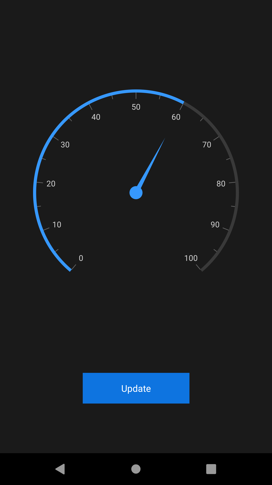
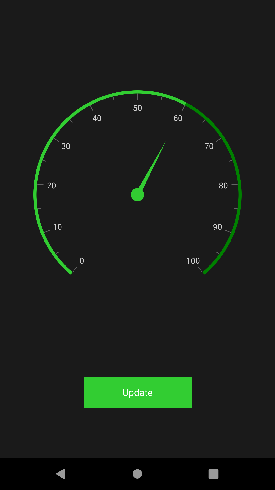

Syncfusion themes allow you apply colors across all the Syncfusion controls with a uniform approach and provide consistent look and feel to your applications. This section covers the following topics: 

* Applying light and dark themes
* Overriding the default theme
* Creating your own theme

## Applying light and dark themes

By default, Syncfusion provides support for light and dark themes. As names suggest, these themes will have colors with light and dark color contrasts, respectively.

To apply themes to your application, merge the following items:

* Theme resource dictionary
* Control style resource dictionaries

#### Theme resource dictionary

This resource dictionary contains *keys* and their respective color codes for all the Syncfusion controls. Currently, the following two theme resource dictionaries are available:

1. Light theme resource dictionary
2. Dark theme resource dictionary

#### Control style resource dictionaries

Each Syncfusion control has a separate control style resource dictionary, whose styles are mapped to the keys declared in [theme resource dictionary](https://help.syncfusion.com/xamarin/themes/themes#theme-resource-dictionary) as a ['DynamicResource'](https://docs.microsoft.com/en-us/xamarin/xamarin-forms/user-interface/styles/xaml/dynamic).


<Application xmlns:syncTheme="clr-namespace:Syncfusion.XForms.Themes;assembly=Syncfusion.Core.XForms"
xmlns:gauge="clr-namespace:Syncfusion.SfGauge.XForms;assembly=Syncfusion.SfGauge.XForms" 
xmlns:buttons="clr-namespace:Syncfusion.XForms.Buttons;assembly=Syncfusion.Buttons.XForms"
             ...>
<Application.Resources>
        <ResourceDictionary>
            <ResourceDictionary.MergedDictionaries>
                <!-- Theme resource dictionary -->
                <syncTheme:DarkTheme />
                <!-- Control style resource dictionaries -->
                <gauge:SfCircularGaugeStyles />
                <buttons:SfButtonStyles />
            </ResourceDictionary.MergedDictionaries>
        </ResourceDictionary>
</Application.Resources>

....

</Application>



### Merging the dictionaries

You can merge the theme resource dictionary and control style resource dictionaries in the following two ways:

#### Manual merging

For manual merging, both the theme resource dictionary and each control style resource dictionary need to be merged for the required controls in the application resources as follows.


<Application xmlns:syncTheme="clr-namespace:Syncfusion.XForms.Themes;assembly=Syncfusion.Core.XForms"
xmlns:gauge="clr-namespace:Syncfusion.SfGauge.XForms;assembly=Syncfusion.SfGauge.XForms" 
xmlns:buttons="clr-namespace:Syncfusion.XForms.Buttons;assembly=Syncfusion.Buttons.XForms"
             ...>
<Application.Resources>
        <ResourceDictionary>
            <ResourceDictionary.MergedDictionaries>
                <!-- Theme resource dictionary -->
                <syncTheme:DarkTheme />
                <!-- Control style resource dictionaries -->
                <gauge:SfCircularGaugeStyles />
                <buttons:SfButtonStyles />
            </ResourceDictionary.MergedDictionaries>
        </ResourceDictionary >
</Application.Resources>

....

</Application>



#### Automatic merging

When using more number of Syncfusion controls in an application, to make the process easier for merging the control style dictionaries of the controls, the SyncfusionThemeDictionary class has been provided for automatic merging. When the theme resource dictionary is merged to this dictionary, control style resource dictionaries will be merged automatically. However, only the styles for the controls used in the application will be merged.



<Application xmlns:syncTheme="clr-namespace:Syncfusion.XForms.Themes;assembly=Syncfusion.Core.XForms"
             ...>

<Application.Resources>
    <syncTheme:SyncfusionThemeDictionary>
        <syncTheme:SyncfusionThemeDictionary.MergedDictionaries>
            <!-- Theme resource dictionary -->
            <syncTheme:DarkTheme />
        </syncTheme:SyncfusionThemeDictionary.MergedDictionaries>
    </syncTheme:SyncfusionThemeDictionary>
</Application.Resources>

....

</Application>



## Overriding the default theme

The theme resource dictionary contains a set of keys that are mapped to the style in control style dictionaries. The default appearance of themes can be customized by overriding the key values.

The following section explains how to override both the primary and control specific keys.

### Overriding the primary keys

The theme resource dictionary contains the following set of primary keys that are mapped to the UI elements of all the controls. To override the primary colors of theme, change the values for these keys as required. You can find the keys and the UI elements to which they are mapped to all the controls in this [documentation](https://help.syncfusion.com/xamarin/themes/keys).

* SyncPrimaryColor
* SyncPrimaryLightColor
* SyncPrimaryDarkColor
* SyncPrimaryForegroundColor
* SyncPrimaryLightForegroundColor
* SyncPrimaryDarkForegroundColor
* SyncSuccessColor
* SyncErrorColor
* SyncWarningColor
* SyncInfoColor



<Application xmlns:syncTheme="clr-namespace:Syncfusion.XForms.Themes;assembly=Syncfusion.Core.XForms"
             ...>
<Application.Resources>
    <syncCore:SyncfusionThemeDictionary>
        <syncCore:SyncfusionThemeDictionary.MergedDictionaries>
            <syncCore:DarkTheme />
            <ResourceDictionary>
                <Color x:Key="SyncPrimaryColor">LimeGreen</Color>
                <Color x:Key="SyncPrimaryLightColor">LimeGreen</Color>
            </ResourceDictionary>
        </syncCore:SyncfusionThemeDictionary.MergedDictionaries>
    </syncCore:SyncfusionThemeDictionary>
</Application.Resources>

....

</Application>



### Overriding the control specific keys

In addition to the primary keys, the theme resource dictionary also contains the keys that are specific to each controls; these keys can also be overridden. You can find the keys and the UI elements to which they are mapped to all the controls in this [documentation](https://help.syncfusion.com/xamarin/themes/keys).



<Application xmlns:syncTheme="clr-namespace:Syncfusion.XForms.Themes;assembly=Syncfusion.Core.XForms"
             ...>
<Application.Resources>
    <syncCore:SyncfusionThemeDictionary>
        <syncCore:SyncfusionThemeDictionary.MergedDictionaries>
            <syncCore:DarkTheme />
            <ResourceDictionary>
                <Color x:Key="SyncPrimaryColor">LimeGreen</Color>
                <Color x:Key="SyncPrimaryLightColor">LimeGreen</Color>
                <Color x:Key="SfCircularGaugeScaleRimColor">Green</Color>
            </ResourceDictionary>
        </syncCore:SyncfusionThemeDictionary.MergedDictionaries>
    </syncCore:SyncfusionThemeDictionary>
</Application.Resources>

....

</Application>



## Creating your own theme

As an alternative approach to the above methods, you can also create your own theme. To create own theme, first, you need to merge the resource, whose key name should be "ControlName" + "Theme" based on the controls, e.g., SfChartTheme and SfTextInputLayoutTheme. You can find this key for each control in this [documentation](https://help.syncfusion.com/xamarin/themes/keys). After merge the control name, you need to merge the required color resources with keys based on the UI elements that need to be customized. You can find the keys and the UI elements to which they are mapped to all the controls in this [documentation](https://help.syncfusion.com/xamarin/themes/keys).

Using this approach, you can create your own theme to all the controls or for specific controls you need. 



<Application xmlns:syncTheme="clr-namespace:Syncfusion.XForms.Themes;assembly=Syncfusion.Core.XForms"
             ...>
<Application.Resources>
    <syncCore:SyncfusionThemeDictionary>
        <syncCore:SyncfusionThemeDictionary.MergedDictionaries>
            <ResourceDictionary>
                <x:String x:Key="SfCircularGaugeTheme">CustomTheme</x:String> 
                <Color x:Key="SyncPrimaryColor">LimeGreen</Color>
                <Color x:Key="SyncPrimaryLightColor">LimeGreen</Color>
                <Color x:Key="SfCircularGaugeScaleRimColor">Green</Color>
            </ResourceDictionary>
        </syncCore:SyncfusionThemeDictionary.MergedDictionaries>
    </syncCore:SyncfusionThemeDictionary>
</Application.Resources>

....

</Application>



 
