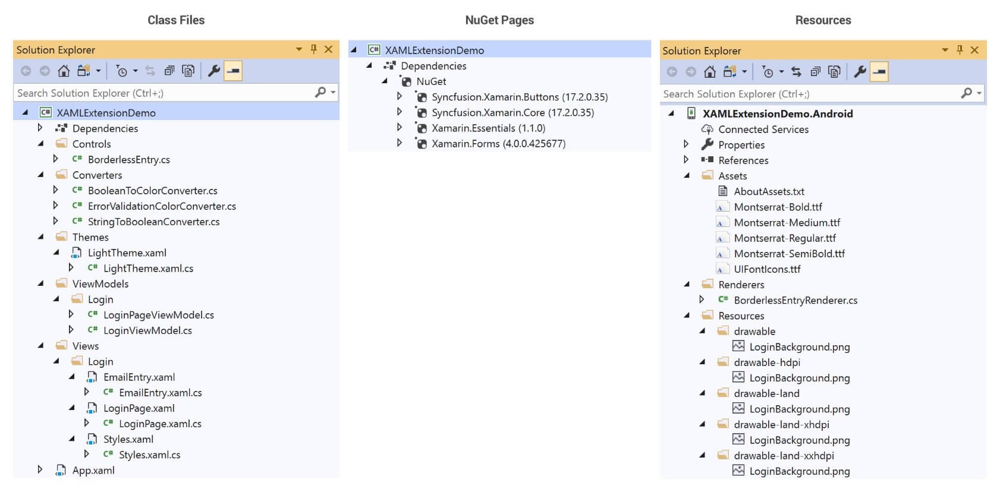
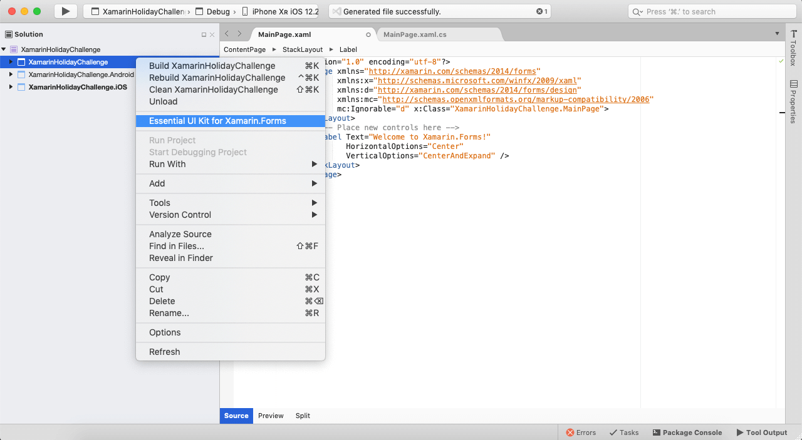
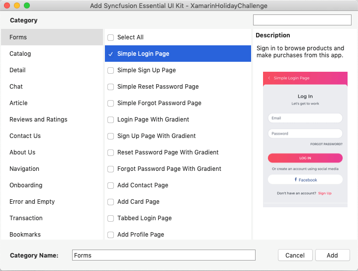

# Essential UI Kit Getting started

The UI Kit screens can be added in your application by the following two ways:

1. Using **Essential UI Kit for Xamarin.Forms** Visual Studio extension.

2. Copying the files from our open source [GitHub repository](https://github.com/syncfusion/essential-ui-kit-for-xamarin.forms).

## Essential UI Kit for Xamarin.Forms Extension

This is the easiest way to add the pre-defined screens to your application. The following steps explain how to add screens to an application with our extension: 

### Extension for Windows

1. Open Visual Studio.

2. Go to Extension, and then click Manage Extensions as shown in the following screenshot.

   

3. Search for **Essential UI Kit for Xamarin.Forms**, and then install it.

   

4. Restart the Visual Studio and allow it to complete the installation. 

5. Now, open an existing Xamarin.Forms application or create a new application as per your requirements.
 
6. Right-click the Xamarin.Forms [NETStandard] project, and you can see the **Essential UI Kit for Xamarin.Forms** option.

   N> The **Essential UI Kit for Xamarin.Forms** add-in will be shown when the project have the **Xamarin.Forms** NuGet package as a referrence and also, Xamarin.Forms project should be a NETStandard project.

7. Select the category and pages you need to add in your application. In the following screenshot, the **Login Page with Gradient** screen has been selected from the **Login** category. 

   

8. Clicking the 'Add' button will include the selected page to your project. The necessary class files, resources, and NuGet package references will automatically be added to your project as shown in the following screenshot.

   
   
### Extension for MAC

1.	Download the UI Kit extension file from [here](https://cdn.syncfusion.com/essential-ui-kit-for-xamarin.forms/Syncfusion.Xamarin.Mac.UIKit_2.5.0.0.mpack).

2.	Install the extension file in Visual Studio for MAC by following [this](https://www.syncfusion.com/kb/10877/how-to-install-extension-in-visual-studio-for-mac) article. 

3.	Right-click the Xamarin.Forms [NETStandard] project, and you can see the Essential UI Kit for Xamarin.Forms option.

	

   N> The **Essential UI Kit for Xamarin.Forms** add-in will be shown when the project have the **Xamarin.Forms** NuGet package as a referrence and also, Xamarin.Forms project should be a NETStandard project.
   
4.	Select the category and pages you need to add in your application and click Add. In the following screenshot, the Simple Login Page screen has been selected from the Forms category.
    
	
	
N> If you are getting any type of “not found” or "does not exist" error while building the project, then open the .NET Standard project file in edit mode and search for ItemGroup with the remove command. If you find it, then delete that item group from the project file and rebuild the project again. Reference https://github.com/mhutch/MonoDevelop.AddinMaker/issues/78.	

## How to render the added page

In a Xamarin.Forms demo application, you must make the added page as the start-up page in the App.xaml.cs file. 
Example: If you added the Login Page, then you must invoke the page as demonstrated in the following code.


MainPage = new SampleFormsApplication.Views.Login.LoginPage();
 

In real-world applications, you may need to do the following to use these XAML pages:
1. Update the services for fetching the data from remote server or local database.
2. Wire up the navigation and update the business logics in view models.

## Requesting Screens and Reporting Bugs

If you would like to request a new screen or report a bug in existing screens, create a feature request or submit a bug through our [feedback portal](https://www.syncfusion.com/feedback/xamarin-forms?control=ui-kit)