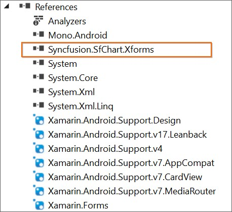
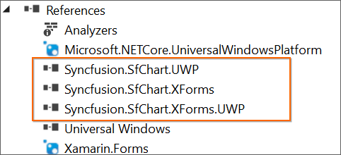
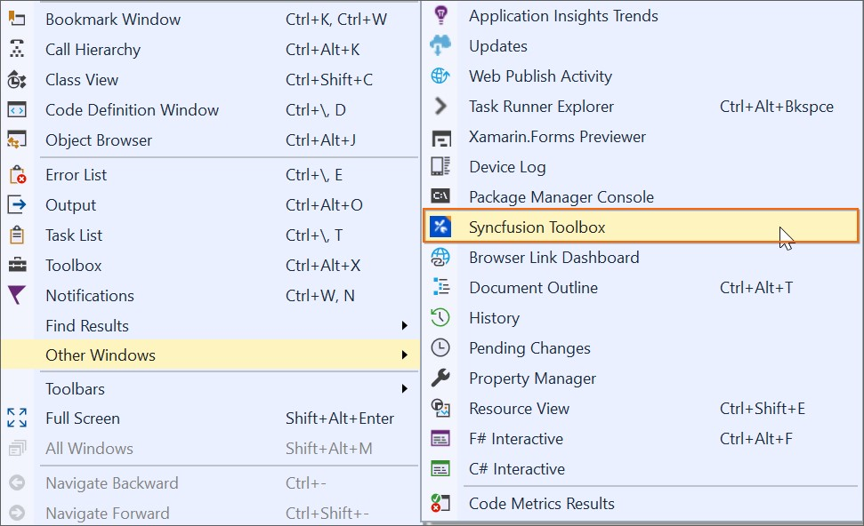
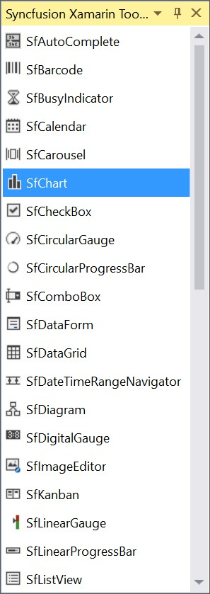

# Utilities

The Syncfusion Xamarin Extension provides you quick access, so that you can create or configure the Syncfusion Xamarin projects. The Syncfusion Xamarin Extensions has the following features.

* Syncfusion Project Template for Xamarin Forms
* Syncfusion Toolbox for Xamarin Forms

## Project Template

Syncfusion provides the **Visual** **Studio** **Project** **Templates** for the Syncfusion Xamarin platform to create the Syncfusion Xamarin Application.

I> The Syncfusion Xamarin Project Templates are available from v16.2.0.41.

## Create Syncfusion Xamarin Application

The following steps direct you to create the **Syncfusion** **Xamarin** **Application** through the **Visual** **Studio** **2017:**

1. To create a **Syncfusion Xamarin project**, choose **New** **Project****->****Syncfusion****->** **Cross-Platform****->****Syncfusion** **Xamarin** **Application** from **Visual** **Studio** **2017**.

   

2. Name the **Project**, choose the destination location, and set the Framework of the project, and then click **OK**. The Project Configuration Wizard appears.
   
3. Choose the options to configure the Syncfusion Xamarin Application by using the following Project Configuration dialog.

### Project Configuration:

Choose the Project, Android, iOS, and UWP by on/off 

**Assemblies From:** Load the Syncfusion Xamarin reference to Xamarin Application, either NuGet or Installed Location.

N> *Installed location option will be available only when installed the Syncfusion Xamarin setup has been installed*.

**Android:**

1.	**Minimum Android Version:** Select the oldest Android version that you want to support your application. 
2.	**Target Android Version:** Select the version of Android to run your application. 

**iOS:**

1.	**Target Device:**  Select the device of Xamarin.iOS Project, either Unified, iPhone/iPod, or iPad.
2.	**Target Version:** Choose the version of Xamarin.iOS Project.

**Choose controls**

Choose the Xamarin application needs to create with the Syncfusion controls. 

4.Click **Create**, the Syncfusion Xamarin Application has been created.

   N> *Choose any one of the project type and controls from Project Configuration Wizard.*

5.Required Syncfusion NuGet/Assemblies and configuration have been added to the project based on the control chosen.

   **Net Standard /PCL:**

   ![] (Syncfusion-Project-Templates_images/Syncfusion-Project-Templates_img3.jpeg)

   

   **Android:**

   

   

   **iOS:**

   

   

   **UWP:**

   

   

## Toolbox

Syncfusion provides the **Visual** **Studio** **Toolbox** for the Syncfusion Xamarin platform to adding the Syncfusion Xamarin (Xamarin.Forms) controls in your project. It supports Microsoft Visual Studio 2015 and 2017. The Syncfusion Xamarin toolbox helps you to use the Syncfusion controls without coding in the Visual Studio designer.

I> The Syncfusion Toolbox are available from v16.2.0.41.

## Add Syncfusion Xamarin (Xamarin.Forms) Controls in your Project

Create the Xamarin or Syncfusion Xamarin project. The following steps direct you to add the Syncfusion controls through the Visual Studio Toolbox:

1. Choose **View** **->** **Other** **Windows** **->** **Syncfusion** **Toolbox** from **Visual** **Studio.**

   

2. Click **Syncfusion** **Toolbox** menu item, the Syncfusion Toolbox wizard has been appeared. The Syncfusion control will be enabled in the Xamarin.Forms designer page. There is no Syncfusion control appears till open the appropriate .xaml file from the Xamarin shared/.NET Standard /PCL project.

   

3. Add the required Syncfusion controls design (.xaml) snippet and namespace by drag and drop the required control from toolbox to designer.

   

4. Install the Syncfusion Xamarin NuGet packages based on the controls in your project and render the Syncfusion control. Refer the following link for know more about Syncfusion Xamarin NuGet packages install and configuration: [https://help.syncfusion.com/xamarin/nuget-packages](https://help.syncfusion.com/xamarin/nuget-packages)

