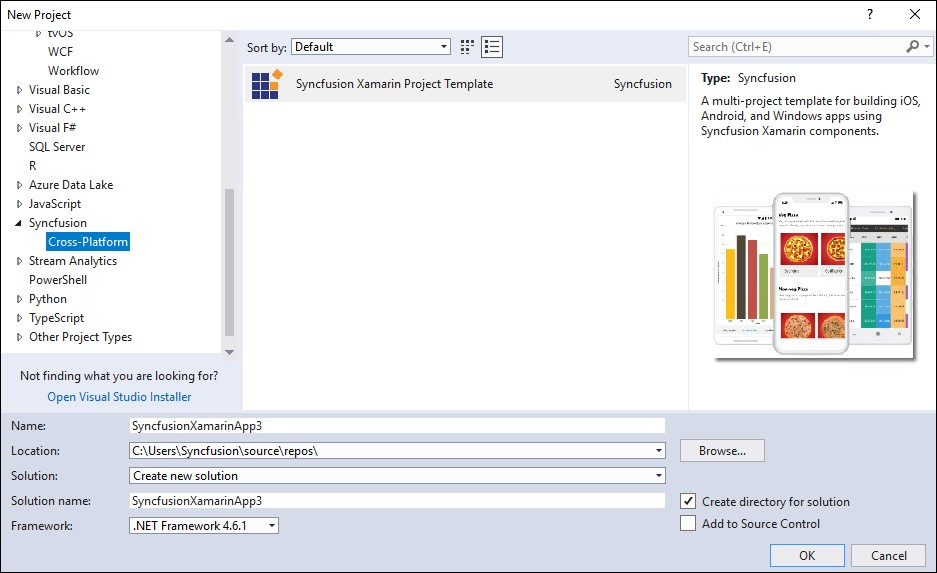
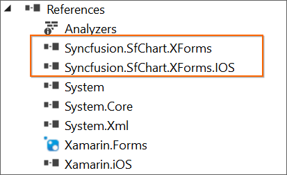

# Utilities

The Syncfusion Xamarin Extension provides you quick access, so that you can easily create or configure Syncfusion Xamarin projects. Syncfusion Xamarin Extensions provides the following features.

* Syncfusion Project Template for Xamarin.Forms
* Syncfusion Toolbox for Xamarin.Forms

## Project Template

Syncfusion provides the **Visual** **Studio** **Project** **Templates** for the Syncfusion Xamarin platform to easily create a Syncfusion Xamarin Application.

I> Syncfusion Xamarin Project Templates are available from v16.2.0.41.

### Create Syncfusion Xamarin Application

The following steps direct you to create a **Syncfusion** **Xamarin** **Application** using  **Visual** **Studio** **2017:**

1. To create a **Syncfusion Xamarin project**, choose **New** **Project****->****Syncfusion****->** **Cross-Platform****->****Syncfusion** **Xamarin** **Application** in **Visual** **Studio** **2017**.

     

2. Name the **Project**, choose the destination location, and set the Framework of the project, and then click **OK**. The Project Configuration Wizard appears.
   
3. Choose the options to configure the Syncfusion Xamarin Application by using the following Project Configuration dialog.

### Project Configuration:

Choose the required Project platforms: Android, iOS, and UWP. 

**Assemblies From:** Specify where the Syncfusion Xamarin assemblies need to be loaded from: either NuGet or Installed Location.

N> *Installed location option will be available only when the Syncfusion Xamarin setup has been installed*.

**Android:**

1.	**Minimum Android Version:** Select the oldest Android version that you want to support your application. 
2.	**Target Android Version:** Select the version of Android to run your application. 

**iOS:**

1.	**Target Device:**  Select the device of Xamarin.iOS Project, either Unified, iPhone/iPod, or iPad.
2.	**Target Version:** Choose the version of Xamarin.iOS Project.

**Choose controls**

Choose the Syncfusion controls that need to be added to the created project. 

4.Click **Create** and the Syncfusion Xamarin Application will be created.

   N> *Choose any one of the project types and controls from the Project Configuration Wizard.*

5.Required Syncfusion NuGet/Assemblies and configuration have been added to the project based on the control(s) chosen.

   **Net Standard /PCL:**

   

   

   **Android:**

   

   

   **iOS:**

   

   

   **UWP:**

   

   

6.Then, Syncfusion licensing registration required message box will be shown as follow, if you have installed the trial setup or NuGet packages since Syncfusion introduced the licensing system from 2018 Volume 2 (v16.2.0.41) Essential Studio release. Please navigate to the [help topic](https://help.syncfusion.com/common/essential-studio/licensing/license-key#how-to-generate-syncfusion-license-key) which is shown in the licensing message box to generate and register the Syncfusion license key to your project. Refer to this [blog](https://blog.syncfusion.com/post/Whats-New-in-2018-Volume-2-Licensing-Changes-in-the-1620x-Version-of-Essential-Studio.aspx) post for understanding the licensing changes introduced in Essential Studio.

   

## Toolbox

Syncfusion provides the **Visual** **Studio** **Toolbox** for the Syncfusion Xamarin platform to help add the Syncfusion Xamarin (Xamarin.Forms) controls in your project. It supports Microsoft Visual Studio 2015 and 2017. The Syncfusion Xamarin Toolbox enables easy drag and drop of Syncfusion controls without XAML coding in the Visual Studio designer.

I> The Syncfusion Toolbox is available from v16.2.0.41.

### Add Syncfusion Xamarin (Xamarin.Forms) Controls in your Project

Create the Xamarin or Syncfusion Xamarin project. The following steps direct you to add the Syncfusion controls through the Visual Studio Toolbox:

1. Choose **View** **->** **Other** **Windows** **->** **Syncfusion** **Toolbox** from **Visual** **Studio.**

    

2. Click **Syncfusion** **Toolbox** menu item and the Syncfusion Toolbox wizard appears. The Syncfusion control will be enabled in the Xamarin.Forms designer page. There is no Syncfusion control till the appropriate XAML file from the Xamarin shared/.NET Standard /PCL project is opened.

    

3. Add the required Syncfusion controls design (XAML) snippet and namespace by dragging and dropping the required control from the Toolbox to the Designer.

    

4. Install the Syncfusion Xamarin NuGet packages based on the controls in your project and render the Syncfusion control. Refer this [link](https://help.syncfusion.com/xamarin/nuget-packages) for know more about Syncfusion Xamarin NuGet packages install and configuration.

