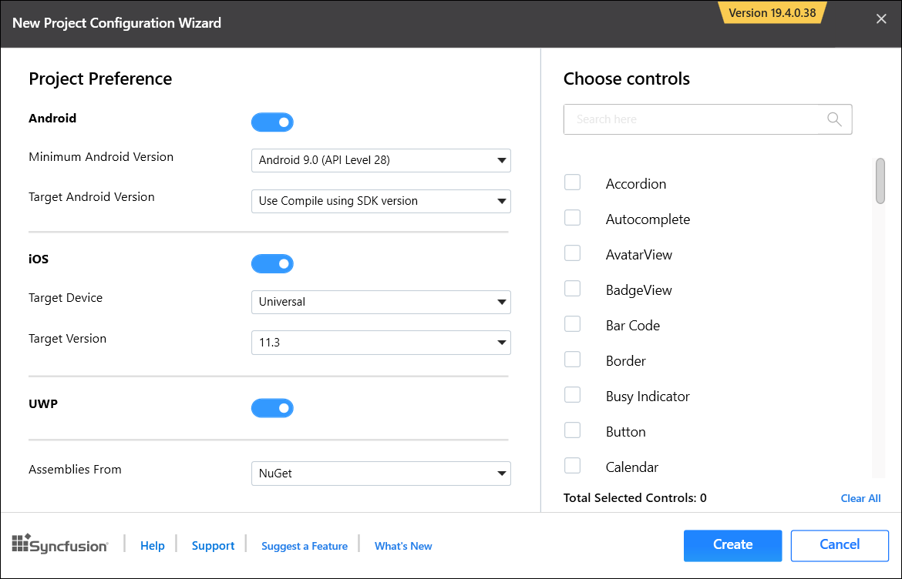
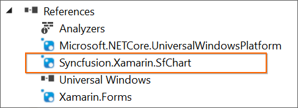

# Create project 

Syncfusion provides the Visual Studio Project Templates for the Syncfusion Xamarin platform to create the Syncfusion Xamarin Application by adding the required Syncfusion NuGet packages for the control chosen.

I> The Syncfusion Xamarin Project Templates are available from v16.2.0.41.

Use the following steps to create the **Syncfusion** **Xamarin** **Application** through the **Visual** **Studio** **2017:**

> Before use the Syncfusion Xamarin Project Template, check whether the **Xamarin Extensions - Syncfusion** installed or not in Visual Studio Extension Manager by clicking on the Tools -> Extensions and Updates -> Installed for Visual Studio 2017 or lower and for Visual Studio 2019 by clicking on the Extensions -> Manage Extensions -> Installed.

1. To create a Syncfusion Xamarin project, follow either one of the options below:

   **Option 1:**  
   Click **Syncfusion Menu** and choose **Essential Studio for Xamarin > Create New Syncfusion Project…** in **Visual Studio**.

   

   N> In Visual Studio 2019, Syncfusion menu is available under Extensions in Visual Studio menu.

   **Option 2:**  
   Choose **File > New > Project** and navigate to **Syncfusion > Cross-Platform > Syncfusion Xamarin Project Template** in **Visual Studio**.

   

2. Name the **Project**, choose the destination location, and set the Framework of the project, and then click **OK**. The Project Configuration Wizard appears.
   
3. Choose the options to configure the Syncfusion Xamarin Application by using the following Project Configuration dialog, choose the Project, Android, iOS, and UWP by on/off.

   

   **Project Configuration:**
   **Assemblies From:** Load the Syncfusion Xamarin reference to Xamarin Application, either NuGet or Installed Location.

   N> Installed location option will be available only when the Syncfusion Xamarin setup has been installed.

   **Android**

   1. **Minimum Android Version:** Select the oldest Android version that you want to support your application. 
   2. **Target Android Version:** Select the version of Android to run your application. 

   **iOS**

   1. **Target Device:**  Select the device of Xamarin.iOS project either Unified, iPhone/iPod, or iPad.
   2.	**Target Version:** Choose the version of Xamarin.iOS Project.

   **Choose controls:** Choose the Xamarin application needs to create with the Syncfusion controls. 

   

4. Click **Create**, the Syncfusion Xamarin Application has been created.

   N> Choose any one of the project type and controls from Project Configuration Wizard.

5. Required Syncfusion NuGet/Assemblies and configuration have been added to the project based on the control chosen.

   **Net Standard /PCL**

   

   

   **Android**

   

   

   **iOS**

   

   

   **UWP**

   

   

6. Then, Syncfusion licensing registration required message box will be shown, if you installed the trial setup or NuGet packages since Syncfusion introduced the licensing system from 2018 Volume 2 (v16.2.0.41) Essential Studio release. Navigate to the [help topic](https://help.syncfusion.com/common/essential-studio/licensing/license-key#how-to-generate-syncfusion-license-key), which is shown in the licensing message box to generate and register the Syncfusion license key to your project. Refer to this [blog](https://blog.syncfusion.com/post/Whats-New-in-2018-Volume-2-Licensing-Changes-in-the-1620x-Version-of-Essential-Studio.aspx) post for understanding the licensing changes introduced in Essential Studio.

   

