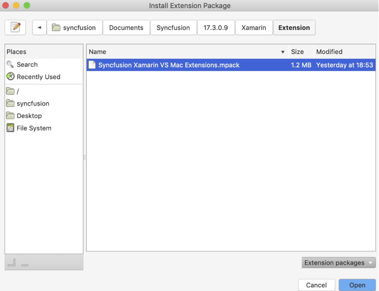
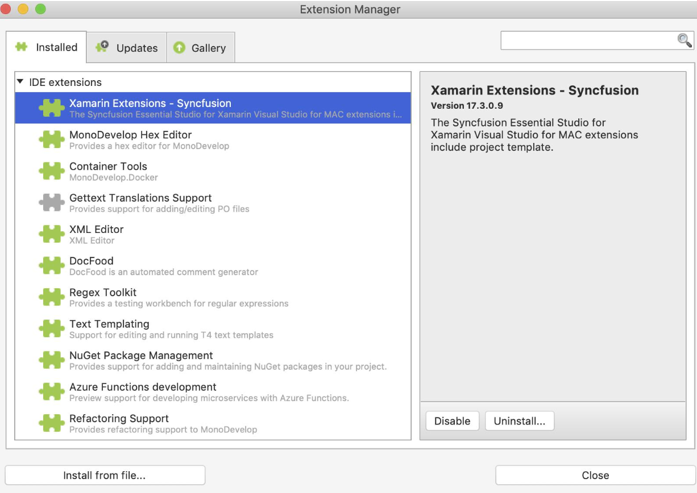
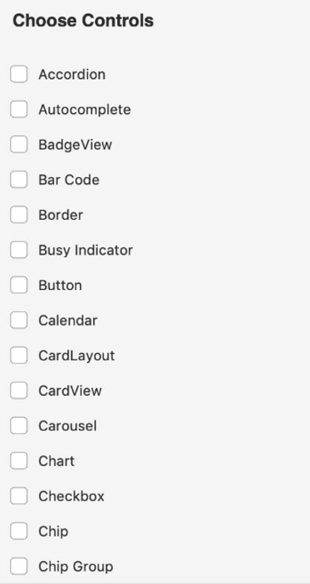
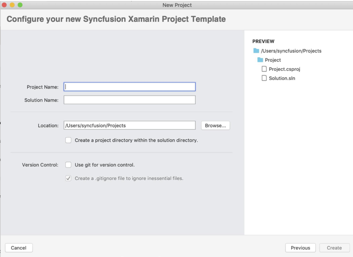
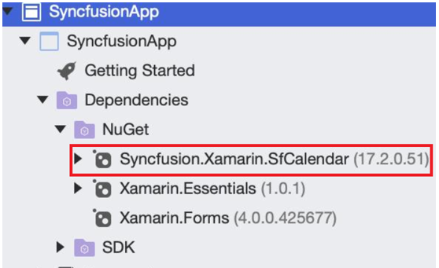
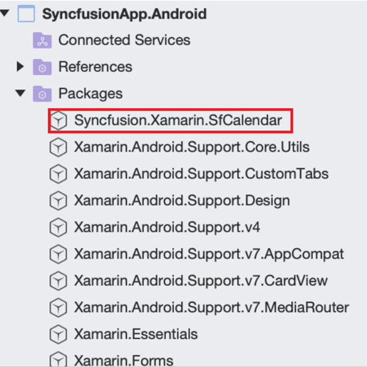
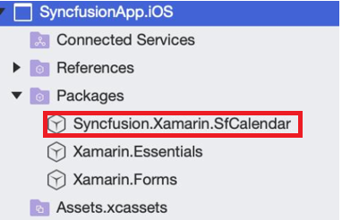

#### Installation

The following procedure illustrates how to install Syncfusion Xamarin Extension in Visual Studio for Mac. 

1. Follow this guideline to install the Essential Studio for Xamarin Mac build if not installed, then you will get the Visual Studio for Mac Extensions in installed location.

**Location:**

 Eg: {Documents}\Syncfusion\{version}\{platform}\Xamarin\Extension\Syncfusion Xamarin VS Mac Extensions.mpack

2. Open the Visual Studio 2019 for Mac.

3. Click the Visual Studio Community and select the Extensions…

    

4. The Extension Manager window will open. Select the Install from file… 

    

5. The Install Extension Package dialog will open. Navigate to Syncfusion Xamarin Mac Extensions file(.mpack) location which explained in above and click open to install.

    

6. Once the extension installed, the Syncfusion Xamarin Extension will listed in the IDE extension section.

    

#### Create Project

Syncfusion provides the Visual Studio for Mac Project Templates for Xamarin platform to create the Syncfusion Xamarin Application by adding the required Syncfusion NuGet packages.

Use the following steps to create the Syncfusion Xamarin Application through the Visual Studio 2019 for Mac:

1)	To create a Syncfusion Xamarin project, follow either one of the options below in Visual Studio for Mac

Option 1:
Click Syncfusion Menu and choose Essential Studio for Xamarin > Create New Syncfusion Project.

    

Option 2:
Choose File > New > Project and navigate to Syncfusion > App > Syncfusion Xamarin Project Template.

2)	Configure the Syncfusion Xamarin Application by using the following Project Configuration dialog, choose the project Android and iOS by toggling respected checkbox and Syncfusion components.

    

### Android:

1. Minimum Android Version: Select the oldest Android version that you want to support your application.
2. Target Android Version: Select the version of Android to run your application.

### iOS:

1. Target Device: Select the device of Xamarin.iOS project either Unified, iPhone/iPod, or iPad
2. Target Version: Choose the version of Xamarin.iOS Project.  

### Choose controls:

Choose the Xamarin application needs to create with the Syncfusion controls.

    

3) Name the project and click the Create.

    

4) Required Syncfusion NuGet and configuration have been added to the project based on the Syncfusion component chosen.

**Net Standard:**

    

**Android:**

    

**iOS:**

    

Now, you can follow the user guide documentation to use the Syncfusion Xamarin components.
