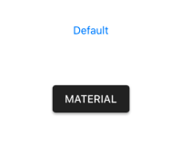
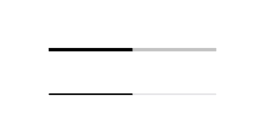

Xamarin.Forms has provided material design support for the framework controls in 3.6 version for iOS and Android platform. When it is enabled in the application, all the supported views will render in uniform look and feel.

To learn about the configurations needed in the application level, please follow the detailed guidelines in this [link](https://docs.microsoft.com/en-us/xamarin/xamarin-forms/user-interface/visual/material-visual).

To achieve this, we need to set the property ['Visual'](https://docs.microsoft.com/en-us/dotnet/api/xamarin.forms.visualelement.visual?view=xamarin-forms#Xamarin_Forms_VisualElement_Visual) as ['Material'](https://docs.microsoft.com/en-us/dotnet/api/xamarin.forms.visualmarker.material?view=xamarin-forms). 


<StackLayout Spacing="50" VerticalOptions="Center" HorizontalOptions="Center">
    <Button Text="Default" />
    <Button Text="Material" Visual="Material" />
</StackLayout>


"Visual" is a property which can be set to the element or it's parent or the page it self. Due to this, you can set ['Visual'](https://docs.microsoft.com/en-us/dotnet/api/xamarin.forms.visualelement.visual?view=xamarin-forms#Xamarin_Forms_VisualElement_Visual) as ['Material'](https://docs.microsoft.com/en-us/dotnet/api/xamarin.forms.visualmarker.material?view=xamarin-forms) for the root element and override it as “Default” for specific element if needed.


<StackLayout Visual="Material" Spacing="50" VerticalOptions="Center" HorizontalOptions="Center">
    <ProgressBar Progress="0.5" ProgressColor="Black" WidthRequest="200" />
    <ProgressBar Progress="0.5" ProgressColor="Black" WidthRequest="200" Visual="Default" />
</StackLayout>


## Apply material visual for Syncfusion controls

To use this feature with Syncfusion controls, you need not to make any additional configurations. The procedure is exactly same as the above. By simply setting the ['Visual'](https://docs.microsoft.com/en-us/dotnet/api/xamarin.forms.visualelement.visual?view=xamarin-forms#Xamarin_Forms_VisualElement_Visual) as ['Material'](https://docs.microsoft.com/en-us/dotnet/api/xamarin.forms.visualmarker.material?view=xamarin-forms) either to the Syncfusion control or to any of its parent views, the UI will be updated. In Volume 3, 2019, we have provided this support for the following controls. 

* Calendar
* Button
* CheckBox
* Radio Button
* Chips
* Range Slider
* Scheduler
* Switch
* Tabbed View
* DataGrid
* Popup
* Picker
* ListView
* TreeView
* Expander
* Accordion